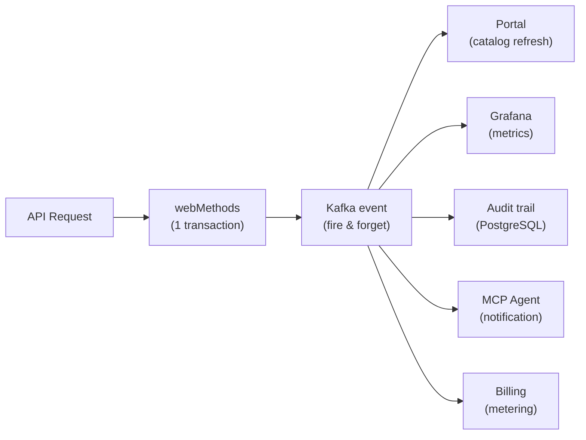

import KafkaMCPArchitecture from '@site/src/components/KafkaMCPArchitecture';

# ADR-043 : Architecture du Pont Kafka → MCP

## Métadonnées

| Champ | Valeur |
|-------|--------|
| **Statut** | Proposé |
| **Date** | 2026-02-15 |
| **Auteur** | Christophe ABOULICAM |
| **Décideurs** | Équipe Core STOA |
| **Catégorie** | Architecture / Event-Driven / AI-Native |
| **Linear** | CAB-1176 |

### Décisions Liées

- **ADR-005** : Event-Driven Kafka — Conception originale des topics et architecture du backbone événementiel
- **ADR-024** : Gateway Unified Modes — 4 modes de déploiement (edge-mcp, sidecar, proxy, shadow)
- **ADR-041** : Plugin Architecture — Modèle Community Core vs Enterprise Extensions

## Contexte

La STOA Platform dispose de trois briques technologiques opérationnelles qui ne sont pas encore connectées entre elles :

1. **Kafka/Redpanda** — déployé comme backbone événementiel interne (CAB-211, CAB-294, CAB-123)
2. **MCP Gateway** — opérationnelle avec SSE Streamable HTTP Transport (CAB-1082)
3. **SSE Transport** — implémenté pour la communication serveur→client via MCP

Le protocole MCP supporte nativement les **notifications initiées par le serveur** (`notifications/send`) via SSE, permettant au serveur de pousser des événements vers les agents connectés sans attendre une requête.

### Problème

Aujourd'hui, les agents IA connectés à STOA via MCP opèrent en mode **pull uniquement** : ils appellent `tools/list` et `tools/call` pour interagir avec la plateforme. Ils n'ont aucune connaissance des événements se produisant sur la plateforme :

- Nouvelle API publiée dans le catalogue
- Abonnement approuvé ou révoqué
- Alerte de sécurité (dépassement de rate limit, anomalie)
- Changement de politique
- Métriques de gateway en temps réel

### Analyse Concurrentielle (Février 2026)

| Plateforme | Kafka | Support MCP | Push Event → Agent |
|-----------|-------|-------------|-------------------|
| **Kong** (Event Gateway, oct. 2025) | Expose Kafka comme API | MCP Gateway (3.12) — proxy | Pas de push |
| **Gravitee** (4.10, jan. 2026) | Médiation de protocole | MCP proxy + Agent Tool Server | Requête/réponse uniquement |
| **Confluent** | Serveur MCP pour admin Kafka | MCP client pour les topics | Outillage admin, pas de push d'événements |
| **Apigee** | N/A | N/A | N/A |
| **STOA** (proposé) | Backbone interne | MCP Gateway natif | Kafka → SSE → notifications MCP |

**Aucun concurrent ne réalise de livraison push événementielle aux agents IA connectés via MCP.**

<!-- last verified: 2026-02 -->

> Les comparaisons de fonctionnalités sont basées sur la documentation publique disponible en 2026-02.
> Les capacités des produits évoluent fréquemment. Nous encourageons les lecteurs à vérifier les
> fonctionnalités actuelles directement auprès de chaque éditeur. Toutes les marques appartiennent à leurs propriétaires respectifs.

Sources :
- Kai Waehner (Confluent), "Agentic AI with A2A and MCP using Kafka" (mai 2025) — théorise l'architecture mais aucun produit
- Blog de release Gravitee 4.10 (jan. 2026) — AI Gateway + MCP proxy, pas de push
- Kong Event Gateway (oct. 2025) — expose Kafka, pas de pont vers MCP
- mcp-kafka / kafka-mcp-server (GitHub) — admin Kafka via outils MCP, pas un pont d'événements

## Décision

Implémenter un **Pont Kafka → MCP** en 4 phases, transformant STOA en la première plateforme de gestion d'API event-driven native IA.

### Architecture

<KafkaMCPArchitecture />

### Topics Kafka — 8 Familles (Système Nerveux Central)

Kafka ne sert pas uniquement le pont MCP — c'est le **système nerveux central** de toute la plateforme. Chaque mutation, chaque événement transite par Kafka, alimentant 38 consommateurs à travers toutes les fonctionnalités STOA.

| Topic | Contenu | Livraison | Rétention | Partitions | Statut |
|-------|---------|----------|-----------|------------|--------|
| `stoa.api.lifecycle` | API created/updated/deprecated/retired | EXACTLY_ONCE | 7j | 6 | Planifié |
| `stoa.subscription.events` | Request → Approved → Revoked | EXACTLY_ONCE | 7j | 6 | Planifié |
| `stoa.security.alerts` | Dépassement rate limit, anomalie détectée | AT_LEAST_ONCE | 30j | 3 | Planifié |
| `stoa.metering.events` | Suivi d'utilisation, événements de facturation | BEST_EFFORT | 3j | 12 | **LIVE** |
| `stoa.audit.trail` | Tous les changements de config, qui/quoi/quand | EXACTLY_ONCE | 90j | 6 | Planifié |
| `stoa.gateway.metrics` | Latence P95, taux d'erreur, débit | BEST_EFFORT | 3j | 12 | Planifié |
| `stoa.deployment.events` | Sync ArgoCD, deploy CLI, rollback | EXACTLY_ONCE | 7j | 3 | Planifié |
| `stoa.resource.lifecycle` | Expiration TTL, extension, nettoyage | EXACTLY_ONCE | 30j | 6 | Planifié |

#### Producteurs par topic

| Topic | Producteurs |
|-------|-----------|
| `stoa.api.lifecycle` | Control Plane API, CLI `stoa push`, webhook GitOps |
| `stoa.subscription.events` | Portal (requête), Control Plane (approve/reject), orchestrateur Saga |
| `stoa.security.alerts` | Gateway Rust (rate limit), Keycloak (échecs auth), OPA (violations de politique) |
| `stoa.metering.events` | Gateway Rust (chaque requête), MCP Gateway (appels d'outils) |
| `stoa.audit.trail` | Control Plane (toutes les mutations), Portal (actions utilisateur), Gateway (changements de config) |
| `stoa.gateway.metrics` | Gateway Rust (métriques par requête), MCP Gateway (latence des outils) |
| `stoa.deployment.events` | ArgoCD (statut de sync), CLI `stoa deploy`, GitHub Actions |
| `stoa.resource.lifecycle` | CronJob TTL, Portal (demande d'extension), Control Plane (nettoyage) |

#### Impact consommateurs — 38 consommateurs débloqués

L'adoption de Kafka comme backbone débloque des dépendances consommateurs sur l'ensemble du backlog : Notification Dispatcher (CAB-376), Onboarding Workflows (CAB-593/594/424), Error Snapshots (CAB-486/487/547), Portal Catalog (CAB-563), Schema Evolution Guard (CAB-464), Vercel-Style DX (CAB-374), Resource TTL (CAB-86), et toute l'infrastructure d'observabilité (CAB-497/498/499/500/501).

### Architecture du Pont SSE

Le pont est un **Consommateur Kafka** qui :
1. Consomme les topics configurés par tenant
2. Applique un filtrage multi-tenant (isolation via namespace Keycloak)
3. Transforme les événements Kafka en événements SSE
4. Applique une contre-pression via token-bucket par connexion
5. Gère la reconnexion avec suivi des offsets

### Modèle de Notification MCP

```json
{
  "jsonrpc": "2.0",
  "method": "notifications/send",
  "params": {
    "type": "stoa.api.lifecycle",
    "data": {
      "event": "api.created",
      "api": {
        "name": "customer-api",
        "version": "2.1.0",
        "owner": "team-payments"
      },
      "timestamp": "2026-02-15T10:30:00Z",
      "tenant": "acme-corp"
    },
    "hint": {
      "action": "tools/list",
      "reason": "New API available — refresh tool registry"
    }
  }
}
```

Le champ `hint` est une innovation STOA : il suggère à l'agent l'action à entreprendre suite à l'événement, sans l'imposer (l'agent décide).

## Phases d'Implémentation

### Phase 1 — Backbone Événementiel Kafka (8 pts, CAB-1177)

Structure des producteurs Kafka dans le Control Plane pour tous les événements de cycle de vie.

- Control Plane → producteurs Kafka (8 familles de topics)
- Kafka → sink PostgreSQL (audit, replay)
- Kafka → pont de métriques Prometheus
- Politiques de topics versionnées dans Git (sémantique de livraison par topic)
- JSON Schema défini pour chaque topic

### Phase 2 — Pont Kafka → SSE (5 pts, CAB-1178)

Consommateur Kafka transformant les événements en flux SSE pour la MCP Gateway.

- KafkaConsumer → adaptateur SSE EventSource
- Filtrage par tenant (isolation multi-tenant via claims Keycloak)
- Gestion de la contre-pression (token-bucket par connexion)
- Logique de reconnexion avec suivi des offsets
- Health check + circuit breaker

### Phase 3 — Notifications MCP (5 pts, CAB-1179)

Les agents IA connectés via MCP reçoivent des événements en temps réel.

- MCP `notifications/send` pour les événements critiques
- Modèle d'abonnement des agents (opt-in par type d'événement)
- Hint événement → outil (api.created → suggestion de rafraîchissement tools/list)
- Génération de contrat AsyncAPI 3.0 depuis UAC (lien avec CAB-712)

### Phase 4 — Gouvernance Event-Driven (8 pts, CAB-1180)

Les événements Kafka alimentent des règles de gouvernance automatiques.

- Policy-as-Event : changement de politique → propagation instantanée à tous les agents
- CQRS : chemin d'écriture (Control Plane) / chemin de lecture (projections event-sourcées)
- Patterns Saga pour les workflows multi-étapes (chaînes d'approbation)
- Dead Letter Queue + politiques de retry par tenant

**Total : 26 points**

## Proposition de Valeur — Réduction des Coûts Gateway Tiers

### Problème : Le Polling Est Coûteux

Lorsqu'un client conserve un gateway tiers (webMethods, Kong Enterprise, Apigee) facturé par transaction, trois patterns existent pour surveiller leurs APIs :

| Pattern | Coût | Latence | Impact Onboarding |
|---------|------|---------|-------------------|
| **Polling** (Control Plane → Gateway) | Transactions fantômes (surveillance pure) | Dépend de l'intervalle | Aucun |
| **Webhook** (Backend → STOA) | Faible | Temps réel | Lourd (dev requis côté backend) |
| **Batch/cron** (export de fichier) | Moyen | Heures | Moyen |

Exemple concret — webMethods facturé par transaction :
- **Sans Kafka** : polling toutes les 30s × 200 APIs × 5 consommateurs = ~2,9M transactions/jour de surveillance pure
- **Avec Kafka** : 0 transaction de surveillance. Les événements transitent par Kafka, les consommateurs lisent Kafka (gratuit)

### Solution : Kafka comme Fan-Out Gratuit



1 événement Kafka → N consommateurs indépendants. Zéro transaction supplémentaire sur le gateway payant.

### Impact sur l'Onboarding

**Sans Kafka** — onboarding d'une API :
1. Déclarer l'API dans le Portal
2. Configurer le webhook backend → STOA (dev requis côté équipe backend)
3. Gérer l'auth du callback (mutual TLS, API key...)
4. Implémenter les retries côté backend (si STOA est down, les événements sont perdus)
5. Tester le webhook de bout en bout

**Avec Kafka** — onboarding d'une API :
1. Déclarer l'API dans le Portal
2. Terminé.

Le backend ne change pas une seule ligne de code. Le gateway émet l'événement dans Kafka. Découplage total.

### Pitch Client en 30 Secondes

> « Vous gardez votre gateway. Nous plaçons Kafka à côté. Vos coûts de surveillance tombent à zéro, l'onboarding des APIs passe de 5-10 jours à 2 clics, et vos agents IA sont notifiés en temps réel. Vos backends ne changent pas une seule ligne de code. »

## Conséquences

### Positives

- **Différenciateur unique** : premier APIM à pousser des événements en temps réel aux agents IA
- **Réutilisation maximale** : Kafka, SSE et MCP Gateway sont déjà déployés — seul le glue manque
- **Alignement roadmap** : s'inscrit dans la vision « L'ESB est Mort » et le positionnement event-driven
- **Valeur client immédiate** : un architecte peut voir en temps réel quand ses APIs sont consommées

### Négatives

- **Complexité opérationnelle** : Kafka ajoute une couche de maintenance (atténué par Redpanda, plus simple)
- **Latence supplémentaire** : Control Plane → Kafka → Pont SSE → MCP ajoute ~50-100ms vs direct
- **Surface d'attaque** : nouveau vecteur de fuite d'informations si le filtrage par tenant est mal implémenté
- **Spéculation MCP** : `notifications/send` est dans la spec mais peu implémenté côté client — risque d'adoption lente

### Risques

| Risque | Probabilité | Impact | Atténuation |
|------|------------|--------|-----------|
| Les clients MCP ne supportent pas les notifications | Moyen | Moyen | Polling de repli + documentation client |
| Fuite cross-tenant via SSE | Faible | Critique | Tests d'isolation systématiques + audit |
| Latence Kafka trop élevée | Faible | Faible | Redpanda optimisé pour la latence, monitoring P95 |
| Gravitee implémente le même pattern | Moyen | Moyen | Avantage du premier entrant |

## Alternatives Considérées

### Alternative A : WebSocket Direct (sans Kafka)

Control Plane → WebSocket → Agents. Plus simple mais perd la durabilité, le replay et le fan-out multi-consommateurs.

**Rejeté** : pas de replay, pas de découplage, pas de persistance.

### Alternative B : Polling Amélioré

Les agents font du long-polling sur un endpoint `/events` du Control Plane.

**Rejeté** : anti-pattern pour le temps réel, charge serveur proportionnelle au nombre d'agents, non event-driven.

### Alternative C : CloudEvents + Webhook

Pousser des événements via webhooks CloudEvents vers les agents.

**Rejeté** : nécessite que les agents exposent un endpoint HTTP (sens inversé), incompatible avec le modèle SSE MCP.

## Références

- [MCP Spec — Transports (2025-06-18)](https://modelcontextprotocol.io/specification/2025-06-18/basic/transports)
- [RFC 8693 — OAuth 2.0 Token Exchange](https://tools.ietf.org/html/rfc8693)
- [AsyncAPI 3.0 Specification](https://www.asyncapi.com/docs/reference/specification/v3.0.0)
- [Kai Waehner — Agentic AI with Kafka, MCP and A2A](https://www.kai-waehner.de/blog/2025/05/26/agentic-ai-with-the-agent2agent-protocol-a2a-and-mcp-using-apache-kafka-as-event-broker/)
- [Gravitee 4.10 Release](https://www.gravitee.io/blog/gravitee-4.10-one-control-point-to-secure-govern-ai-agents-mcp-and-llms)
- [Kong Event Gateway](https://konghq.com/blog/enterprise/how-to-productize-event-data-and-event-apis)
- STOA Interne : CAB-211 (Event-Driven Architecture), CAB-123 (Metering Pipeline), CAB-1082 (MCP SSE Transport)
