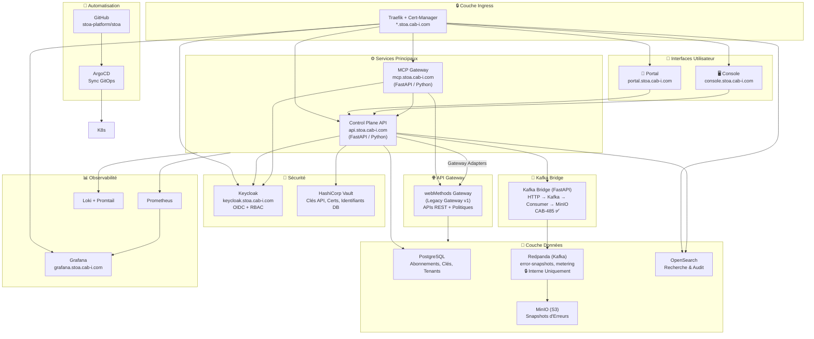
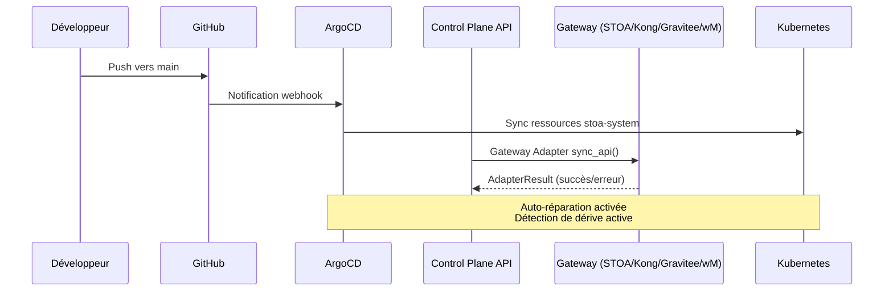
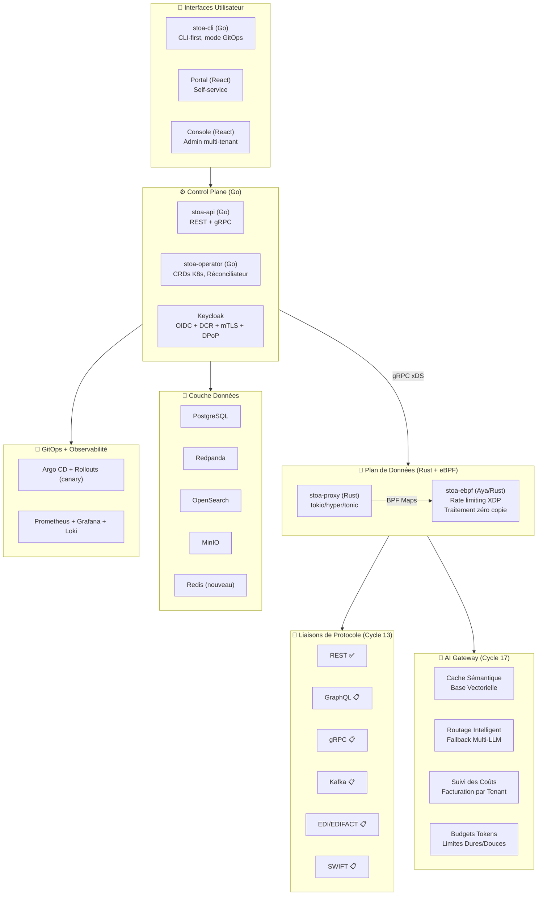
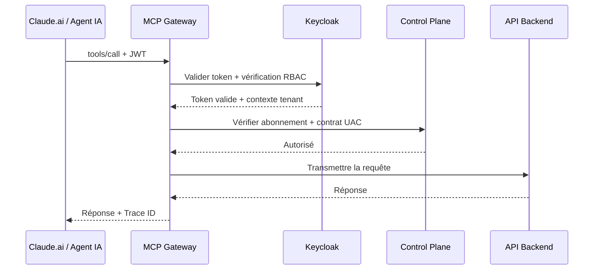

# Vue d'Ensemble de l'Architecture

> **« Deux architectures, une vision »** — Implémentation actuelle + État cible pour v1.0

La plateforme STOA est conçue comme une plateforme de gateway cloud-native et multi-tenant, construite pour les APIs traditionnelles et les agents IA. Ce document maintient deux vues distinctes :

1. **Live** — Ce qui est effectivement déployé et en production
2. **Cible** — L'architecture vers laquelle nous convergeons (v1.0 Q3 2026)

*Dernière mise à jour : 2 février 2026 — Post Cycle 5 (CAB-668)*

---

## Architecture Live (Février 2026)

*Ce qui tourne en production sur `*.stoa.cab-i.com`*



### Services Live — Statut 02/02/2026

| Service | URL | Statut | Stack |
|---------|-----|--------|-------|
| Portal | `portal.stoa.cab-i.com` | ✅ Live | React |
| Control Plane API | `api.stoa.cab-i.com` | ✅ Live | FastAPI (Python) |
| Console | `console.stoa.cab-i.com` | ✅ Live | React |
| MCP Gateway | `mcp.stoa.cab-i.com` | ✅ Live | FastAPI (Python) |
| Keycloak | `keycloak.stoa.cab-i.com` | ✅ Live | Keycloak (OIDC) |
| Grafana | `grafana.stoa.cab-i.com` | ✅ Live | Grafana + Loki |
| OpenSearch | `opensearch.stoa.cab-i.com` | ✅ Live | OpenSearch |
| Docs | `docs.gostoa.dev` | ✅ Live | Docusaurus (Vercel) |
| Kafka Bridge | Interne uniquement | ✅ Live | FastAPI (CAB-485) |
| Error Snapshot Consumer | Interne uniquement | ✅ Live | Python (CAB-485) |

### Fonctionnalités Live — Implémentées (Post Cycle 5)

- ✅ **Auth** : Keycloak OIDC + TOTP 2FA + RBAC multi-tenant
- ✅ **Abonnements** : Outil → Utilisateur → Tenant avec clés API (Vault)
- ✅ **MCP Gateway** : `list_tools`, `call_tool`, `list_resources` — intégration Claude.ai corrigée (bugs JSON-RPC résolus)
- ✅ **Découverte d'outils Multi-Tenant** : Outils limités au tenant avec injection du contexte JWT
- ✅ **GitOps Multi-Gateway** : ArgoCD + Patron Adaptateur de Gateway (STOA, Kong, Gravitee, webMethods)
- ✅ **Foundation ArgoCD** : Déploiement continu GitOps pour `stoa-system`
- ✅ **Error Snapshots** : Capture → Kafka → MinIO → Récupération via API (CAB-397 + CAB-485)
- ✅ **Observabilité** : Prometheus + Grafana + Loki centralisés
- ✅ **Recherche** : Catalogue OpenSearch + piste d'audit
- ✅ **Webhooks** : Notifications `subscription.created/renewed/revoked`
- ✅ **Sécurité** : Gestion des secrets Vault, RBAC Keycloak, socle mTLS

### Dépôts Git

| Dépôt | Hébergement | Objectif |
|-------|-------------|---------|
| `stoa-platform/stoa` | GitHub (public) | Code principal de la plateforme (Apache 2.0) |
| `stoa-platform/stoa-docs` | GitHub (public) | Site de documentation |
| `stoa-platform/stoa-web` | GitHub (public) | Page d'accueil (gostoa.dev) |
| `stoa-platform/stoa-helm` | GitHub (public) | Charts Helm |
| `PotoMitan/stoa-gitops` | GitLab (privé) | Applications ArgoCD, playbooks Ansible, infra |
| `PotoMitan/stoa-catalog` | GitLab (privé) | Définitions d'APIs tenant, configs webMethods |
| `PotoMitan/stoa-ops` | GitLab (privé) | Terraform, scripts opérationnels |

### Flux de Déploiement (Live)



:::caution Important
Le flux de déploiement n'est **PAS** piloté par Kafka. Le Control Plane API orchestre la synchronisation des gateways directement via le Patron Adaptateur de Gateway ([ADR-035](/docs/architecture/adr/adr-035-gateway-adapter-pattern)).

Kafka est utilisé exclusivement pour le streaming d'événements internes (snapshots d'erreurs, metering), jamais pour l'orchestration du déploiement. Voir ADR-017 : Kafka Interne Uniquement.
:::

### Namespace Kubernetes

Tous les composants s'exécutent dans le namespace `stoa-system` sur EKS :

```bash
kubectl get pods -n stoa-system
```

---

## Architecture Cible (v1.0 — Q3 2026)

*Vision : natif eBPF, CLI-first, prêt pour l'IA*



### Différences Live → Cible

| Composant | Live (Fév. 2026) | Cible (Q3 2026) | Cycle |
|-----------|-----------------|------------------|-------|
| **Gateway** | webMethods (Java) | stoa-proxy (Rust) | Cycle 15 |
| **Rate Limiting** | User-space (slowapi) | XDP/eBPF (noyau) | Cycle 15 |
| **Control Plane** | FastAPI (Python) | stoa-api (Go) | Cycle 15 |
| **CLI** | — | stoa-cli (Go) | Cycle 15 |
| **Operator** | — | stoa-operator (Go) | Cycle 15 |
| **GitOps** | ArgoCD + Gateway Adapters | Argo CD + Rollouts | CAB-483 |
| **Cache** | En mémoire | Redis distribué | CAB-306 |
| **Protocoles B2B** | REST uniquement | EDI/SWIFT/Euro Num. | Cycle 13 |
| **AI Gateway** | MCP de base | Cache sémantique + routage | Cycle 17 |

### CRDs — Feuille de Route v1.0

:::info Non Encore Déployé
Les Custom Resource Definitions suivantes sont **prévues pour v1.0** et ne sont pas encore déployées. Elles seront gérées par le `stoa-operator` :
:::

```yaml
# FEUILLE DE ROUTE - Non déployé encore
apiVersion: stoa.io/v1alpha1
kind: Tool
metadata:
  name: billing-api
  namespace: tenant-acme
spec:
  protocol: rest
  upstream: https://api.acme.com/billing
  auth:
    type: oauth2
    issuer: https://keycloak.stoa.cab-i.com/realms/acme
---
apiVersion: stoa.io/v1alpha1
kind: ToolSet
metadata:
  name: acme-tools
  namespace: tenant-acme
spec:
  tools:
    - billing-api
    - inventory-api
  policies:
    rateLimit: 1000/min
    auth: required
```

---

## Feuille de Route de Migration

```
Jan 2026       Fév 2026       Mar 2026       Q2 2026        Q3 2026
    │              │              │              │              │
    ▼              ▼              ▼              ▼              ▼
┌───────┐     ┌───────┐     ┌───────┐     ┌───────┐     ┌───────┐
│v0.1.0 │     │v0.2.0 │     │v0.3.0 │     │v0.5.0 │     │v1.0.0 │
│MVP    │────►│Demo   │────►│Proxy  │────►│eBPF   │────►│GA     │
│       │     │       │     │       │     │       │     │       │
│Arch   │     │+Claude│     │+Rust  │     │+eBPF  │     │Cible  │
│Live   │     │ .ai   │     │Proxy  │     │       │     │Finale │
└───────┘     └───────┘     └───────┘     └───────┘     └───────┘
    │                                                        │
    └──────────── Période Hybride ───────────────────────────┘
        (webMethods + stoa-proxy coexistent avec bascule de trafic)
```

---

## Stack Technologique

| Couche | Live (Fév. 2026) | Cible (v1.0) |
|--------|-----------------|--------------|
| Gateway | webMethods (Java) | Rust, Tokio, Hyper |
| MCP Gateway | Python, FastAPI | Rust (intégré dans stoa-proxy) |
| Control Plane API | Python, FastAPI | Go |
| Frontend | React, TypeScript, Tailwind | React, TypeScript, Tailwind |
| Base de données | PostgreSQL | PostgreSQL |
| Event Streaming | Redpanda (API Kafka) | Redpanda (API Kafka) |
| Recherche | OpenSearch | OpenSearch |
| Stockage objet | MinIO | MinIO / S3 |
| Cache | En mémoire | Redis |
| Auth | Keycloak | Keycloak |
| Secrets | HashiCorp Vault | HashiCorp Vault |
| Observabilité | Prometheus, Grafana, Loki | Prometheus, Grafana, Loki |
| GitOps | ArgoCD + Gateway Adapters | ArgoCD + Argo Rollouts |
| Infrastructure | Kubernetes (EKS), Helm | Kubernetes, Helm, Terraform |

---

## Zones de Sécurité

| Zone | Niveau de Confiance | Composants |
|------|--------------------|-----------|
| **Externe** | Non fiable | Clients API, Claude.ai, Console Web |
| **DMZ** | Semi-fiable | Ingress Traefik, API Gateway, MCP Gateway |
| **Interne** | Fiable | Control Plane, Keycloak, Couche Données |

Principes de sécurité clés :
- Kafka/Redpanda : **zéro exposition externe** (ADR-017)
- Isolation multi-tenant via contexte JWT (ADR-016)
- GitOps avec Argo CD pour la config déclarative ([ADR-015](/docs/architecture/adr/adr-015-token-optimization-architecture))
- Tous les secrets gérés via HashiCorp Vault

---

## Flux du MCP Gateway



### Isolation des Outils Multi-Tenant

Chaque tenant ne voit que ses propres outils :

| Tenant | Outils Plateforme | Outils Tenant |
|--------|------------------|---------------|
| **Parzival (IOI)** | `stoa_*` | `ioi:billing:*`, `ioi:inventory:*` |
| **Sorrento (Gregarious)** | `stoa_*` | `greg:oasis:*`, `greg:sixers:*` |
| **Halliday (Admin)** | Visibilité complète cross-tenant | Tous les outils |

---

## Documents Associés

- [Vue d'Ensemble du Gateway](/docs/concepts/gateway) — Concepts du gateway
- [Choix Technologiques (ADRs)](/docs/architecture/adr) — Décisions architecturales
- [GitOps avec ArgoCD](/docs/concepts/gitops) — Stratégie de déploiement

---

## Journal des Modifications

| Date | Version | Modifications |
|------|---------|---------------|
| 2026-02-02 | 2.1 | Alignement CAB-668 : terminologie Phase→Cycle, actualisation Fév. 2026, fonctionnalités post-Cycle 5 |
| 2026-01-18 | 2.0 | Séparation Live vs Cible, corrections d'URLs |
| 2026-01-15 | 1.9 | Ajout CAB-485 (Error Snapshots) |
| 2026-01-11 | 1.8 | Intégration OPA MCP Gateway |

---

*Référence : [CAB-668](https://linear.app/hlfh-workspace/issue/CAB-668) — STOA Platform*
