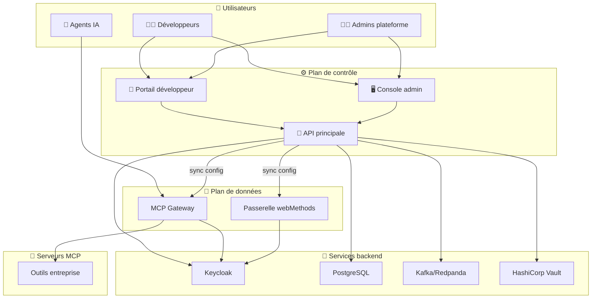
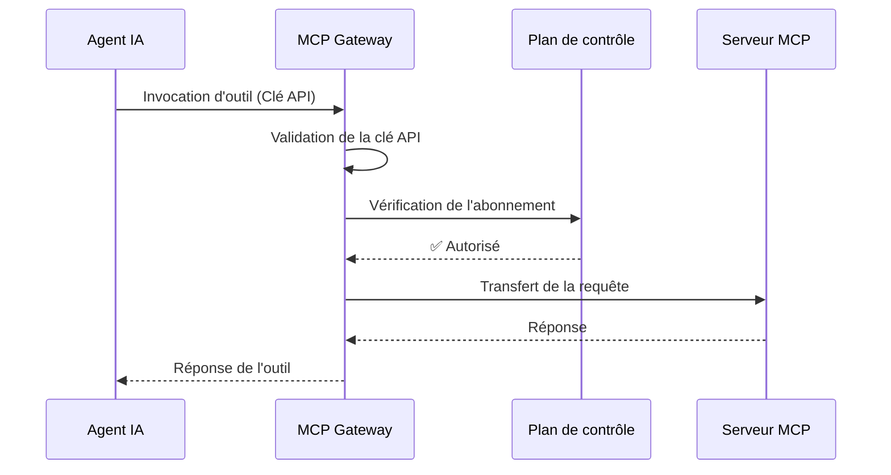

# Vue d'ensemble de l'architecture

STOA Platform est conçue comme une plateforme de passerelle cloud-native et multi-tenant, construite pour les API traditionnelles et les agents IA.

## Architecture de haut niveau

STOA suit un modèle de séparation **Plan de contrôle / Plan de données**, similaire à Kubernetes et Istio.



### Plan de contrôle vs Plan de données

| Aspect | Plan de contrôle | Plan de données |
|--------|------------------|-----------------|
| **Rôle** | Configuration & gestion | Exécution du trafic |
| **Composants** | API principale, Portail, Console | MCP Gateway, webMethods |
| **Latence** | Échelle humaine (ms OK) | Échelle machine (sub-ms) |
| **Mise à l'échelle** | Modérée | Élevée (par requête) |

:::tip Décision d'architecture
Cette séparation est documentée dans [ADR-001 : Stratégie d'exposition des API](/docs/architecture/adr/adr-001-api-exposure-strategy).
:::

## Composants principaux

### API du Plan de contrôle

L'API de gestion centrale construite avec **Python** et **FastAPI**.

| Aspect | Détails |
|--------|---------|
| Langage | Python 3.12+ |
| Framework | FastAPI (asynchrone) |
| Base de données | PostgreSQL + SQLAlchemy |
| Streaming d'événements | Kafka/Redpanda |
| Auth | Keycloak (OIDC) |

**Responsabilités :**
- Gestion des abonnements
- Provisionnement des tenants
- Catalogue d'outils
- Suivi de l'utilisation
- Application des politiques

### MCP Gateway

La MCP Gateway gère les interactions du Model Context Protocol, permettant aux agents IA de consommer de manière sécurisée les outils d'entreprise.

| Aspect | Implémentation actuelle |
|--------|------------------------|
| Langage | Python 3.12+ |
| Framework | FastAPI (asynchrone) |
| Moteur de politiques | OPA (Open Policy Agent) |
| Protocole | MCP (Model Context Protocol) |

**Responsabilités :**
- Gestion du protocole MCP
- Routage des requêtes
- Validation de l'authentification
- Limitation de débit
- Collecte des métriques

:::info Feuille de route
Une implémentation haute performance en **Rust + Tokio** est prévue pour le Q4 2026, avec accélération eBPF au niveau du noyau. Consultez notre [Feuille de route](/docs/roadmap) pour plus de détails.
:::

### Passerelle API

Le trafic API traditionnel est géré par la **passerelle webMethods** (implémentation actuelle).

| Aspect | Détails |
|--------|---------|
| Produit | Software AG webMethods |
| Fonctionnalités | Limitation de débit, transformations, politiques |
| Protocole | REST, SOAP |

:::info Feuille de route
La migration vers une passerelle native Rust/eBPF est prévue pour la Phase 16+, offrant des performances améliorées et une charge opérationnelle réduite.
:::

### Portail UI

Portail développeur en libre-service construit avec **React** et **TypeScript**.

**Fonctionnalités :**
- Navigation dans le catalogue d'API/outils
- Gestion des abonnements
- Génération de clés API
- Tableaux de bord d'utilisation
- Accès à la documentation

### Console UI

Console d'administration construite avec **React** et **TypeScript**.

**Fonctionnalités :**
- Gestion des tenants
- Administration des utilisateurs
- Configuration des politiques
- Supervision du système
- Journaux d'audit

## Couche de sécurité

### Keycloak

Gestion des identités et des accès fournissant :
- Authentification OIDC/OAuth2
- SSO (Single Sign-On)
- RBAC (Contrôle d'accès basé sur les rôles)
- Authentification multi-facteurs
- Fédération d'utilisateurs

### HashiCorp Vault

Gestion des secrets pour :
- Chiffrement des clés API
- Identifiants de base de données
- Certificats TLS
- Jetons de service

## Couche de données

### PostgreSQL

Base de données principale stockant :
- Abonnements
- Tenants
- Utilisateurs
- Définitions d'outils
- Journaux d'audit

### Kafka/Redpanda

Streaming d'événements pour :
- Événements d'audit
- Métriques d'utilisation
- Communication inter-services

:::warning Usage interne uniquement
Kafka est strictement interne sans aucune exposition externe (ADR-017). Toutes les intégrations externes passent par les API REST.
:::

## Stack d'observabilité

| Composant | Usage |
|-----------|-------|
| **Prometheus** | Collecte des métriques |
| **Grafana** | Tableaux de bord & visualisation |
| **Loki** | Agrégation des logs |
| **Alertmanager** | Routage des alertes |

## Flux d'une requête



1. L'**Agent IA** envoie une requête d'invocation d'outil avec une clé API
2. La **MCP Gateway** valide la clé API auprès de Keycloak
3. La **Gateway** vérifie le statut de l'abonnement auprès de l'API du Plan de contrôle
4. Le **Plan de contrôle** confirme que l'abonnement est actif
5. La **Gateway** transfère la requête au serveur MCP approprié
6. Le **Serveur MCP** exécute l'outil et retourne la réponse
7. La **Gateway** retourne la réponse à l'agent IA

## Déploiement

STOA Platform s'exécute sur **Kubernetes** et peut être déployée via :

- **Charts Helm** : Disponibles dans `stoa-infra/charts/`
- **GitOps** : Compatible ArgoCD
- **IaC** : Modules Terraform disponibles

### Namespace Kubernetes

Tous les composants s'exécutent dans le namespace `stoa-system` :

```bash
kubectl get pods -n stoa-system
```

### Points d'entrée Ingress

| Service | Modèle d'URL |
|---------|--------------|
| Portail | `portal.<domaine>` |
| Console | `console.<domaine>` |
| API | `api.<domaine>` |
| Passerelle | `gateway.<domaine>` |
| Auth | `auth.<domaine>` |

## Résumé de la stack technologique

| Couche | Technologie | Notes |
|--------|-------------|-------|
| Plan de contrôle | Python, FastAPI | API de gestion |
| MCP Gateway | Python, FastAPI, OPA | Gestion du protocole MCP |
| Passerelle API | webMethods | Trafic API traditionnel |
| Frontend | React, TypeScript, Tailwind | Portail & Console |
| Base de données | PostgreSQL | Stockage principal |
| Streaming d'événements | Kafka/Redpanda | Événements internes |
| Auth | Keycloak | OIDC/OAuth2 |
| Secrets | HashiCorp Vault | Chiffrement, identifiants |
| Observabilité | Prometheus, Grafana, Loki | Métriques, logs |
| Infrastructure | Kubernetes, Helm, ArgoCD | Déploiement |

## Étapes suivantes

- [Guide de démarrage rapide](/docs/guides/quickstart) — Lancer STOA en local
- [Référence API](/docs/api/control-plane) — Explorer l'API du Plan de contrôle
- [MCP Gateway](/docs/concepts/mcp-gateway) — Plongée dans l'intégration MCP
