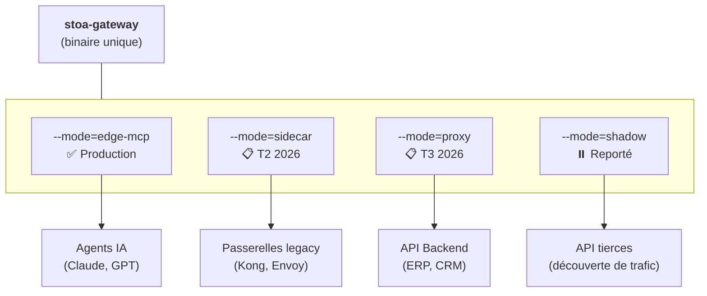
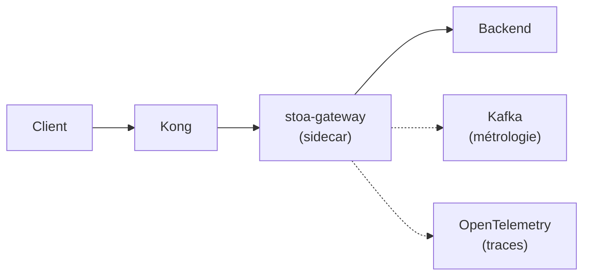

# Passerelle STOA

## Vue d'ensemble

La passerelle STOA est le composant de passerelle API unifiée de la plateforme STOA. Elle fournit une gestion d'API AI-native avec 4 modes de déploiement pour s'adapter à différents cas d'usage.

**Implémentation actuelle** : Python/FastAPI (`mcp-gateway/`)
**Implémentation cible** : Rust/Tokio (`stoa-gateway/`) — T4 2026

Voir [ADR-024](../architecture/adr/adr-024-gateway-unified-modes) pour la décision d'architecture.

## Vision architecturale



## Modes de déploiement {#deployment-modes}

### Mode Edge-MCP (actuel)

**Statut** : ✅ Production

Le mode principal pour l'intégration des agents IA via le Model Context Protocol (MCP).

**Cas d'usage** :
- Intégration Claude Desktop
- Accès d'agents LLM personnalisés aux API d'entreprise
- Workflows d'automatisation pilotés par l'IA

**Fonctionnalités** :
- Transport SSE (Server-Sent Events)
- Gestion des messages JSON-RPC 2.0
- Registre dynamique d'outils à partir de CRD Kubernetes
- Authentification OAuth2/OIDC via Keycloak
- Évaluation de politiques OPA
- Pipeline de métrologie Kafka

**Exemple** :
```bash
# Implémentation Python actuelle
cd mcp-gateway && uvicorn src.main:app --port 3001

# Future implémentation Rust
stoa-gateway --mode=edge-mcp --port=3001
```

**Points d'entrée** :
- `GET /mcp/sse` — Point d'entrée SSE pour Claude Desktop
- `POST /mcp/v1/tools/{name}` — Invocation d'outil
- `GET /mcp/v1/tools` — Lister les outils disponibles

---

### Mode Sidecar (prévu T2 2026)

**Statut** : 📋 Prévu

Déployez STOA derrière des passerelles API existantes pour ajouter observabilité et gouvernance sans remplacer l'infrastructure.

**Cas d'usage** :
- Ajouter les capacités STOA à Kong, Envoy ou Apigee
- Migration progressive depuis les passerelles legacy
- Exigences de conformité entreprise

**Fonctionnalités** :
- Injection d'observabilité (traces OpenTelemetry)
- Événements de métrologie vers Kafka pour la facturation
- Validation de conformité UAC
- Capture de snapshots d'erreurs pour le débogage

**Exemple** :
```bash
stoa-gateway --mode=sidecar \
  --primary-gateway=kong \
  --metering-enabled=true
```

**Architecture** :


---

### Mode Proxy (prévu T3 2026)

**Statut** : 📋 Prévu

Passerelle API classique avec application complète des politiques, pour les déploiements greenfield.

**Cas d'usage** :
- Nouveaux déploiements d'API nécessitant de la gouvernance
- Remplacement complet des passerelles legacy
- Plateformes API multi-tenant

**Fonctionnalités** :
- Évaluation de politiques OPA (bloquante)
- Limitation de débit par tenant/consommateur
- Transformation des requêtes/réponses
- Patterns de circuit breaker
- Terminaison mTLS

**Exemple** :
```bash
stoa-gateway --mode=proxy \
  --upstream=http://backend:8080 \
  --opa-endpoint=http://opa:8181
```

---

### Mode Shadow (reporté) {#shadow-mode}

**Statut** : ⏸️ Reporté en attente de revue sécurité

Observation passive du trafic pour la découverte d'API legacy. Déployez pendant 2 semaines, auto-génération de contrats d'interface.

**Cas d'usage** :
- API legacy sans documentation
- Progiciels black-box (SAP, Oracle, etc.)
- Découverte d'inventaire d'API

**Fonctionnalités** (prévues) :
- Zéro modification des requêtes/réponses
- Capture des patterns de trafic
- Auto-génération de contrats UAC (parsing HTTP, pas de ML)
- Validation humaine avant promotion

**Exemple** :
```bash
stoa-gateway --mode=shadow \
  --target=http://legacy-erp:8080 \
  --output=/var/lib/stoa/uac
```

**Exigences de sécurité** (avant implémentation) :
- Détection/masquage des PII avant stockage
- Opt-in explicite par API/tenant
- Rétention < 30 jours avec purge automatique
- Conformité RGPD Article 25

---

## Configuration

### Variables d'environnement

| Variable | Description | Défaut |
|----------|-------------|--------|
| `GATEWAY_MODE` | Mode de déploiement | `edge-mcp` |
| `GATEWAY_PORT` | Port HTTP | `3001` |
| `KEYCLOAK_URL` | URL de base Keycloak | Requis |
| `KEYCLOAK_REALM` | Realm Keycloak | `stoa` |
| `OPA_ENABLED` | Activer l'évaluation de politiques OPA | `true` |
| `METERING_ENABLED` | Activer la métrologie Kafka | `true` |

### CRD Kubernetes

La passerelle surveille les CRD Tool et ToolSet :

```yaml
apiVersion: gostoa.dev/v1alpha1
kind: Tool
metadata:
  name: my-api-tool
  namespace: tenant-acme
spec:
  displayName: My API Tool
  description: A sample tool
  endpoint: https://api.example.com/v1/action
  method: POST
```

Voir la [Référence des outils MCP](../reference/mcp-tools) pour le schéma complet.

## Actuel vs cible

| Aspect | Actuel (Python) | Cible (Rust) |
|--------|------------------|---------------|
| Répertoire | `mcp-gateway/` | `stoa-gateway/` |
| Langage | Python 3.11 | Rust (Tokio) |
| Framework | FastAPI | Axum/Hyper |
| Statut | Production | T4 2026 |
| Modes | edge-mcp uniquement | Les 4 modes |

## Documentation associée

- [ADR-024 : Architecture unifiée de la passerelle](../architecture/adr/adr-024-gateway-unified-modes)
- [Spécification du protocole MCP](https://modelcontextprotocol.io/)
- [Référence API de la passerelle MCP](../api/mcp-gateway)
- [ADR-021 : Observabilité pilotée par le UAC](../architecture/adr/adr-021-uac-driven-observability)
