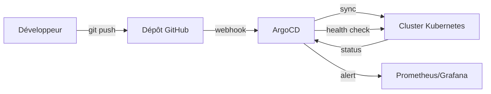
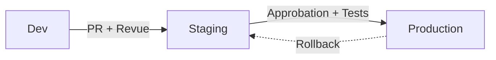
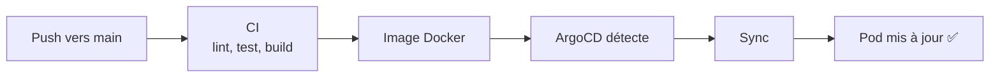

# GitOps avec ArgoCD

Comment STOA exploite GitOps pour une gestion de configuration déclarative et auditable dans plusieurs environnements.

## Philosophie GitOps

STOA adopte les principes GitOps où Git est la source de vérité unique pour toute la configuration de la plateforme :

- **Configuration Déclarative** — L'état souhaité est défini en YAML, pas par des scripts impératifs
- **Git comme Source de Vérité** — Toute configuration stockée, versionnée et auditable dans Git
- **Synchronisation Automatique** — ArgoCD réconcilie en continu l'état réel du cluster avec l'état souhaité
- **Auto-Réparation** — La dérive est détectée automatiquement, l'état du cluster est restauré pour correspondre à Git
- **Piste d'Audit** — Chaque modification possède un commit Git avec auteur, horodatage et justification

## Architecture



STOA utilise ArgoCD pour la gestion des ressources Kubernetes. Chaque composant géré est une `Application` ArgoCD :

| Composant | Application ArgoCD | Politique de sync |
|-----------|-------------------|-------------------|
| STOA Gateway | `stoa-gateway` | Auto-sync + auto-réparation |
| Control Plane API | `control-plane-api` | Auto-sync + auto-réparation |
| Console UI | `control-plane-ui` | Auto-sync + auto-réparation |
| Developer Portal | `stoa-portal` | Auto-sync + auto-réparation |

## Promotion Multi-Environnements (ADR-040)

STOA implémente un modèle « Born GitOps » où les environnements sont des citoyens de première classe, et non une réflexion après coup.

### Trois Environnements

| Environnement | Mode | Couleur | Objectif |
|---------------|------|---------|---------|
| **Développement** | `full` | Vert | Sans restriction — créer, modifier, supprimer |
| **Staging** | `full` | Ambre | Validation pré-production |
| **Production** | `read-only` | Rouge | Verrouillé — modifications via promotion uniquement |

### Flux de Promotion



1. **Développer** en `dev` — accès CRUD complet, itération rapide
2. **Promouvoir** vers `staging` — tests automatisés, validation des intégrations
3. **Approuver** pour `prod` — validation manuelle, le mode lecture seule empêche les modifications directes

### Opérations Limitées par Environnement

La Console UI reflète l'environnement courant avec des indicateurs visuels :

- **Point vert** — Développement (toutes les actions disponibles)
- **Point ambre** — Staging (toutes les actions disponibles)
- **Point rouge + icône cadenas** — Production (lecture seule, pas de création/édition/suppression)

Les requêtes API sont limitées à l'environnement : `GET /v1/apis?environment=staging` retourne uniquement les APIs de staging.

## Exemple d'Application ArgoCD

```yaml
apiVersion: argoproj.io/v1alpha1
kind: Application
metadata:
  name: stoa-gateway
  namespace: argocd
spec:
  project: default
  source:
    repoURL: https://github.com/stoa-platform/stoa
    targetRevision: main
    path: stoa-gateway/k8s
  destination:
    server: https://kubernetes.default.svc
    namespace: stoa-system
  syncPolicy:
    automated:
      prune: true        # Supprimer les ressources retirées de Git
      selfHeal: true     # Annuler les modifications manuelles du cluster
    syncOptions:
      - CreateNamespace=true
```

### Politiques de Sync

| Politique | Effet |
|-----------|-------|
| `automated.prune: true` | Les ressources supprimées de Git sont retirées du cluster |
| `automated.selfHeal: true` | Les modifications manuelles via kubectl sont annulées pour correspondre à Git |
| `syncOptions: CreateNamespace` | Le namespace est créé automatiquement s'il est absent |

## Intégration CI/CD

ArgoCD s'intègre avec le pipeline CI de STOA :



| Étape | Outil | Déclencheur |
|-------|-------|-------------|
| Push de code | GitHub | Fusion par le développeur |
| Pipeline CI | GitHub Actions | Push vers main |
| Build Docker | GitHub Actions | Succès CI |
| Sync ArgoCD | ArgoCD | Changement d'image détecté |
| Vérification santé | ArgoCD | Sonde post-sync |
| Alerting | Prometheus | Santé dégradée |

### Stratégie de Mise à Jour des Images

STOA utilise `imagePullPolicy: Always` avec `kubectl rollout restart` pour déployer de nouvelles images. ArgoCD surveille le déploiement et rapporte le statut de synchronisation.

## Détection de Dérive

ArgoCD compare en permanence l'état réel du cluster avec l'état défini dans Git :

| Statut | Signification | Action |
|--------|--------------|--------|
| **Synced + Healthy** | Le cluster correspond à Git, les pods tournent | Aucune |
| **OutOfSync** | Git a changé, le cluster n'est pas encore mis à jour | La sync automatique applique les modifications |
| **Degraded** | Les pods échouent aux vérifications de santé | Investiguer, rollback potentiel |
| **Unknown** | ArgoCD ne peut pas atteindre l'application | Vérifier l'accès au dépôt |

Lorsque l'auto-réparation est activée, STOA annule automatiquement toute modification manuelle effectuée via `kubectl` — garantissant que Git reste la source de vérité unique.

## Structure du Dépôt de Configuration

```
stoa/
├── stoa-gateway/
│   └── k8s/
│       └── deployment.yaml     # Manifest K8s du Gateway
├── control-plane-ui/
│   └── k8s/
│       └── deployment.yaml     # Manifest de la Console UI
├── portal/
│   └── k8s/
│       └── deployment.yaml     # Manifest du Portal
└── charts/
    └── stoa-platform/
        ├── crds/               # Définitions CRD (Tool, ToolSet)
        ├── templates/          # Templates Helm
        └── values.yaml         # Valeurs par défaut
```

## Bonnes Pratiques

- **Ne jamais modifier manuellement les ressources du cluster** — Toutes les modifications via des PRs Git
- **Utiliser des PRs pour tous les changements** — Revue de code + validation CI avant fusion
- **Séparation des environnements** — Dev pour l'expérimentation, staging pour la validation, prod via promotion
- **Secrets via Infisical** — Ne jamais stocker les secrets dans Git ; utiliser la gestion externe des secrets
- **Surveiller le statut de sync ArgoCD** — Dashboard Grafana avec alertes sync/santé
- **Rollback via Git** — `git revert` le commit problématique, ArgoCD se synchronise automatiquement

## En Savoir Plus

- [Démarrage Rapide](/docs/guides/quickstart) — Premiers pas avec STOA
- [Vue d'ensemble de l'Architecture](/docs/concepts/architecture) — Architecture du système
- [ADR-007 : GitOps avec ArgoCD](/docs/architecture/adr/adr-007-gitops-argocd) — Décision architecturale
- [ADR-040 : Born GitOps](/docs/architecture/adr/adr-040-born-gitops-multi-environment) — Architecture multi-environnements
- [Guide de Déploiement](/docs/deployment/hybrid) — Options de déploiement hybride
