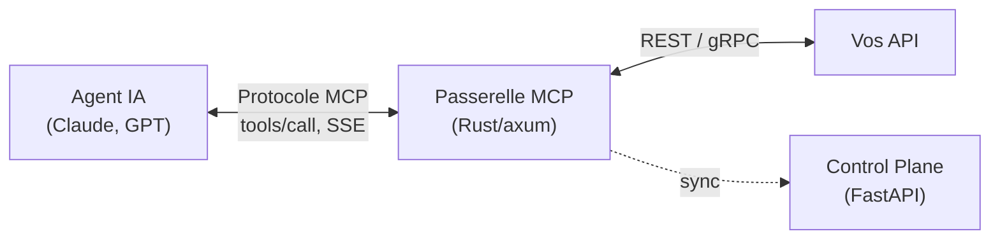
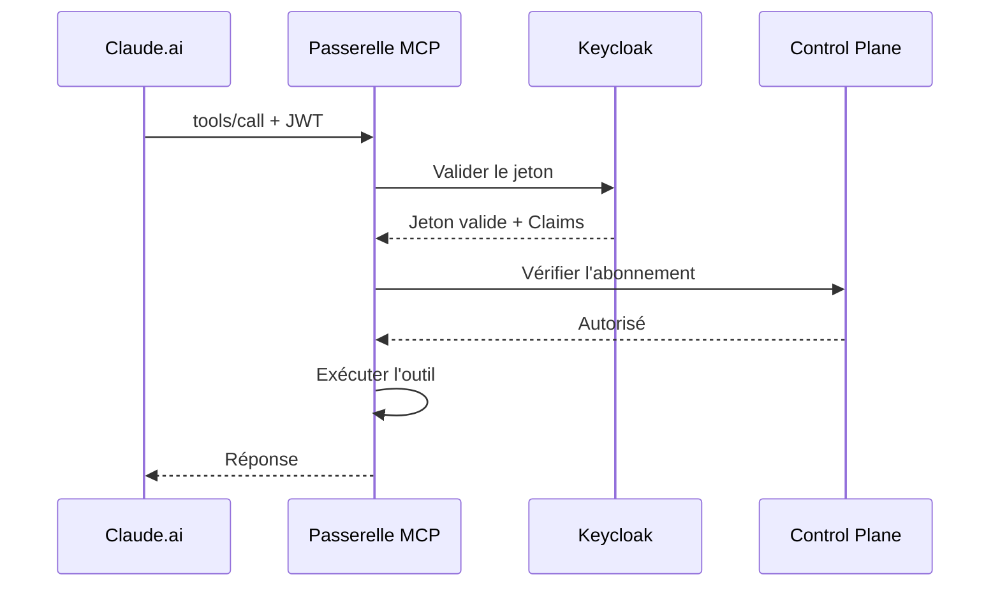

# Passerelle MCP

La passerelle MCP de STOA est une **passerelle API MCP-native dédiée**, permettant aux agents IA comme Claude, GPT et les applications LLM personnalisées de consommer les API d'entreprise de manière sécurisée via le Model Context Protocol.

## Vue d'ensemble

La passerelle MCP fait le pont entre les agents IA et votre écosystème d'API. Elle gère l'authentification, la limitation de débit, la validation des abonnements et l'isolation multi-tenant — tout en parlant le protocole MCP natif.



## Implémentation actuelle

La passerelle MCP est construite avec **Python** et **FastAPI** pour un développement rapide et flexible.

| Aspect | Détails |
|--------|---------|
| Langage | Python 3.12+ |
| Framework | FastAPI (async) |
| Moteur de politiques | OPA (Open Policy Agent) |
| Protocole | MCP 2024-11-05 |

:::info Feuille de route
Une implémentation haute performance en **Rust + Tokio + Hyper** est prévue pour le **T4 2026**, apportant :
- Accélération au niveau noyau via eBPF
- Latence additionnelle inférieure à la milliseconde
- Empreinte mémoire significativement réduite

Consultez notre [Feuille de route](/docs/roadmap) pour plus de détails.
:::

## Fonctionnalités clés

### 🔐 Sécurité entreprise
- **Intégration Keycloak OIDC** avec multi-realm par tenant
- Validation de jetons JWT avec mappage d'audience
- Gestion des clés API avec rotation automatique

### 🏢 Isolation multi-tenant
- Namespace Kubernetes par tenant (`tenant-{name}`)
- Politiques réseau empêchant la communication inter-tenant
- Limitation de débit et quotas par tenant

### 📊 Observabilité complète
- Métriques Prometheus sur le port 9090
- Traçage des requêtes avec identifiants de corrélation
- Analytique d'utilisation par abonnement

### ⚡ Prêt pour la production
- Traitement asynchrone des requêtes avec FastAPI
- Pipeline de métrologie basé sur Kafka/Redpanda
- Pooling de connexions et regroupement de requêtes
- Application des politiques basée sur OPA

## Support du protocole MCP

STOA implémente la [spécification MCP](https://modelcontextprotocol.io/) complète (version `2024-11-05`) avec des extensions entreprise.

### Méthodes supportées

| Méthode | Description |
|---------|-------------|
| `tools/list` | Découvrir les outils disponibles |
| `tools/call` | Invoquer un outil |
| `resources/list` | Lister les ressources disponibles |
| `resources/read` | Lire le contenu d'une ressource |
| `prompts/list` | Lister les prompts disponibles |
| `prompts/get` | Obtenir un modèle de prompt |

### Options de transport

- **HTTP/SSE** : Server-Sent Events pour les réponses en streaming
- **WebSocket** : Communication bidirectionnelle (prévu)

## Flux d'authentification {#authentication-flow}



## Visibilité des outils multi-tenant

Chaque tenant ne voit que les outils auxquels il est autorisé à accéder :

| Tenant | Outils visibles |
|--------|-----------------|
| **Parzival** (High Five) | `stoa_*`, `highfive:*` |
| **Sorrento** (IOI) | `stoa_*`, `ioi:*` |
| **Halliday** (Admin) | Tous les outils (inter-tenant) |

## Configuration

### Variables d'environnement

```bash
# Serveur
MCP_GATEWAY_HOST=0.0.0.0
MCP_GATEWAY_PORT=3001

# Control Plane
CONTROL_PLANE_URL=http://control-plane:8080

# Keycloak
KEYCLOAK_URL=https://auth.<YOUR_DOMAIN>
KEYCLOAK_REALM=stoa

# OPA (pour les politiques)
OPA_URL=http://opa:8181
```

### Déploiement Kubernetes

```yaml
apiVersion: apps/v1
kind: Deployment
metadata:
  name: mcp-gateway
  namespace: stoa-system
spec:
  replicas: 3
  template:
    spec:
      containers:
        - name: mcp-gateway
          image: stoaplatform/mcp-gateway:latest
          ports:
            - containerPort: 3001
          resources:
            requests:
              cpu: 500m
              memory: 512Mi
            limits:
              cpu: 2000m
              memory: 2Gi
```

## Intégration avec Claude.ai

La passerelle MCP de STOA s'intègre directement avec Claude.ai via le connecteur MCP :

1. **Configurer le serveur MCP** dans les paramètres de Claude.ai
2. **S'authentifier** avec votre clé API STOA
3. **Découvrir les outils** automatiquement via `tools/list`
4. **Invoquer les outils** à travers une conversation naturelle

### Exemple d'invocation d'outil

```json
{
  "method": "tools/call",
  "params": {
    "name": "stoa_catalog",
    "arguments": {
      "action": "list",
      "status": "active"
    }
  }
}
```

## Métriques et monitoring

### Métriques Prometheus

| Métrique | Type | Description |
|----------|------|-------------|
| `mcp_requests_total` | Counter | Total des requêtes MCP |
| `mcp_request_duration_seconds` | Histogram | Latence des requêtes |
| `mcp_tool_invocations_total` | Counter | Invocations d'outils par nom |
| `mcp_errors_total` | Counter | Erreurs par type |

### Tableau de bord Grafana

Tableaux de bord pré-configurés disponibles pour :
- Débit et latence des requêtes
- Patterns d'invocation des outils
- Taux d'erreur par tenant
- Événements de limitation de débit

## Étapes suivantes

- [Guide de démarrage rapide](/docs/guides/quickstart) - Commencer avec STOA
- [Référence API](/docs/api/mcp-gateway) - Points d'entrée de la passerelle MCP
- [Guide d'authentification](/docs/guides/authentication) - Configurer l'authentification
