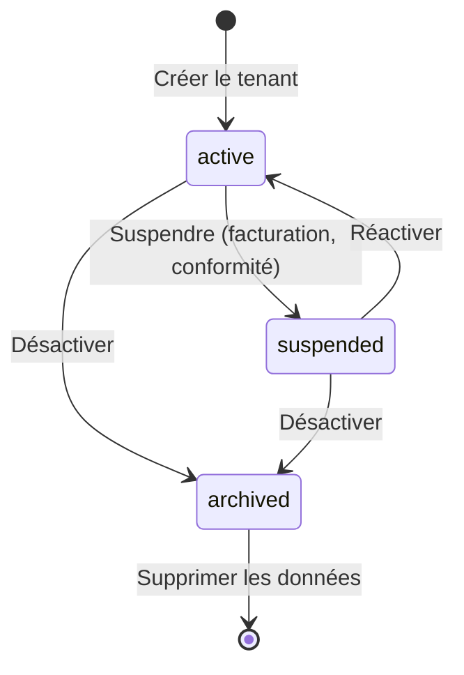

# Isolation multi-tenant

STOA implémente un modèle de **multi-tenancy strict** où chaque tenant est entièrement isolé au niveau de l'infrastructure, de l'identité, des données et du réseau. Cela permet à un seul déploiement STOA de servir plusieurs organisations sans fuite de données inter-tenant.

## Modèle de données du tenant

Chaque tenant dans STOA possède les propriétés suivantes :

| Champ | Type | Description |
|-------|------|-------------|
| `id` | string | Identifiant slug (ex. `oasis`, `acme-corp`) — immuable |
| `name` | string | Nom d'affichage (ex. « OASIS Gunters ») |
| `description` | string | Description optionnelle |
| `status` | enum | `active`, `suspended`, `archived` |
| `settings` | JSON | Quotas, feature flags, configuration personnalisée |
| `created_at` | timestamp | Date de création |

### Cycle de vie du statut du tenant



- **Active** — Accès complet à toutes les fonctionnalités de la plateforme
- **Suspended** — Accès en lecture seule, pas d'appels API, pas de déploiements. Utilisé pour les problèmes de facturation ou les blocages de conformité.
- **Archived** — Données conservées pour l'audit, aucun accès. En attente de suppression selon la politique de rétention.

## Cinq couches d'isolation {#five-isolation-layers}

### 1. Isolation par namespace Kubernetes

Chaque tenant opère dans un namespace dédié avec des labels pour l'application des politiques :

```yaml
apiVersion: v1
kind: Namespace
metadata:
  name: tenant-acme
  labels:
    stoa.io/tenant-id: acme
    stoa.io/tier: enterprise
    pod-security.kubernetes.io/enforce: restricted
```

Les quotas de ressources empêchent un tenant unique de consommer les ressources du cluster :

```yaml
apiVersion: v1
kind: ResourceQuota
metadata:
  name: tenant-quota
  namespace: tenant-acme
spec:
  hard:
    requests.cpu: "10"
    requests.memory: 20Gi
    persistentvolumeclaims: "5"
    services.loadbalancers: "2"
```

### 2. Isolation réseau

Les politiques réseau empêchent la communication inter-tenant au niveau du CNI :

```yaml
apiVersion: networking.k8s.io/v1
kind: NetworkPolicy
metadata:
  name: tenant-isolation
  namespace: tenant-acme
spec:
  podSelector: {}
  policyTypes: [Ingress, Egress]
  ingress:
    - from:
      - namespaceSelector:
          matchLabels:
            stoa.io/tenant-id: acme
  egress:
    - to:
      - namespaceSelector:
          matchLabels:
            stoa.io/tenant-id: acme
    - to:
      - namespaceSelector:
          matchLabels:
            kubernetes.io/metadata.name: stoa-system
```

Les tenants peuvent communiquer avec leur propre namespace et le namespace partagé `stoa-system` (pour l'API Control Plane et la passerelle), mais jamais avec d'autres tenants.

### 3. Isolation au niveau de la passerelle

La passerelle STOA applique les limites des tenants au niveau de la couche API :

- **Routage par tenant** — Chaque API est scopée à un identifiant de tenant
- **Limites de débit séparées** — Application des quotas par tenant
- **Politiques indépendantes** — Les politiques OPA évaluent le contexte du tenant
- **Certificats spécifiques au tenant** — Certificats mTLS scopés par tenant

Dans les déploiements multi-passerelle, chaque adapter de passerelle (Kong, Gravitee, webMethods, STOA) maintient l'isolation des tenants via ses mécanismes natifs.

### 4. Isolation de l'authentification

L'architecture multi-realm de Keycloak fournit l'isolation des identités :

- **Un realm par tenant** — Magasins d'utilisateurs isolés, identifiants séparés
- **Configurations clients isolées** — Chaque tenant a ses propres clients OIDC
- **Validation de jetons indépendante** — Les jetons d'un realm sont invalides dans un autre
- **Rôles scopés au tenant** — `tenant-admin` ne peut gérer que son propre tenant

### 5. Isolation des données

- **Schéma par tenant** — Schémas de base de données isolés par tenant
- **Chiffrement au repos** — Toutes les données tenant chiffrées (AES-256)
- **Politiques de sauvegarde séparées** — Planifications de sauvegarde par tenant
- **Journalisation d'audit** — Chaque accès aux données journalisé avec le contexte du tenant

## RBAC et scope par tenant {#rbac-and-tenant-scoping}

Le modèle RBAC de STOA combine des rôles à l'échelle de la plateforme et des rôles scopés par tenant :

| Rôle | Scope | Permissions |
|------|-------|-------------|
| `cpi-admin` | **Plateforme** | Accès complet à tous les tenants, toutes les opérations |
| `tenant-admin` | **Tenant** | Accès complet à son propre tenant uniquement |
| `devops` | **Tenant** | Déployer et promouvoir au sein de son propre tenant |
| `viewer` | **Tenant** | Accès en lecture seule à son propre tenant |

Comportements clés :
- Un `tenant-admin` pour le tenant `acme` **ne peut pas** voir les ressources du tenant `globex`
- Un `viewer` peut parcourir les API et outils mais ne peut pas invoquer, créer ou modifier
- Un `cpi-admin` voit tous les tenants et peut effectuer des opérations inter-tenant
- Le mode d'environnement (dev/staging/prod) restreint davantage les opérations — la production est en lecture seule par défaut

## Paramètres du tenant {#tenant-settings}

Le champ JSON `settings` sur chaque tenant permet une configuration par tenant :

```json
{
  "quotas": {
    "max_apis": 50,
    "max_subscriptions": 200,
    "max_rate_limit": 10000
  },
  "features": {
    "mcp_enabled": true,
    "shadow_mode": false,
    "advanced_analytics": true
  },
  "notifications": {
    "webhook_url": "https://hooks.acme.com/stoa",
    "email_alerts": true
  }
}
```

## Niveaux de tenant {#tenant-tiers}

| Niveau | Ressources | Fonctionnalités | SLA |
|--------|-----------|-----------------|-----|
| **Community** | Limitées | API de base, MCP basique | Best effort |
| **Starter** | Modérées | API + outils MCP, portail | 99% |
| **Business** | Élevées | Plateforme complète, multi-passerelle | Sur accord |
| **Enterprise** | Personnalisées | White-label, support dédié | SLA personnalisé |

## Observabilité par tenant {#per-tenant-observability}

Chaque métrique dans STOA est labellisée avec l'identifiant du tenant, permettant des tableaux de bord par tenant :

- **Taux de requêtes API** — `stoa_api_requests_total{tenant="acme"}`
- **Taux d'erreur** — `stoa_api_errors_total{tenant="acme"}`
- **Percentiles de latence** — `stoa_api_duration_seconds{tenant="acme"}`
- **Utilisation des ressources** — CPU, mémoire, stockage par namespace
- **Attribution des coûts** — Consommation de ressources par tenant pour la facturation

Les tableaux de bord Grafana peuvent être filtrés par tenant pour les tenant-admins, ou visualisés à travers tous les tenants pour les administrateurs plateforme.

## Liens connexes

- [Vue d'ensemble de l'architecture](/docs/concepts/architecture) — Architecture du système
- [Passerelle MCP](/docs/concepts/mcp-gateway) — Concepts de la passerelle
- [Guide des abonnements](/docs/guides/subscriptions) — Gestion des abonnements API
- [ADR-022 : Architecture tenant UAC](/docs/architecture/adr/adr-022-uac-tenant-architecture) — Décision d'architecture
