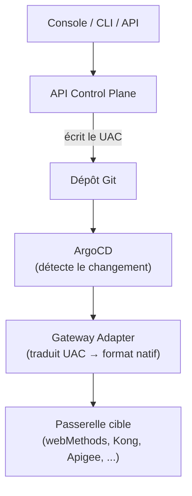

# Universal API Contract (UAC)

Le Universal API Contract (UAC) est le **format de définition d'API agnostique** de STOA. Il normalise les spécifications d'API dans un modèle commun qui peut être réconcilié vers n'importe quelle passerelle supportée.

## Pourquoi le UAC ?

Les différentes passerelles API utilisent des formats de configuration différents :

- webMethods utilise sa propre API REST avec des modèles de ressources spécifiques
- Kong utilise du YAML déclaratif avec des services, routes et plugins
- Apigee utilise des API proxies avec des endpoints proxy et des endpoints cibles

Le UAC fournit une définition unique que STOA traduit dans le format natif de chaque passerelle via le pattern [Gateway Adapter](../guides/console#adaptateurs-de-gateway).

## Structure du UAC {#uac-structure}

Une définition UAC capture tout ce qui est nécessaire pour déployer une API :

```yaml
apiName: petstore
apiVersion: 1.0.0
tenant: acme
displayName: Petstore API
description: Manage pets in the store

# Spécification API
spec:
  format: openapi3
  url: https://api.example.com/v1/openapi.json

# Point d'entrée backend
endpoint:
  url: https://backend.acme.internal/pets
  method: REST
  timeout: 30s

# Contrôle d'accès
auth:
  type: oauth2
  scopes:
    - read:pets
    - write:pets

# Politiques
policies:
  - type: rate_limit
    config:
      requests_per_minute: 600
  - type: cors
    config:
      allowed_origins: ["https://app.acme.com"]
  - type: logging
    config:
      level: info

# Visibilité portail
portal:
  visible: true
  categories: ["pets", "demo"]
```

## Le UAC dans le flux GitOps {#uac-in-the-gitops-flow}

Le UAC est l'artefact qui circule dans le pipeline GitOps :



## Composants du UAC {#uac-components}

### Identité API

| Champ | Requis | Description |
|-------|--------|-------------|
| `apiName` | Oui | Identifiant unique de l'API au sein du tenant |
| `apiVersion` | Oui | Chaîne de version sémantique |
| `tenant` | Oui | ID du tenant propriétaire |
| `displayName` | Non | Nom lisible par un humain |
| `description` | Non | Description de l'API |

### Point d'entrée (Endpoint)

| Champ | Requis | Description |
|-------|--------|-------------|
| `url` | Oui | URL du service backend |
| `method` | Non | Protocole (REST, GraphQL, gRPC) |
| `timeout` | Non | Timeout de requête |

### Politiques

Les politiques sont appliquées dans l'ordre et traduites en plugins/handlers natifs de la passerelle :

| Type de politique | Description |
|-------------------|-------------|
| `rate_limit` | Limitation de débit par consommateur |
| `cors` | Règles de partage de ressources cross-origin |
| `jwt` | Validation JWT et extraction de claims |
| `ip_filter` | Liste d'autorisation/blocage d'IP |
| `logging` | Niveau de journalisation des requêtes/réponses |
| `transform` | Règles de transformation des en-têtes/corps |

### Configuration d'authentification

| Type d'auth | Description |
|-------------|-------------|
| `oauth2` | OAuth 2.0 avec scopes |
| `api_key` | Clé API dans l'en-tête ou les paramètres |
| `basic` | Authentification HTTP Basic |
| `none` | API publique (sans auth) |

## Traduction par le Gateway Adapter {#gateway-adapter-translation}

Chaque Gateway Adapter implémente la traduction du UAC vers le format natif :

```python
class GatewayAdapterInterface:
    def sync_api(self, api_spec: dict, tenant_id: str) -> AdapterResult:
        """Traduit le UAC et synchronise vers la passerelle cible."""

    def upsert_policy(self, policy_spec: dict) -> AdapterResult:
        """Traduit et applique la politique."""

    def provision_application(self, app_spec: dict) -> AdapterResult:
        """Provisionne l'accès consommateur."""
```

L'adapter garantit des opérations **idempotentes** — synchroniser le même UAC deux fois produit des résultats identiques sur la passerelle.

## Mode Shadow (futur) {#shadow-mode-future}

Dans le mode **shadow** prévu, STOA pourra auto-générer des définitions UAC en capturant passivement le trafic API. Cela permet l'onboarding d'API existantes sans spécification manuelle :

1. Déployer la passerelle STOA en mode shadow à côté du trafic existant
2. Capturer les patterns requête/réponse
3. Auto-générer le UAC avec des schémas et politiques inférés
4. Réviser et publier via la Console
