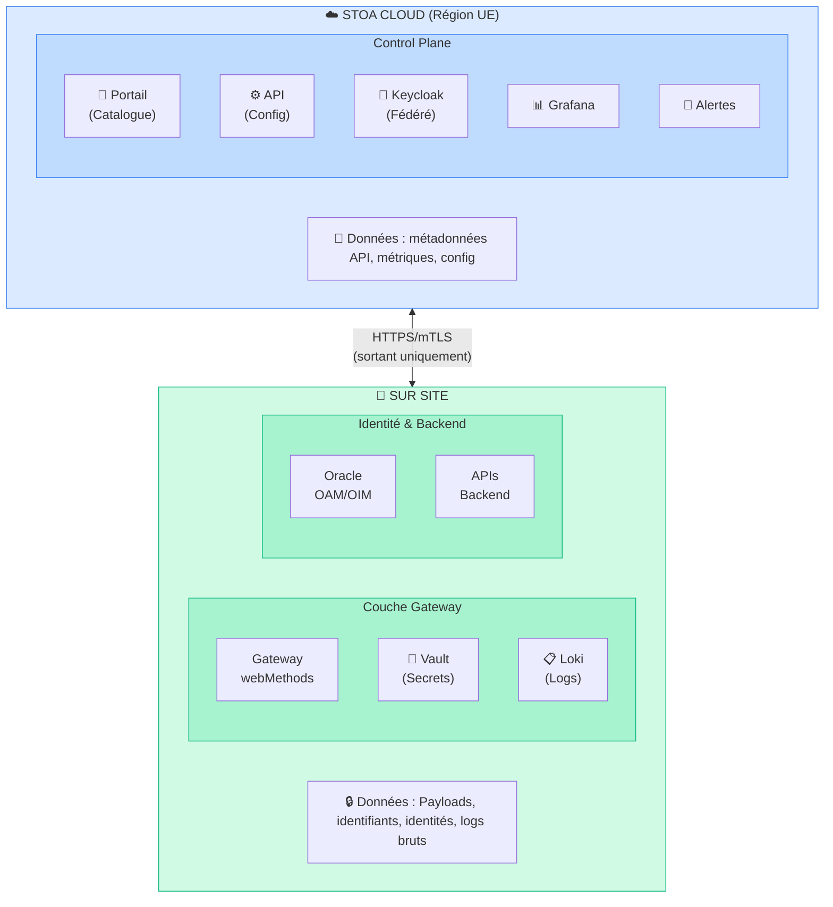
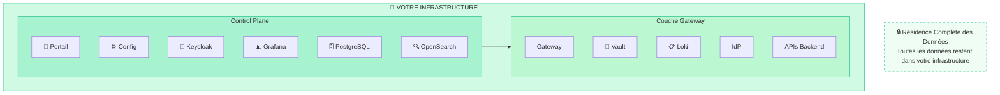
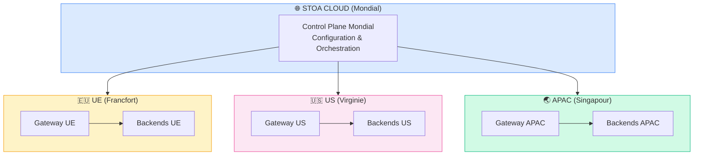
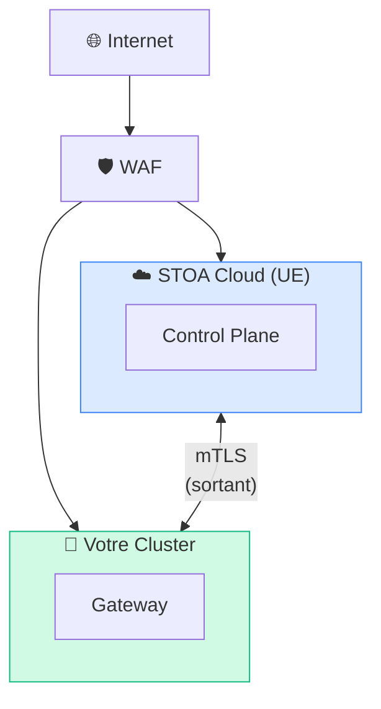

# Déploiement Hybride

La Plateforme STOA supporte plusieurs modèles de déploiement pour répondre à vos exigences de sécurité, de souveraineté et d'exploitation.

## Modèles de Déploiement

| Modèle | Control Plane | Gateway | Résidence des Données | Idéal Pour |
|--------|---------------|---------|----------------------|------------|
| **Hybride** | STOA Cloud (UE) | Sur site | Données métier sur site | La plupart des entreprises |
| **Entièrement Sur Site** | Votre infrastructure | Votre infrastructure | 100% sur site | Souveraineté maximale |
| **Multi-Cloud** | STOA Cloud | Plusieurs régions | Distribué | Organisations mondiales |

---

## Modèle 1 : Hybride (Recommandé)

**Control Plane Cloud + Gateway Sur Site**

Le modèle de déploiement par défaut équilibre la facilité de gestion avec la souveraineté des données.



### Ce Qui Reste Sur Site

| Type de Données | Description | Chiffrement |
|-----------------|-------------|-------------|
| **Payloads API** | Corps des requêtes/réponses | TLS en transit |
| **Identifiants** | Clés API, tokens, certificats | AES-256 au repos (Vault) |
| **Identités Utilisateurs** | Annuaire Oracle OAM/OIM | Contrôles existants |
| **Logs Bruts** | Détails complets des transactions | Contrôlés par le client |
| **Secrets** | Données HashiCorp Vault | AES-256-GCM |

### Ce Qui Va dans le Cloud

| Type de Données | Description | Sensibilité |
|-----------------|-------------|-------------|
| **Métadonnées API** | Noms, descriptions, specs OpenAPI | Faible |
| **Métriques Agrégées** | Compteurs de requêtes, latences, erreurs | Faible |
| **Configuration** | Règles de routage, politiques | Faible |
| **Tokens Fédérés** | Courte durée de vie, sans identifiants | Faible |

### Exigences Réseau

| Direction | Protocole | Ports | Objectif |
|-----------|----------|-------|---------|
| **Sur site → Cloud** | HTTPS | 443 | Sync config, envoi métriques |
| **Cloud → Sur site** | Aucun | — | Aucune connexion entrante requise |

**Avantage sécurité clé :** Aucune connexion entrante requise. Toute communication est initiée depuis votre infrastructure.

### Prérequis

- Cluster Kubernetes 1.28+ sur site
- HTTPS sortant vers les endpoints STOA Cloud
- Résolution DNS pour les services STOA
- Fournisseur d'identité existant (OAM, Okta, Azure AD)

---

## Modèle 2 : Entièrement Sur Site

**Souveraineté Maximale**

Pour les organisations nécessitant un contrôle total sur tous les composants.



### Quand Choisir l'Option Entièrement Sur Site

- Exigence réglementaire de résidence des données à 100%
- Environnements air-gappés
- Secteur gouvernemental ou défense
- Exigences de conformité extrêmes (régulateurs bancaires)

### Exigences Supplémentaires

| Composant | Exigence Sur Site |
|-----------|------------------|
| **Kubernetes** | Cluster de production (3+ nœuds) |
| **PostgreSQL** | Configuration HA (primaire + réplica) |
| **OpenSearch** | Cluster pour logs et recherche |
| **Stockage Objet** | Compatible S3 (MinIO) |
| **Certificats TLS** | PKI ou Let's Encrypt |

### Compromis

| Aspect | Hybride | Entièrement Sur Site |
|--------|---------|----------------------|
| Complexité opérationnelle | Faible | Élevée |
| Mises à jour | Automatiques | Manuelles |
| Support | Complet | Self-service limité |
| Résidence des données | Métadonnées dans le cloud | 100% sur site |
| Configuration initiale | 1-2 jours | 1-2 semaines |

---

## Modèle 3 : Multi-Cloud (Futur)

**Distribution Mondiale**

Pour les organisations nécessitant une présence dans plusieurs régions ou clouds.



### Capacités Prévues

- Équilibrage de charge géographique
- Résidence des données par région
- Basculement inter-régions
- Tableau de bord mondial unifié

**Statut :** Feuille de route T4 2026

---

## Récapitulatif des Flux de Données

### Matrice de Données du Modèle Hybride

| Données | Direction | Chiffrement | Fréquence |
|---------|-----------|-------------|-----------|
| Config | Cloud → Sur site | mTLS | À chaque changement |
| Métriques (agrégées) | Sur site → Cloud | TLS | Toutes les 15s |
| Alertes | Cloud → Équipe Ops | TLS | Au déclenchement |
| Tokens (fédérés) | Cloud ↔ Sur site | TLS | Par requête |
| Payloads | Conçus pour rester sur site | N/A | N/A |
| Identifiants | Conçus pour rester sur site | N/A | N/A |

### Schéma Réseau



---

## Démarrage

### Démarrage Rapide Hybride

:::info Bêta Privée
L'accès au dépôt est accordé aux participants bêta. [Demandez l'accès](mailto:christophe@hlfh.io) pour obtenir le chart Helm et les instructions de déploiement.
:::

```bash
# 1. Créer le namespace
kubectl create namespace stoa-system

# 2. Ajouter le dépôt Helm STOA (fourni avec l'accès bêta)
helm repo add stoa https://charts.gostoa.dev
helm repo update

# 3. Installer avec la configuration hybride
helm install stoa stoa/stoa-platform \
  --namespace stoa-system \
  --set mode=hybrid \
  --set controlPlane.endpoint=https://api.<YOUR_DOMAIN> \
  --set controlPlane.tenantId=YOUR_TENANT_ID

# 4. Vérifier l'installation
kubectl get pods -n stoa-system
```

### Démarrage Rapide Entièrement Sur Site

```bash
# 1. Installer les prérequis
helm install postgresql bitnami/postgresql -n stoa-system
helm install opensearch opensearch/opensearch -n stoa-system
helm install vault hashicorp/vault -n stoa-system

# 2. Installer la stack complète STOA
helm install stoa stoa/stoa-full \
  --namespace stoa-system \
  --set mode=on-premises \
  --values your-values.yaml
```

---

## Étapes Suivantes

- [Sécurité & Conformité](/docs/enterprise/security-compliance) — Détails sur la résidence des données
- [Guides de Migration](/docs/guides/migration) — Migrer depuis des plateformes existantes
- [Architecture Globale](/docs/concepts/architecture) — Approfondissement des composants

---

*Besoin d'aide pour choisir le bon modèle de déploiement ? [Contactez-nous](mailto:contact@gostoa.dev) pour une consultation d'architecture.*
