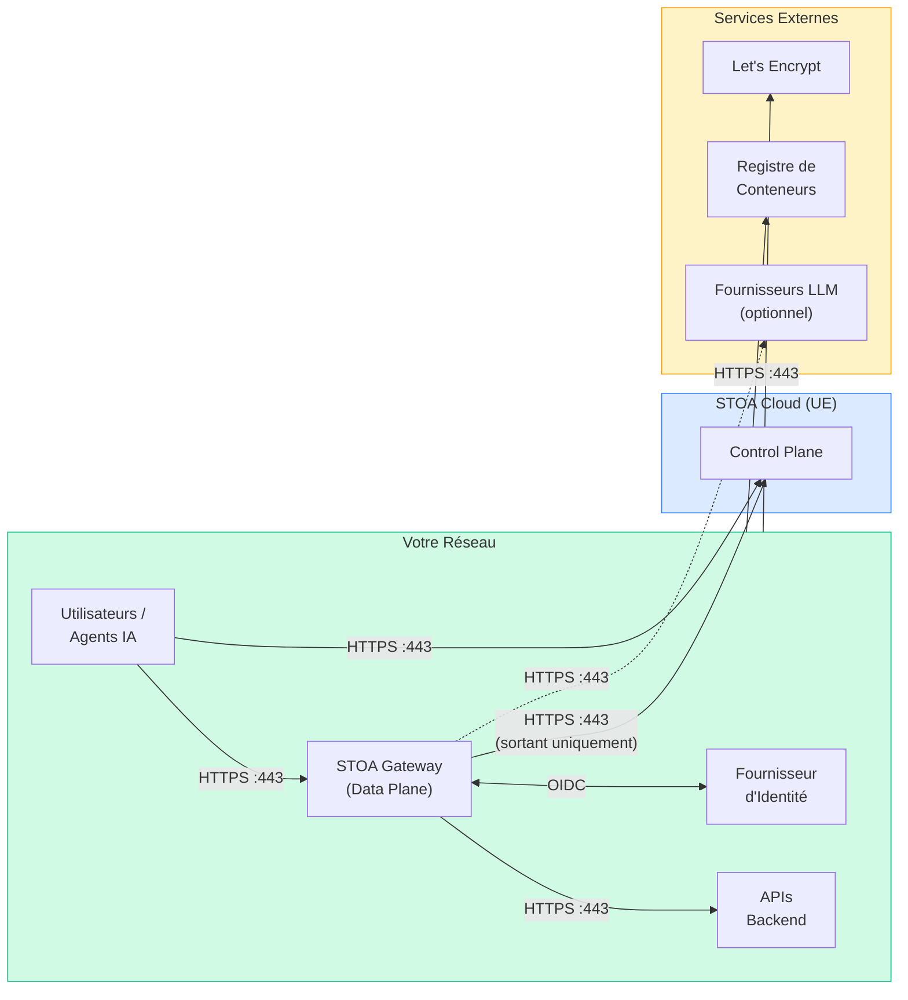

# Prérequis de Déploiement

Ce document fournit la liste complète des exigences d'infrastructure, de réseau et d'authentification pour déployer la Plateforme STOA. **Partagez-le avec vos équipes IT, réseau et sécurité** avant le déploiement.

:::tip Quel modèle de déploiement ?
Consultez [Déploiement Hybride](/docs/deployment/hybrid) pour choisir entre les modèles Hybride, Entièrement Sur Site ou Multi-Cloud. Cette page couvre les prérequis techniques pour tous les modèles.
:::

---

## 1. Exigences d'Infrastructure

### Cluster Kubernetes

| Exigence | Minimum | Recommandé |
|----------|---------|-----------|
| **Version Kubernetes** | 1.28+ | 1.30+ |
| **Nœuds workers** | 2 | 3+ |
| **CPU par nœud** | 4 vCPU | 8 vCPU |
| **RAM par nœud** | 8 Go | 16 Go |
| **Disque par nœud** | 40 Go SSD | 100 Go NVMe |
| **Runtime de conteneur** | containerd 1.7+ | containerd 1.7+ |
| **Contrôleur Ingress** | Quelconque (nginx, Traefik, Envoy) | nginx-ingress |
| **cert-manager** | v1.12+ | v1.14+ |
| **Helm** | v3.12+ | v3.14+ |

**Distributions supportées :** EKS, GKE, AKS, OVH MKS, K3s, RKE2, OpenShift 4.12+.

### Budget de Ressources par Composant

| Composant | Réplicas | CPU Request | CPU Limit | RAM Request | RAM Limit | Disque |
|-----------|----------|-------------|-----------|-------------|-----------|--------|
| **Control Plane API** | 2 | 250m | 1000m | 256Mi | 1Gi | — |
| **Console UI** | 1 | 100m | 500m | 128Mi | 256Mi | — |
| **Developer Portal** | 1 | 100m | 500m | 128Mi | 256Mi | — |
| **Stoa Gateway** | 2 | 250m | 1000m | 128Mi | 512Mi | — |
| **Keycloak** | 1 | 500m | 2000m | 512Mi | 2Gi | — |
| **PostgreSQL** | 1 (HA : 2) | 250m | 1000m | 512Mi | 2Gi | 20Gi PVC |
| **Total (minimum)** | **8 pods** | **1,8 CPU** | **7 CPU** | **2 Go** | **6,5 Go** | **20 Go** |

### Dépendances Externes (Entièrement Sur Site uniquement)

Ces composants ne sont requis que pour le modèle Entièrement Sur Site. En mode Hybride, STOA Cloud les fournit.

| Composant | Version | Objectif | Alternative |
|-----------|---------|---------|-------------|
| **PostgreSQL** | 16+ | Base de données Control Plane | Tout PG géré (RDS, Cloud SQL, Azure DB) |
| **Redis** | 7+ | Cache gateway (optionnel) | — |
| **OpenSearch** | 2.11+ | Logs et recherche (optionnel) | Elasticsearch 8.x |

---

## 2. Matrice des Flux Réseau

### Vue d'Ensemble



### Matrice Détaillée des Ports

#### Flux Entrants (vers votre cluster)

| Source | Destination | Port | Protocole | Objectif | Requis ? |
|--------|-------------|------|----------|---------|---------|
| Utilisateurs / Navigateurs | Contrôleur Ingress | **443** | HTTPS/TLS | Accès Console, Portal, API | Oui |
| Utilisateurs / Navigateurs | Contrôleur Ingress | **80** | HTTP | Redirection vers HTTPS | Recommandé |
| Agents IA (Claude, GPT, etc.) | Contrôleur Ingress | **443** | HTTPS/TLS | Gateway MCP (découverte + appels d'outils) | Oui |
| Agents IA | Contrôleur Ingress | **443** | HTTPS/TLS | Découverte OAuth 2.1 + échange de tokens | Oui |
| Monitoring (Uptime Kuma, etc.) | Contrôleur Ingress | **443** | HTTPS/TLS | Endpoints de vérification de santé | Recommandé |

#### Flux Sortants (depuis votre cluster)

| Source | Destination | Port | Protocole | Objectif | Requis ? |
|--------|-------------|------|----------|---------|---------|
| Pods gateway | APIs backend | **variable** | HTTP/HTTPS | Routage du trafic API | Oui |
| Pods gateway | Fournisseur d'identité | **443** | HTTPS | Validation de token OIDC (JWKS) | Oui |
| Pods gateway | API STOA Cloud | **443** | HTTPS | Sync config, envoi métriques (Hybride uniquement) | Hybride uniquement |
| Control Plane API | Fournisseur d'identité | **443** | HTTPS | Fédération utilisateur, introspection de token | Oui |
| Control Plane API | PostgreSQL | **5432** | TCP/TLS | Requêtes base de données | Oui |
| Nœuds K8s | Registre de conteneurs | **443** | HTTPS | Pull des images (GHCR) | Oui |
| cert-manager | Let's Encrypt | **443** | HTTPS | Émission de certificats TLS (ACME) | Si LE utilisé |
| Pods gateway | APIs Fournisseur LLM | **443** | HTTPS | Routage IA (si fonctionnalités LLM activées) | Optionnel |

#### Flux Internes (au sein de votre cluster)

| Source | Destination | Port | Protocole | Objectif |
|--------|-------------|------|----------|---------|
| Contrôleur Ingress | Pods Console UI | **8080** | HTTP | Serving frontend |
| Contrôleur Ingress | Pods Portal | **8080** | HTTP | Serving portal |
| Contrôleur Ingress | Pods Control Plane API | **8000** | HTTP | API REST |
| Contrôleur Ingress | Pods gateway | **8080** | HTTP | Trafic MCP + proxy |
| Contrôleur Ingress | Pods Keycloak | **8080** | HTTP | UI Auth + endpoints OIDC |
| Control Plane API | Keycloak | **8080** | HTTP | Validation de token, sync utilisateurs |
| Control Plane API | PostgreSQL | **5432** | TCP | Base de données |
| Gateway | Control Plane API | **8000** | HTTP | Chargement config, registre d'outils |
| Gateway | Keycloak | **8080** | HTTP | Endpoint JWKS, introspection de token |
| Keycloak | PostgreSQL | **5432** | TCP | Base de données Auth |

### Résumé des Règles Pare-feu

À fournir à votre équipe réseau :

```
# ENTRANT (vers le cluster K8s)
ALLOW  TCP/443   FROM 0.0.0.0/0     TO <INGRESS_LB_IP>    # Trafic HTTPS
ALLOW  TCP/80    FROM 0.0.0.0/0     TO <INGRESS_LB_IP>    # Redirection HTTP→HTTPS

# SORTANT (depuis le cluster K8s)
ALLOW  TCP/443   TO ghcr.io                                # Images de conteneurs
ALLOW  TCP/443   TO acme-v02.api.letsencrypt.org           # Certificats TLS (si LE)
ALLOW  TCP/443   TO <VOTRE_DOMAINE_IDP>                    # OIDC (Keycloak, Okta, Azure AD)
ALLOW  TCP/5432  TO <VOTRE_HOST_PG>                        # PostgreSQL (si externe)
ALLOW  TCP/443   TO api.gostoa.dev                         # STOA Cloud (Hybride uniquement)

# SORTANT OPTIONNEL
ALLOW  TCP/443   TO api.anthropic.com                      # Routage LLM (si activé)
ALLOW  TCP/443   TO api.openai.com                         # Routage LLM (si activé)
```

---

## 3. Exigences DNS

### Sous-domaines

STOA nécessite **5 sous-domaines** pointant vers l'IP externe ou le load balancer de votre contrôleur Ingress.

| Sous-domaine | Service | Objectif |
|--------------|---------|---------|
| `console.<YOUR_DOMAIN>` | Console UI | Tableau de bord administrateur |
| `portal.<YOUR_DOMAIN>` | Developer Portal | Catalogue API, abonnements |
| `api.<YOUR_DOMAIN>` | Control Plane API | API REST + opérations admin |
| `mcp.<YOUR_DOMAIN>` | Stoa Gateway | Protocole MCP, accès agents IA, proxy API |
| `auth.<YOUR_DOMAIN>` | Keycloak | SSO, fournisseur OIDC |

**Sous-domaines optionnels :**

| Sous-domaine | Service | Quand Nécessaire |
|--------------|---------|-----------------|
| `grafana.<YOUR_DOMAIN>` | Grafana | Si déploiement de la stack d'observabilité |
| `vault.<YOUR_DOMAIN>` | Vault/Infisical | Si déploiement du gestionnaire de secrets |

### Configuration DNS

```
# Tous les sous-domaines pointent vers la même IP LB Ingress
console.<YOUR_DOMAIN>    A    <INGRESS_LB_IP>
portal.<YOUR_DOMAIN>     A    <INGRESS_LB_IP>
api.<YOUR_DOMAIN>        A    <INGRESS_LB_IP>
mcp.<YOUR_DOMAIN>        A    <INGRESS_LB_IP>
auth.<YOUR_DOMAIN>       A    <INGRESS_LB_IP>
```

Les **certificats TLS** sont gérés par cert-manager (ClusterIssuer avec Let's Encrypt ou votre CA interne). Aucune gestion manuelle de certificats n'est requise.

---

## 4. Exigences d'Authentification

### Fournisseur d'Identité (IdP)

STOA utilise **Keycloak** comme courtier d'identité. Keycloak peut fédérer avec votre IdP existant.

| Type d'IdP | Intégration | Protocole | Ce que vous fournissez |
|------------|-------------|----------|----------------------|
| **Keycloak (inclus)** | Inclus dans le chart Helm | OIDC | Rien — prêt à l'emploi |
| **Azure AD / Entra ID** | Courtier d'identité Keycloak | OIDC/SAML | ID tenant, Client ID, Client Secret |
| **Okta** | Courtier d'identité Keycloak | OIDC | URL Issuer, Client ID, Client Secret |
| **Oracle OAM** | Courtier d'identité Keycloak | SAML 2.0 | XML de métadonnées, Entity ID |
| **LDAP/Active Directory** | Fédération d'utilisateurs Keycloak | LDAP | URL de connexion, Bind DN, Search Base |
| **Tout fournisseur OIDC** | Courtier d'identité Keycloak | OIDC | Issuer, Client ID, Secret |

### Rôles RBAC

STOA est livré avec 4 rôles prédéfinis. Mappez-les vers les groupes de votre IdP :

| Rôle STOA | Permissions | Mapping Typique |
|-----------|-------------|-----------------|
| `cpi-admin` | Administration complète de la plateforme | Groupe Admin IT |
| `tenant-admin` | Gérer son propre tenant (APIs, apps, utilisateurs) | Responsable Équipe API |
| `devops` | Déployer et promouvoir des APIs | Équipe DevOps / SRE |
| `viewer` | Accès en lecture seule | Auditeurs, parties prenantes |

### MCP OAuth 2.1 (Accès des Agents IA)

Les agents IA (Claude, GPT, personnalisés) s'authentifient via **OAuth 2.1 avec PKCE** :

| Exigence | Détail |
|----------|--------|
| **Protocole** | OAuth 2.1 (découverte RFC 9728 + métadonnées RFC 8414) |
| **Type de grant** | Authorization Code avec PKCE (S256) |
| **Type de client** | Public (sans client_secret) |
| **Enregistrement** | Dynamic Client Registration (DCR) — automatique |
| **Scopes** | `stoa:read`, `stoa:write`, `stoa:admin` |

Aucune configuration manuelle n'est nécessaire pour les agents IA — le Gateway gère automatiquement la découverte OAuth, DCR et PKCE.

---

## 5. Images de Conteneurs

Toutes les images STOA sont publiées sur GitHub Container Registry (GHCR).

| Image | Politique de Tag | Taille |
|-------|-----------------|--------|
| `ghcr.io/stoa-platform/control-plane-api` | `latest`, semver | ~250 Mo |
| `ghcr.io/stoa-platform/control-plane-ui` | `latest`, semver | ~50 Mo |
| `ghcr.io/stoa-platform/portal` | `latest`, semver | ~50 Mo |
| `ghcr.io/stoa-platform/stoa-gateway` | `latest`, semver | ~30 Mo |
| `ghcr.io/stoa-platform/keycloak` | `latest` | ~500 Mo |

### Air-Gappé / Registre Privé

Pour les environnements sans accès Internet :

```bash
# Pull et re-tag pour votre registre privé
for img in control-plane-api control-plane-ui portal stoa-gateway keycloak; do
  docker pull ghcr.io/stoa-platform/$img:latest
  docker tag ghcr.io/stoa-platform/$img:latest your-registry.internal/$img:latest
  docker push your-registry.internal/$img:latest
done
```

Puis surcharger dans les valeurs Helm :

```yaml
global:
  imageRegistry: your-registry.internal
  imagePullSecrets:
    - name: your-registry-secret
```

---

## 6. Comparaison des Topologies de Déploiement

### Hybride (Recommandé)

```
Votre Responsabilité                    STOA Cloud (UE)
┌─────────────────────────┐            ┌────────────────────┐
│ Cluster K8s             │            │ Control Plane      │
│  ├── Stoa Gateway (2)   │───HTTPS───▶│  ├── Console UI    │
│  ├── Vos APIs Backend   │  sortant   │  ├── Portal        │
│  └── Fournisseur IdP    │ seulement  │  ├── API           │
│                         │            │  ├── Keycloak      │
│ Pare-feu : TCP/443 OUT  │            │  └── PostgreSQL    │
└─────────────────────────┘            └────────────────────┘
```

**Vous gérez :** Cluster K8s, pods gateway, APIs backend, fédération IdP.
**STOA gère :** Control Plane, base de données, mises à jour, monitoring.
**Réseau :** HTTPS sortant uniquement (aucune connexion entrante depuis STOA Cloud).

### Entièrement Sur Site

```
Votre Responsabilité (tout)
┌──────────────────────────────────────┐
│ Cluster K8s                          │
│  ├── Control Plane API (2)           │
│  ├── Console UI (1)                  │
│  ├── Portal (1)                      │
│  ├── Stoa Gateway (2)                │
│  ├── Keycloak (1)                    │
│  ├── PostgreSQL (1-2)                │
│  └── [Optionnel] Grafana, OpenSearch │
│                                      │
│ Pare-feu : TCP/443 IN (utilisateurs) │
│           TCP/443 OUT (GHCR, LE)     │
└──────────────────────────────────────┘
```

**Vous gérez :** Tout.
**STOA fournit :** Chart Helm, images de conteneurs, documentation, support.
**Réseau :** HTTPS entrant pour les utilisateurs + sortant pour les pulls d'images et les certificats TLS.

---

## 7. Liste de Vérification Pré-Déploiement

À remettre à votre équipe IT. Tous les éléments doivent être confirmés avant le jour du déploiement.

### Infrastructure

- [ ] Cluster Kubernetes provisionné (version 1.28+)
- [ ] Minimum 2 nœuds workers (4 vCPU, 8 Go chacun)
- [ ] Contrôleur Ingress installé (nginx-ingress, Traefik ou équivalent)
- [ ] cert-manager installé (v1.12+)
- [ ] Helm v3.12+ disponible
- [ ] Accès `kubectl` confirmé depuis la machine de déploiement
- [ ] Classe de stockage disponible pour les PVCs (20 Go minimum)

### Réseau

- [ ] IP du load balancer Ingress assignée
- [ ] 5 enregistrements DNS créés (console, portal, api, mcp, auth)
- [ ] Propagation DNS vérifiée (`dig console.<YOUR_DOMAIN>`)
- [ ] Règles pare-feu appliquées (voir [Section 2](#2-matrice-des-flux-réseau))
- [ ] HTTPS sortant vers `ghcr.io` confirmé
- [ ] HTTPS sortant vers `acme-v02.api.letsencrypt.org` confirmé (si LE utilisé)
- [ ] HTTPS sortant vers votre IdP confirmé

### Authentification

- [ ] Détails de fédération IdP collectés (type, endpoint, client ID/secret)
- [ ] Mapping des rôles RBAC défini (4 rôles STOA → groupes de votre IdP)
- [ ] Utilisateur admin identifié pour la configuration initiale

### Base de Données (Entièrement Sur Site uniquement)

- [ ] PostgreSQL 16+ provisionné
- [ ] Deux bases de données créées : `stoa_production`, `keycloak`
- [ ] Chaîne de connexion disponible (host, port, utilisateur, mot de passe)
- [ ] SSL/TLS activé pour les connexions DB

### Images de Conteneurs

- [ ] Pull depuis `ghcr.io` confirmé, OU
- [ ] Images mirrorées vers registre privé + valeurs Helm mises à jour

---

## 8. Matrice de Support

| Élément | Hybride | Entièrement Sur Site |
|---------|---------|---------------------|
| Mises à jour Control Plane | Automatiques | Helm upgrade (manuel) |
| Correctifs de sécurité | Automatiques | Pull image + rollout |
| Sauvegardes base de données | Gérées par STOA | Votre responsabilité |
| Certificats TLS | cert-manager (auto) | cert-manager ou votre CA |
| Monitoring | Inclus (Grafana) | Optionnel (addon Helm) |
| SLA | 99,9% (Control Plane) | Dépend de votre infra |
| Canaux de support | Email + Slack | Email + Slack |

---

## Étapes Suivantes

1. **Choisir votre modèle** → [Déploiement Hybride](/docs/deployment/hybrid)
2. **Démarrage rapide** → [Guide de Démarrage Rapide](/docs/guides/quickstart)
3. **Revue sécurité** → [Sécurité & Conformité](/docs/enterprise/security-compliance)
4. **Migration** → [Guides de Migration](/docs/guides/migration) (Kong, Apigee, webMethods, etc.)

---

*Des questions sur les prérequis ? [Contactez-nous](mailto:contact@gostoa.dev) — nous accompagnons les équipes enterprise dans les revues d'architecture et la planification du déploiement.*
