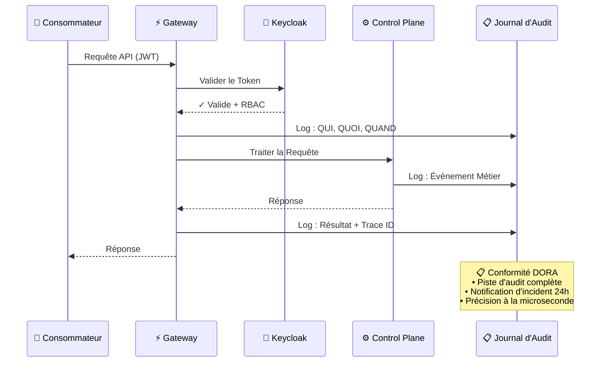
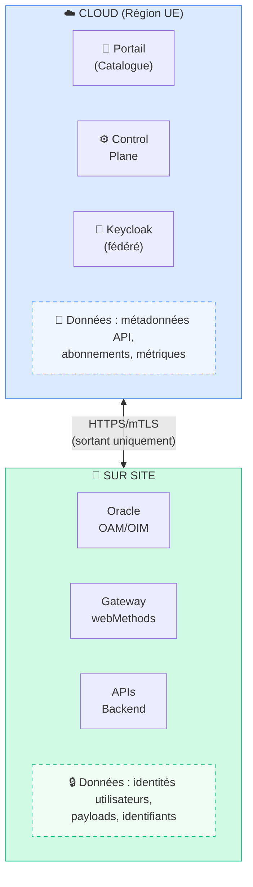
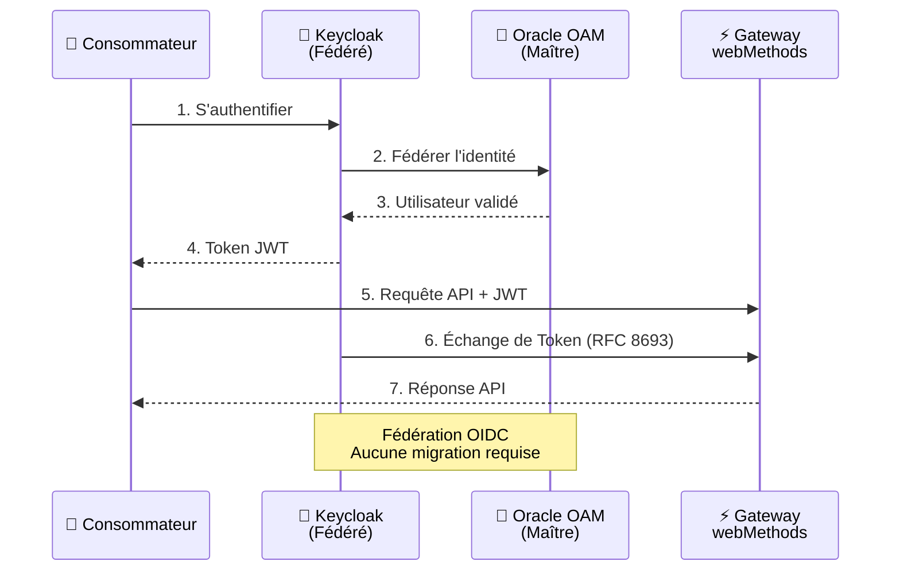
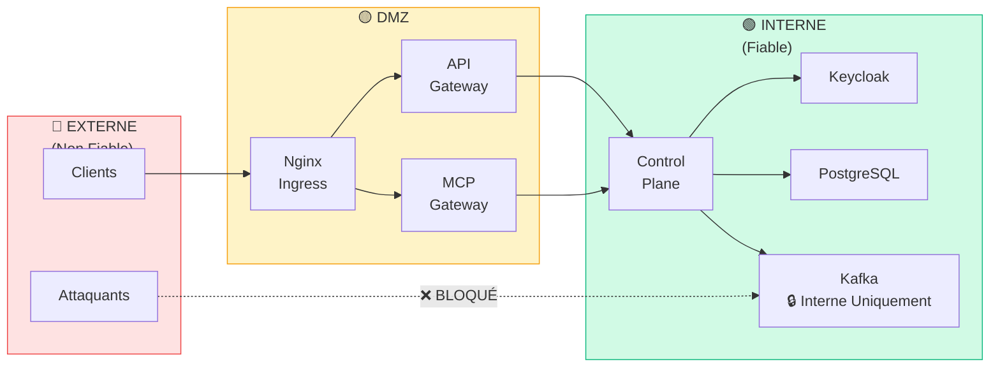

# Sécurité & Conformité

La Plateforme STOA est conçue avec les **exigences de sécurité des entreprises européennes** au cœur de son architecture. Cette page explique comment STOA aide les organisations à respecter leurs obligations réglementaires tout en maintenant l'efficacité opérationnelle.

## Conformité Réglementaire

### DORA (Digital Operational Resilience Act)

Le Digital Operational Resilience Act impose aux entités financières de renforcer la gestion des risques liés aux TIC. STOA répond aux principales exigences DORA :

| Exigence DORA | Comment STOA Aide |
|---------------|-------------------|
| **Gestion des risques TIC** | Control Plane centralisé avec piste d'audit complète de toutes les opérations API |
| **Notification des incidents** | Alertes en temps réel via Grafana + logs structurés dans OpenSearch pour la reconstruction des incidents |
| **Tests de résilience opérationnelle** | Contrôles de santé et circuit breakers intégrés |
| **Risques liés aux tiers** | Gouvernance des abonnements API avec workflows d'approbation et surveillance de l'utilisation |

**Flux de Conformité DORA :**

:::info Avertissement de Conformité
STOA fournit des outils et fonctionnalités pour soutenir vos démarches de conformité. La certification, l'audit et la responsabilité finale de conformité incombent à l'organisation implémentant la solution. Consultez des conseillers qualifiés pour vos exigences réglementaires spécifiques.
:::

### NIS2 (Directive sur la Sécurité des Réseaux et des Systèmes d'Information)

NIS2 étend les exigences de cybersécurité à travers les secteurs essentiels. STOA soutient la conformité grâce à :

- **Sécurité de la Chaîne d'Approvisionnement** — Traçabilité complète des dépendances API et des intégrations tierces
- **Souveraineté** — Option de Control Plane hébergé en Europe avec contrôles de résidence des données
- **Gestion des Incidents** — Alertes automatisées et journaux d'audit répondant aux exigences de notification en 24 heures
- **Contrôle d'Accès** — Contrôle d'accès basé sur les rôles avec intégration Keycloak et isolation multi-tenant

:::info Avertissement de Conformité
STOA fournit des outils et fonctionnalités pour soutenir vos démarches de conformité NIS2. La certification et la responsabilité d'audit incombent à l'organisation implémentant la solution.
:::

### RGPD (Règlement Général sur la Protection des Données)

STOA implémente les principes de privacy by design :

| Capacité | Implémentation |
|----------|----------------|
| **Minimisation des Données** | Anonymisation configurable des logs — masquage des données personnelles dans les logs de requêtes/réponses |
| **Résidence des Données** | Options de déploiement : Control Plane Cloud EU ou Entièrement Sur Site |
| **Droit d'Accès** | Journaux d'utilisation API par consommateur avec capacités d'export |
| **Portabilité des Données** | Contrats OpenAPI standards, sans verrouillage propriétaire |

:::info Avertissement de Conformité
STOA fournit des fonctionnalités de privacy by design pour soutenir la conformité RGPD. La responsabilité de la protection des données incombe au responsable du traitement.
:::

## Architecture de Résidence des Données

Comprendre où circulent les données est essentiel pour la conformité. L'architecture hybride de STOA fournit des périmètres clairs :

### Ce Qui Reste Sur Site

- **Données Métier** — Tous les payloads de requêtes/réponses API contenant des informations métier
- **Identités Utilisateurs** — Oracle OAM/OIM reste le fournisseur d'identité maître
- **Identifiants** — Secrets, certificats et configuration sensible
- **Logs Bruts** — Journaux de transactions détaillés (seules les métriques agrégées sont envoyées vers le cloud)

### Ce Qui Va dans le Cloud

- **Métadonnées API** — Informations du catalogue, spécifications OpenAPI
- **Métriques Agrégées** — Compteurs de requêtes, percentiles de latence, taux d'erreur
- **Données d'Abonnement** — Qui a accès à quelles APIs
- **Tokens Fédérés** — Tokens de courte durée via la fédération Keycloak (pas des identifiants)

## Architecture de Sécurité

### Authentification & Autorisation

- **Fédération OIDC** — Keycloak se fédère avec Oracle OAM existant, aucune migration requise
- **Échange de Token** — Échange de token conforme RFC 8693 pour les appels service-à-service
- **mTLS** — Mutual TLS entre les composants Control Plane et Gateway
- **RBAC** — Contrôle d'accès basé sur les rôles avec isolation par tenant

### Gestion des Secrets

STOA s'intègre avec **HashiCorp Vault** pour la gestion des secrets :

- Génération de secrets dynamiques pour les identifiants de bases de données
- Rotation automatique des identifiants
- Journalisation d'audit de tous les accès aux secrets
- Intégration native Kubernetes via le driver CSI

### Sécurité Réseau

| Couche | Protection |
|--------|------------|
| **Périphérie** | Intégration WAF, protection DDoS via Cloudflare |
| **Transport** | TLS 1.3, mTLS pour la communication interne |
| **Application** | Validation des entrées, rate limiting, circuit breakers |
| **Données** | Chiffrement au repos (AES-256), chiffrement au niveau des champs pour les données personnelles |

### Architecture des Zones de Confiance

STOA implémente une architecture Zero Trust avec des zones de sécurité clairement définies :

**Définitions des Zones :**
- **Externe (Rouge)** — Trafic internet non fiable, attaquants potentiels
- **DMZ (Ambre)** — Zone semi-fiable avec contrôleurs d'entrée et gateways
- **Interne (Vert)** — Zone fiable avec services core, bases de données et files de messages

## Audit & Observabilité

### Piste d'Audit

Chaque action dans STOA est enregistrée avec :

- **Qui** — Identité utilisateur, tenant, rôle
- **Quoi** — Type d'action, ressources affectées
- **Quand** — Horodatage avec précision à la microseconde
- **Où** — IP source, localisation géographique
- **Résultat** — Succès/échec, détails des erreurs

### Rétention des Logs

| Type de Log | Rétention par Défaut | Configurable |
|-------------|---------------------|--------------|
| Logs d'Accès | 90 jours | Oui |
| Logs d'Audit | 1 an | Oui |
| Métriques | 13 mois | Oui |
| Événements de Sécurité | 2 ans | Oui |

### Rapports de Conformité

Tableaux de bord intégrés pour :

- Utilisation des APIs par consommateur/équipe
- Échecs d'authentification et anomalies
- Patterns d'accès aux données
- Métriques de conformité SLA

## Certifications de Sécurité (Feuille de Route)

| Certification | Statut | Cible |
|---------------|--------|-------|
| SOC 2 Type II | Planifié | T4 2026 |
| ISO 27001 | Planifié | 2027 |
| ISAE 3402 | Planifié | 2027 |

---

## Étapes Suivantes

- [Options de Déploiement Hybride](/docs/deployment/hybrid) — Choisissez votre modèle de déploiement
- [Cas d'Usage Enterprise](/docs/enterprise/use-cases) — Implémentations spécifiques par secteur
- [Guides de Migration](/docs/guides/migration) — Migrer depuis des plateformes legacy
