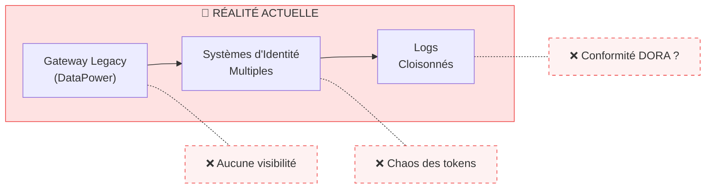
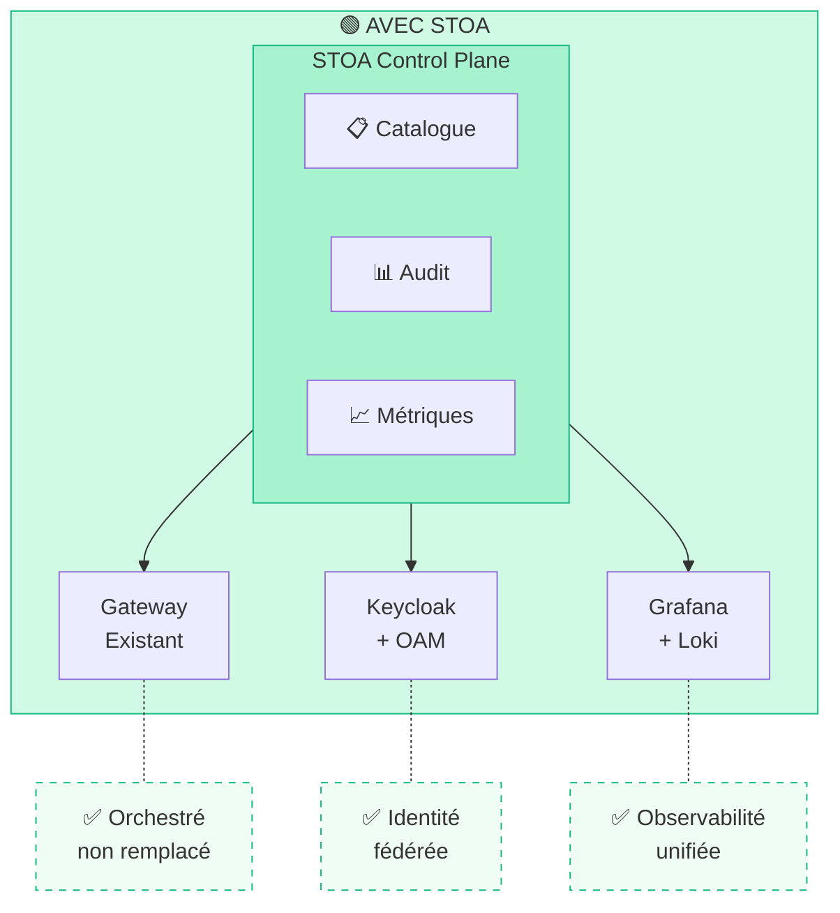
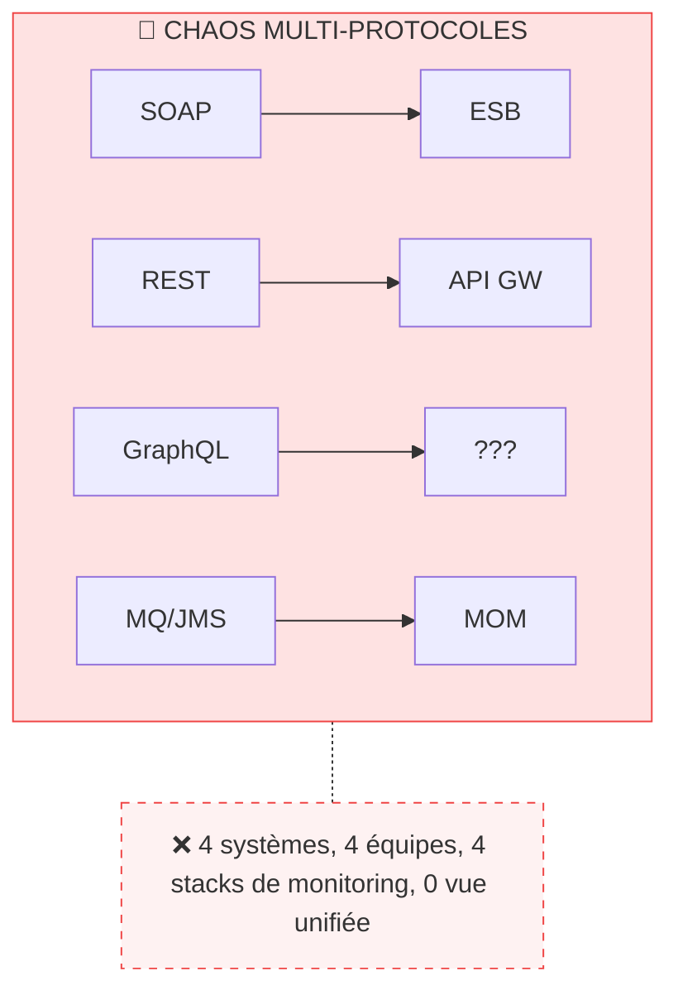
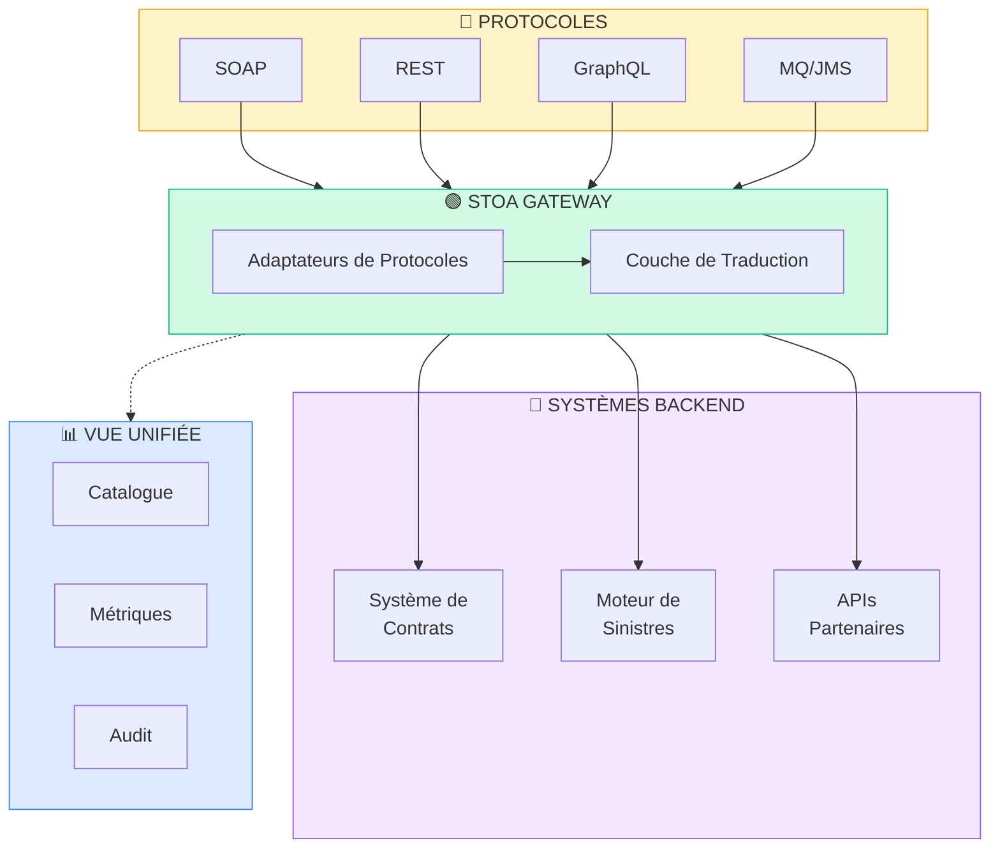
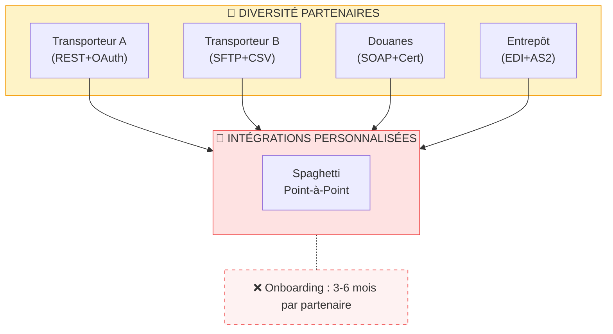
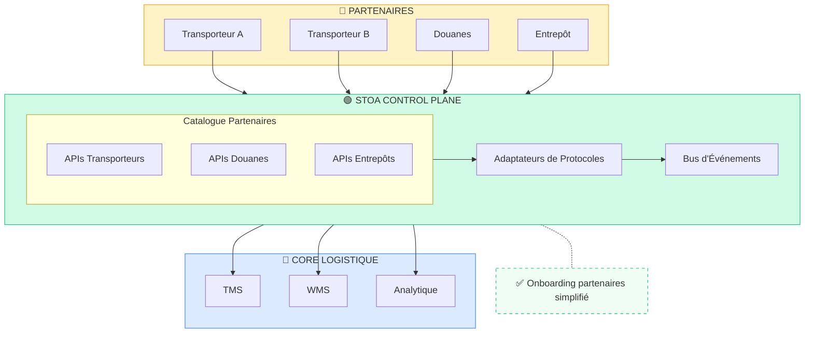
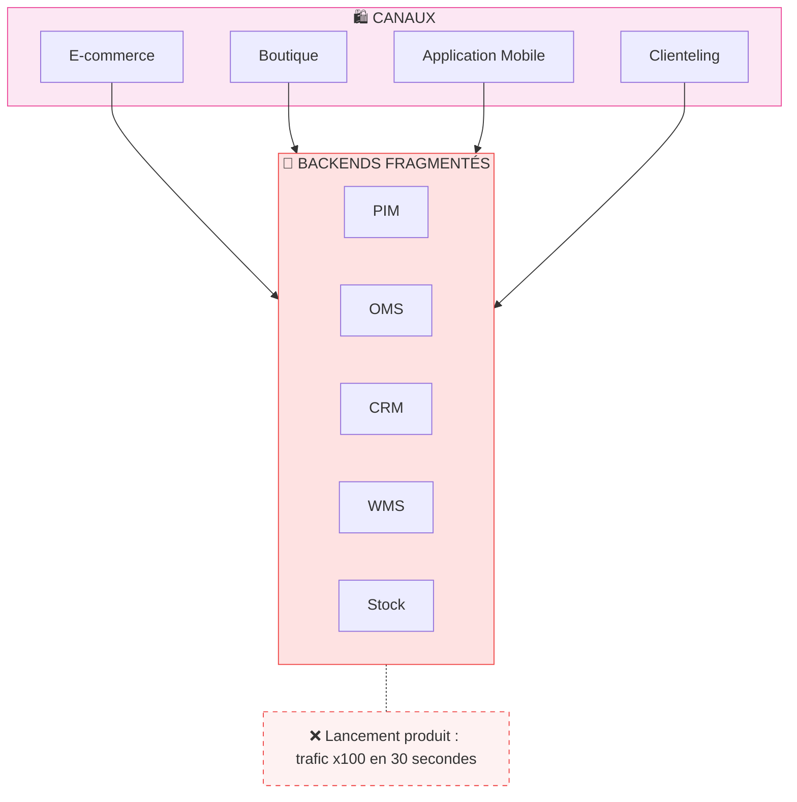
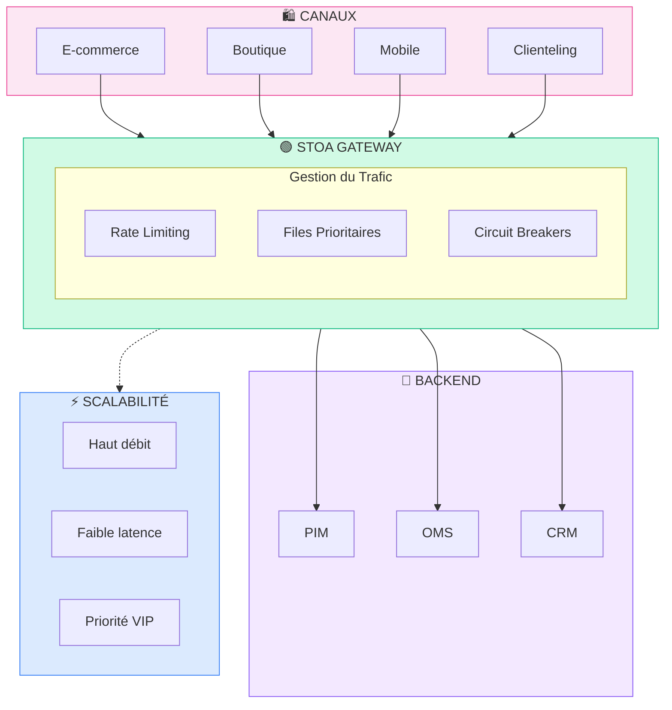

# Cas d'Usage Enterprise

La Plateforme STOA répond aux défis critiques de gestion des APIs dans les secteurs réglementés. Chaque vertical fait face à des contraintes spécifiques nécessitant des solutions adaptées.

## Banque & Services Financiers

**Clients cibles :** Banques commerciales, institutions financières européennes, processeurs de paiement

### Le Défi

**Points de douleur :**
- **Pression de conformité DORA** — Notification d'incident en 24 heures avec des pistes d'audit incomplètes
- **Opacité du gateway legacy** — Observabilité limitée sur l'infrastructure gateway existante
- **Fragmentation des identités** — Formats de token multiples, aucune autorisation unifiée
- **Coût** — Licences onéreuses pour une expertise de plus en plus rare

### Solution STOA

**Bénéfices clés :**
- ✅ **Piste d'audit favorable à DORA** — Journalisation complète du cycle de vie des requêtes
- ✅ **Protection du legacy** — Conserver l'investissement gateway existant, ajouter une couche de contrôle
- ✅ **Identité unifiée** — Keycloak se fédère avec l'OAM/OIM existant
- ✅ **Maîtrise des coûts** — Core open source, paiement uniquement pour le support enterprise

### Architecture de Référence Bancaire

| Composant | Actuel | Avec STOA |
|-----------|--------|-----------|
| Gateway | DataPower/webMethods | Conserver l'existant + orchestration STOA |
| Identité | Oracle OAM/OIM | OAM + fédération Keycloak |
| Observabilité | Logs éparpillés | Tableaux de bord Grafana/Loki unifiés |
| Catalogue API | Excel/Confluence | Portail Développeur en self-service |
| Conformité | Rapports manuels | Pistes d'audit favorables à DORA |

---

## Assurance

**Clients cibles :** Grands groupes d'assurance, réassureurs, insurtechs

### Le Défi

Les APIs d'assurance doivent gérer des protocoles divers (SOAP legacy, REST moderne, GraphQL émergent) tout en maintenant des pistes d'audit strictes pour la conformité réglementaire.

**Points de douleur :**
- **Prolifération des protocoles** — SOAP, REST, GraphQL, messagerie asynchrone
- **Intégration partenaires** — Chaque API partenaire nécessite une intégration personnalisée
- **Exigences d'audit** — Historique complet des transactions pour les sinistres et contrats
- **Solvabilité II** — Exigences de gestion des risques opérationnels

### Solution STOA

**Bénéfices clés :**
- ✅ **Traduction de protocoles** — Exposer le SOAP legacy en REST moderne
- ✅ **Onboarding partenaires** — Abonnement en self-service pour simplifier l'intégration
- ✅ **Piste d'audit unifiée** — Corrélation des transactions cross-protocoles
- ✅ **Monitoring en temps réel** — Suivi des SLAs sur tous les types d'API

---

## Logistique & Supply Chain

**Clients cibles :** Prestataires logistiques mondiaux, transitaires, 3PL, compagnies maritimes

### Le Défi

Les APIs logistiques nécessitent un échange de données en temps réel avec des centaines de partenaires, chacun avec des capacités techniques et des exigences de sécurité différentes.

**Points de douleur :**
- **Diversité des partenaires** — REST, SOAP, EDI, SFTP, AS2 — chaque partenaire est unique
- **Tracking en temps réel** — La visibilité des expéditions nécessite des mises à jour en moins d'une seconde
- **Variabilité du volume** — Pics de trafic x10 lors du Black Friday
- **Fragmentation de la sécurité** — Authentification différente par partenaire

### Solution STOA

**Bénéfices clés :**
- ✅ **Onboarding partenaires rapide** — Adaptateurs pré-construits, portail en self-service
- ✅ **Événements en temps réel** — Support webhook et event streaming
- ✅ **Scalabilité élastique** — Auto-scaling pour les périodes de pointe
- ✅ **Monitoring unifié** — Suivi de tous les SLAs partenaires dans un seul tableau de bord

---

## Luxe & Retail

**Clients cibles :** Conglomérats du luxe, marques premium, retailers omnicanaux

### Le Défi

Le retail de luxe nécessite des expériences omnicanales fluides avec une scalabilité extrême lors des lancements de produits et des événements mode.

**Points de douleur :**
- **Trafic événementiel** — Lancements de produits, Fashion Weeks, événements VIP
- **Cohérence omnicanale** — Mêmes données sur tous les points de contact
- **Traitement VIP** — Accès prioritaire pour les clients à haute valeur
- **Portée mondiale** — Faible latence de Paris à Shanghai

### Solution STOA

**Bénéfices clés :**
- ✅ **Scalabilité événementielle** — Conçu pour absorber des volumes élevés de requêtes lors des pics
- ✅ **Priorité VIP** — Rate limiting par niveaux, files d'attente prioritaires
- ✅ **Edge mondial** — Intégration CDN, déploiement multi-régions
- ✅ **Stock en temps réel** — Cohérence des stocks sur tous les canaux

---

## Capacités Cross-Sectorielles

Quel que soit le secteur, STOA offre :

| Capacité | Description |
|----------|-------------|
| **Portail Self-Service** | Les développeurs trouvent et souscrivent aux APIs sans tickets IT |
| **Observabilité Unifiée** | Tableau de bord unique pour toutes les APIs, tous les protocoles |
| **Fonctionnalités de Conformité** | Pistes d'audit intégrées pour soutenir les démarches DORA, NIS2, RGPD |
| **Déploiement Hybride** | Control Plane cloud + Gateway sur site |
| **Sans Remplacement Total** | Augmenter les gateways existants, ne pas les remplacer |

---

## Étapes Suivantes

- [Sécurité & Conformité](/docs/enterprise/security-compliance) — Détails DORA, NIS2, RGPD
- [Déploiement Hybride](/docs/deployment/hybrid) — Options d'architecture
- [Demander une Démo](mailto:contact@gostoa.dev) — Voir STOA en action pour votre secteur

---

*Vous avez un cas d'usage spécifique non couvert ici ? [Contactez-nous](mailto:contact@gostoa.dev) pour discuter de vos besoins.*
