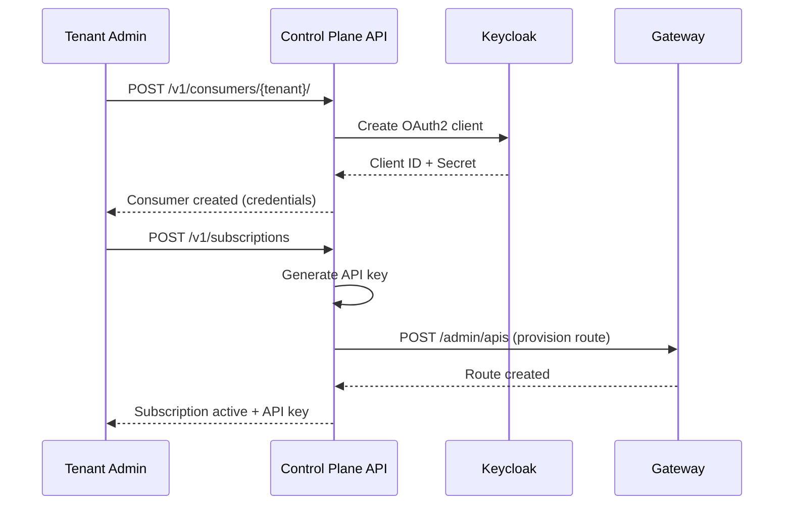

import EnvSetup from '@site/docs/_partials/_env-setup.mdx';

# Intégration des Consommateurs

Enregistrez des partenaires externes et des applications en tant que consommateurs d'API — avec des credentials OAuth2 automatiques, des certificats mTLS optionnels et une intégration en masse.

## Qu'est-ce qu'un Consommateur ?

Un **consommateur** représente un partenaire externe, une application ou une équipe qui consomme vos APIs. Les consommateurs sont différents des utilisateurs :

| Concept | Représente | Méthode d'Auth | Exemple |
|---------|-----------|-------------|---------|
| **Utilisateur** | Une personne avec un accès | OIDC (Keycloak) | Développeur accédant à la Console |
| **Consommateur** | Une app ou un partenaire | Clé API ou OAuth2 | Application mobile appelant votre API |

Chaque consommateur appartient à un **tenant** et peut avoir plusieurs abonnements à différentes APIs.

## Modèle de Données du Consommateur

| Champ | Type | Description |
|-------|------|-------------|
| `id` | UUID | Identifiant généré automatiquement |
| `external_id` | string | Votre identifiant (unique par tenant, par exemple `partner-acme`) |
| `name` | string | Nom d'affichage |
| `email` | string | Email de contact |
| `company` | string | Nom de l'organisation (optionnel) |
| `description` | text | Notes sur ce consommateur (optionnel) |
| `tenant_id` | string | Le tenant auquel appartient ce consommateur |
| `status` | enum | `active`, `suspended`, `blocked` |
| `consumer_metadata` | JSON | Attributs personnalisés (optionnel) |

### Statut du Consommateur

| Statut | Accès API | Cas d'Usage |
|--------|-----------|----------|
| **active** | Accès complet via les abonnements | Fonctionnement normal |
| **suspended** | Temporairement bloqué | Problèmes de facturation, investigation |
| **blocked** | Définitivement bloqué | Violation des conditions, incident de sécurité |

<EnvSetup />

## Enregistrer un Consommateur

### Via l'API REST

```bash
curl -X POST "${STOA_API_URL}/v1/consumers/${TENANT_ID}" \
  -H "Authorization: Bearer ${TOKEN}" \
  -H "Content-Type: application/json" \
  -d '{
    "external_id": "partner-acme",
    "name": "ACME Corp Integration",
    "email": "api-team@acme.example.com",
    "company": "ACME Corporation",
    "description": "Production integration for order management",
    "consumer_metadata": {
      "contract_id": "CNT-2026-042",
      "tier": "enterprise"
    }
  }'
```

**Réponse (201 Created) :**

```json
{
  "id": "consumer-uuid-123",
  "external_id": "partner-acme",
  "name": "ACME Corp Integration",
  "email": "api-team@acme.example.com",
  "company": "ACME Corporation",
  "tenant_id": "oasis",
  "status": "active",
  "keycloak_client_id": "oasis-partner-acme",
  "consumer_metadata": {
    "contract_id": "CNT-2026-042",
    "tier": "enterprise"
  },
  "created_at": "2026-02-13T10:00:00Z"
}
```

### Ce qui se Passe à la Création

Lorsque vous créez un consommateur, STOA effectue automatiquement :

1. **Crée un client OAuth2 Keycloak** — `{tenant_id}-{external_id}` (par exemple `oasis-partner-acme`)
2. **Active les comptes de service** — Le client peut obtenir des tokens via le grant `client_credentials`
3. **Retourne les credentials une seule fois** — Le Client ID et le secret ne sont affichés qu'à la création

Le consommateur peut maintenant s'authentifier à STOA et s'abonner aux APIs.

### Via la Console

1. Accédez à **Consommateurs** dans la barre latérale de la Console
2. Cliquez sur **Ajouter un Consommateur**
3. Remplissez le formulaire d'enregistrement
4. Copiez les credentials OAuth2 depuis la boîte de dialogue de confirmation

## Authentification des Consommateurs

Les consommateurs s'authentifient en utilisant leur client Keycloak créé automatiquement :

```bash
# Obtenir un token d'accès via les credentials client
TOKEN=$(curl -s -X POST "${STOA_AUTH_URL}/realms/${TENANT_REALM}/protocol/openid-connect/token" \
  -d "client_id=oasis-partner-acme" \
  -d "client_secret=${CLIENT_SECRET}" \
  -d "grant_type=client_credentials" | jq -r '.access_token')

# Utiliser le token pour les appels API
curl "${STOA_API_URL}/v1/portal/apis" \
  -H "Authorization: Bearer ${TOKEN}"
```

## Gérer les Consommateurs

### Lister les Consommateurs

```bash
curl "${STOA_API_URL}/v1/consumers/${TENANT_ID}" \
  -H "Authorization: Bearer ${TOKEN}"
```

### Mettre à Jour un Consommateur

```bash
curl -X PUT "${STOA_API_URL}/v1/consumers/${TENANT_ID}/${CONSUMER_ID}" \
  -H "Authorization: Bearer ${TOKEN}" \
  -H "Content-Type: application/json" \
  -d '{
    "name": "ACME Corp Integration v2",
    "consumer_metadata": {
      "contract_id": "CNT-2026-042",
      "tier": "enterprise",
      "upgraded_at": "2026-06-01"
    }
  }'
```

### Supprimer un Consommateur

```bash
curl -X DELETE "${STOA_API_URL}/v1/consumers/${TENANT_ID}/${CONSUMER_ID}" \
  -H "Authorization: Bearer ${TOKEN}"
```

:::warning
La suppression d'un consommateur révoque également tous ses abonnements et supprime son client Keycloak. Cette action est irréversible.
:::

## Certificats mTLS

Pour les intégrations à haute sécurité, les consommateurs peuvent s'authentifier via des certificats mTLS (mutual TLS) à la place ou en plus des clés API.

### Champs du Certificat

| Champ | Description |
|-------|-------------|
| `certificate_fingerprint` | Empreinte SHA-256 du certificat X.509 |
| `certificate_subject_dn` | Nom distinctif du sujet |
| `certificate_issuer_dn` | Nom distinctif de l'émetteur |
| `certificate_not_before` | Date de début de validité |
| `certificate_not_after` | Date de fin de validité |
| `certificate_status` | `active`, `rotating`, `revoked`, `expired` |

### Renouveler un Certificat

```bash
curl -X POST "${STOA_API_URL}/v1/consumers/${TENANT_ID}/${CONSUMER_ID}/certs/rotate" \
  -H "Authorization: Bearer ${TOKEN}" \
  -H "Content-Type: application/json" \
  -d '{
    "new_certificate_pem": "-----BEGIN CERTIFICATE-----\n...\n-----END CERTIFICATE-----",
    "grace_period_hours": 48
  }'
```

Pendant la période de grâce, l'ancien et le nouveau certificat sont tous deux acceptés.

## Intégration en Masse

Pour intégrer de nombreux consommateurs en une fois (par exemple migration de partenaires), utilisez le téléchargement CSV :

```bash
curl -X POST "${STOA_API_URL}/v1/consumers/${TENANT_ID}/bulk-onboard" \
  -H "Authorization: Bearer ${TOKEN}" \
  -F "file=@consumers.csv"
```

### Format CSV

```csv
external_id,name,email,company,description
partner-acme,ACME Corp,api@acme.example.com,ACME Corporation,Order management
partner-globex,Globex Inc,api@globex.example.com,Globex Inc,Supply chain
partner-initech,Initech,api@initech.example.com,Initech,HR integration
```

**Réponse :**

```json
{
  "total": 3,
  "created": 3,
  "failed": 0,
  "errors": []
}
```

## Flux Consommateur + Abonnement

Le flux d'intégration typique combine l'enregistrement du consommateur avec la création d'abonnement :



## RBAC pour la Gestion des Consommateurs

| Action | Rôle Requis |
|--------|--------------|
| Créer un consommateur | `tenant-admin`, `cpi-admin` |
| Lister les consommateurs | `tenant-admin`, `devops`, `viewer`, `cpi-admin` |
| Mettre à jour un consommateur | `tenant-admin`, `cpi-admin` |
| Supprimer un consommateur | `tenant-admin`, `cpi-admin` |
| Intégration en masse | `tenant-admin`, `cpi-admin` |
| Renouveler un certificat | `tenant-admin`, `cpi-admin` |

## Voir Aussi

- [Cycle de Vie des Abonnements](/docs/guides/subscriptions-lifecycle) — États d'abonnement et approbation
- [Rotation des Clés API](/docs/guides/api-key-rotation) — Renouveler les clés sans interruption
- [Permissions RBAC](/docs/reference/rbac-permissions) — Matrice complète des permissions
- [Guide d'Authentification](/docs/guides/authentication) — Configuration OIDC et Keycloak
