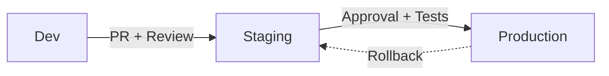

import EnvSetup from '@site/docs/_partials/_env-setup.mdx';

# Gestion des Environnements

STOA implémente un modèle "Born GitOps" (ADR-040) où les environnements sont des citoyens de première classe avec des modes d'accès distincts, des indicateurs visuels et des requêtes limitées.

## Trois Environnements

| Environnement | Mode | Couleur | Objectif |
|-------------|------|-------|---------|
| **Development** | `full` | Vert | Sans restriction — créer, modifier, supprimer librement |
| **Staging** | `full` | Ambre | Validation pré-production |
| **Production** | `read-only` | Rouge | Verrouillé — modifications uniquement via promotion |

### Modes d'Environnement

| Mode | Créer | Modifier | Supprimer | Déployer | Qui Peut Contourner |
|------|--------|------|--------|--------|-----------------|
| `full` | Oui | Oui | Oui | Oui | Tous avec les permissions de rôle |
| `read-only` | Non | Non | Non | Non | `cpi-admin` uniquement (correctifs d'urgence) |
| `promote-only` | Non | Non | Non | Oui | `devops` et au-dessus |

## Récupérer les Environnements

<EnvSetup />

```bash
curl "${STOA_API_URL}/v1/environments" \
  -H "Authorization: Bearer ${TOKEN}"
```

**Réponse :**

```json
{
  "environments": [
    {"name": "dev", "label": "Development", "mode": "full", "color": "green"},
    {"name": "staging", "label": "Staging", "mode": "full", "color": "amber"},
    {"name": "prod", "label": "Production", "mode": "read-only", "color": "red"}
  ]
}
```

## Requêtes Limitées à l'Environnement

Toutes les requêtes API peuvent être limitées à un environnement spécifique en utilisant le paramètre de requête `environment` :

```bash
# Lister les APIs en staging uniquement
curl "${STOA_API_URL}/v1/apis?environment=staging" \
  -H "Authorization: Bearer ${TOKEN}"

# Lister les déploiements en production
curl "${STOA_API_URL}/v1/deployments?environment=prod" \
  -H "Authorization: Bearer ${TOKEN}"
```

Sans le paramètre `environment`, l'API retourne les ressources de l'environnement actif (par défaut : `dev`).

## Indicateurs de la Console

La Console reflète l'environnement actif avec des repères visuels :

| Indicateur | Signification |
|-----------|---------|
| Point vert | Development — toutes les actions disponibles |
| Point ambre | Staging — toutes les actions disponibles |
| Point rouge + icône cadenas | Production — mode lecture seule actif |

### Changer d'Environnement

Dans la Console, utilisez le menu déroulant du **sélecteur d'environnement** dans l'en-tête. L'environnement sélectionné :

- Persiste lors des navigations entre pages (stocké dans localStorage)
- Limite toutes les requêtes de données (APIs, déploiements, abonnements)
- Active/désactive les boutons d'action en fonction du mode d'environnement

## Production en Lecture Seule

Lorsque l'environnement est `prod`, les opérations d'écriture sont bloquées à deux niveaux :

### Application au Backend

L'API utilise une protection `require_writable_environment` sur tous les endpoints d'écriture :

```
POST /v1/apis                → 403 Forbidden (prod est en lecture seule)
PUT /v1/apis/{id}            → 403 Forbidden
DELETE /v1/apis/{id}         → 403 Forbidden
GET /v1/apis                 → 200 OK (les lectures sont toujours autorisées)
```

**Réponse d'erreur :**

```json
{
  "detail": "Environment 'prod' is read-only. Write operations are not permitted."
}
```

### Application au Frontend

Le hook `useEnvironmentMode` désactive les boutons et formulaires :

- Les boutons **Créer** sont masqués ou désactivés
- Les formulaires **Modifier** sont en lecture seule
- Les actions **Supprimer** sont masquées
- Une bannière affiche : "Environnement de production — mode lecture seule"

### Contournement CPI Admin

Les administrateurs de plateforme (rôle `cpi-admin`) peuvent contourner les restrictions de lecture seule pour les correctifs d'urgence. Le contournement est journalisé dans la piste d'audit.

## Workflow de Promotion

Les modifications transitent du développement vers la production via un pipeline de promotion :



### Étape 1 : Développer en Dev

Créez et itérez librement dans l'environnement de développement :
- Accès CRUD complet pour tous les rôles
- Aucune approbation requise
- Itération rapide

### Étape 2 : Promouvoir en Staging

Déplacez les modifications validées en staging pour les tests d'intégration :
- Des tests automatisés s'exécutent contre staging
- Validation d'intégration avec d'autres services
- Revue pré-production

### Étape 3 : Approuver pour la Production

Les modifications de production nécessitent une approbation explicite :
- Porte manuelle — approbation `cpi-admin` ou `tenant-admin`
- L'application de lecture seule empêche les modifications directes
- Toutes les modifications tracées dans Git (piste d'audit GitOps)

## Intégration ArgoCD

Lors de l'utilisation d'ArgoCD pour le déploiement GitOps, chaque environnement correspond à une Application ArgoCD avec sa propre politique de synchronisation :

| Environnement | Comportement ArgoCD |
|-------------|----------------|
| Dev | Auto-sync, auto-correction, itération rapide |
| Staging | Auto-sync, auto-correction, validation d'intégration |
| Production | Auto-sync, auto-correction, promotion uniquement |

La dérive en production est automatiquement corrigée par la fonction d'auto-correction d'ArgoCD. Les modifications manuelles via `kubectl` sont écrasées pour correspondre à l'état défini dans Git.

## Voir Aussi

- [GitOps avec ArgoCD](/docs/concepts/gitops) — Architecture GitOps et intégration ArgoCD
- [Permissions RBAC](/docs/reference/rbac-permissions) — Contrôle d'accès basé sur les rôles
- [Démarrage Rapide](/docs/guides/quickstart) — Débuter avec STOA
- [Vue d'Ensemble de l'Architecture](/docs/concepts/architecture) — Architecture du système
