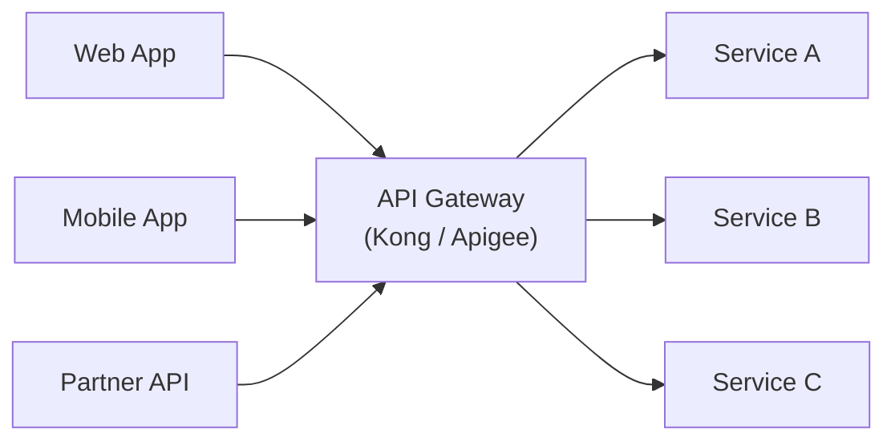
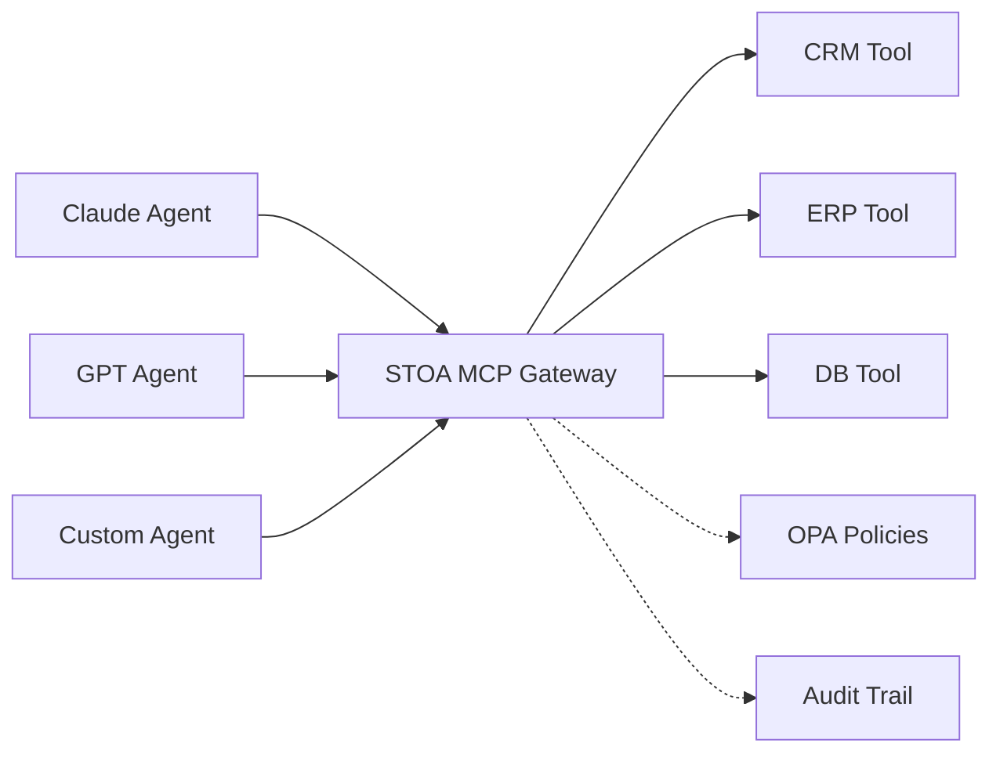
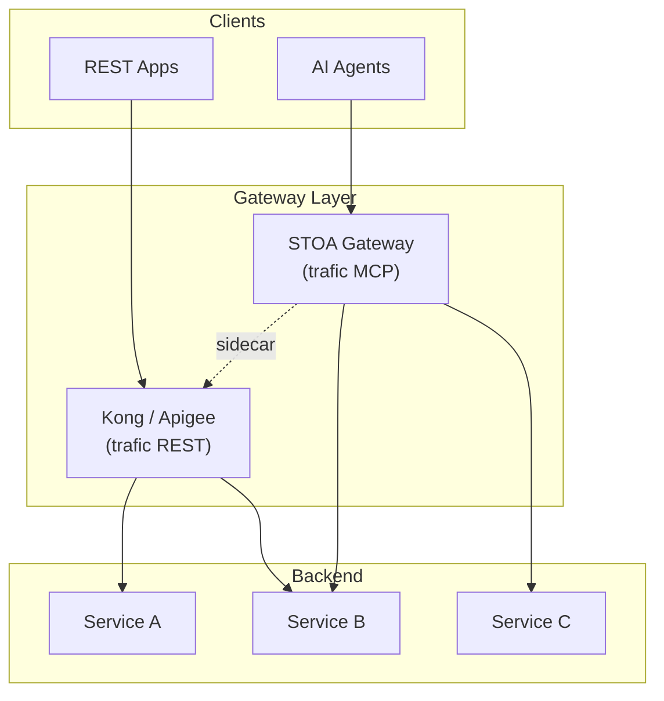
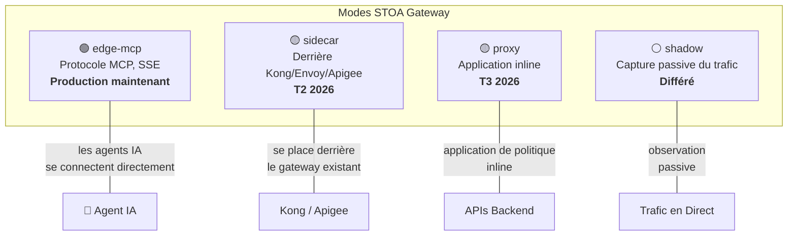
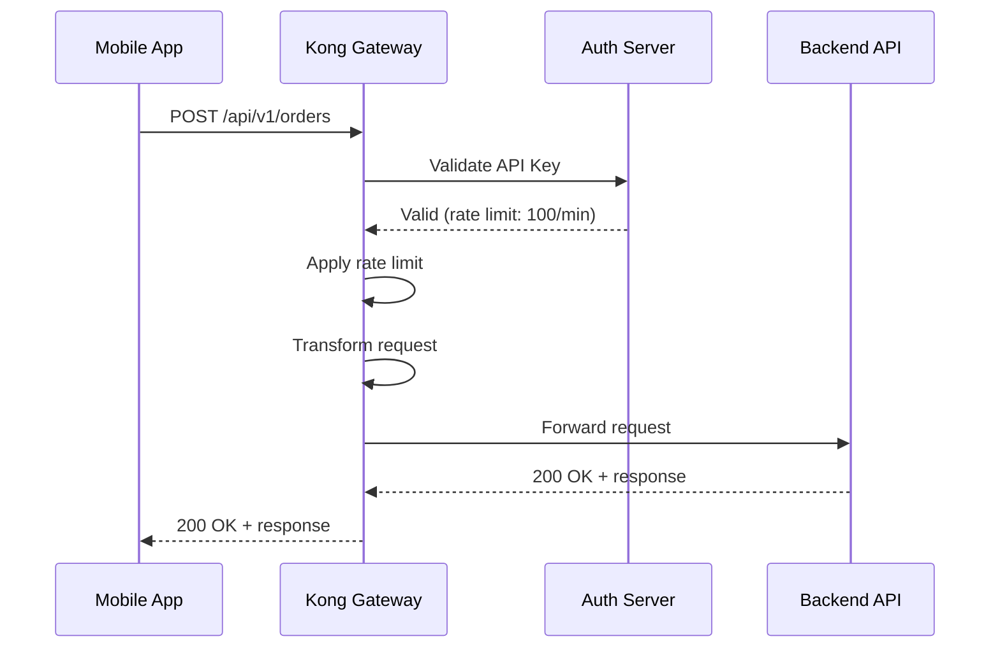
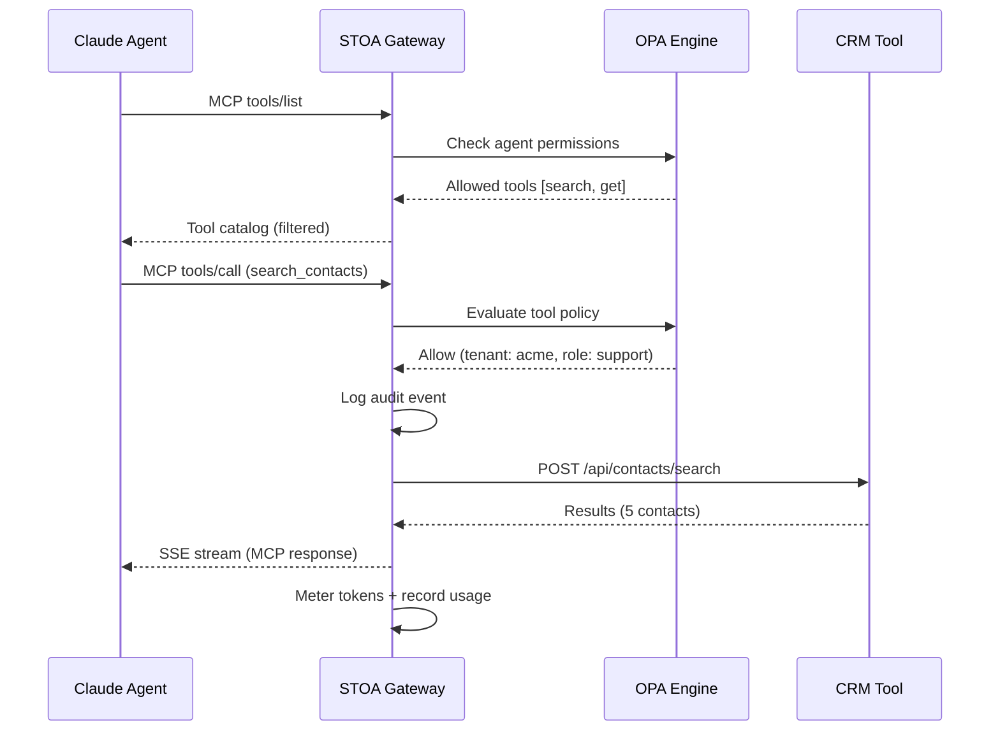

# Patterns API Gateway — STOA vs Kong vs Apigee (Comparaison 2026)

> STOA n'est pas un API gateway polyvalent — c'est un gateway AI-native conçu spécifiquement pour gouverner l'accès aux outils pour les agents LLM, en complément (et non en remplacement) des gateways traditionnels.

Le paysage des API gateways en 2026 couvre deux catégories distinctes : les **gateways traditionnels** conçus pour la gestion du trafic REST/GraphQL, et les **gateways AI-native** conçus pour le Model Context Protocol (MCP) et la gouvernance agent-to-tool. Comprendre ces patterns architecturaux aide les organisations à choisir le bon gateway — ou la bonne combinaison de gateways — selon leurs besoins spécifiques.

## Patterns d'Architecture Gateway

### Pattern 1 : API Gateway Traditionnel (Kong, Apigee)

Les gateways traditionnels se positionnent à la périphérie de votre infrastructure et gèrent tout le trafic API entrant. Ils assurent le routage, la limitation de débit, l'authentification et la transformation de protocole pour les applications développées par des humains.



**Points forts :** Écosystèmes de plugins matures, éprouvés à grande échelle, large support de protocoles (REST, gRPC, GraphQL, WebSocket).

**Limitation :** Conçus pour les patterns requête-réponse entre applications. Les agents IA nécessitent la découverte d'outils, la gestion de sessions et des réponses en streaming que les gateways traditionnels n'ont pas été conçus pour gérer.

### Pattern 2 : MCP Gateway AI-Native (STOA)

Un MCP gateway est conçu spécifiquement pour la communication des agents IA. Au lieu de router des requêtes HTTP, il gère la découverte d'outils, l'invocation et la gouvernance pour les agents LLM en utilisant le Model Context Protocol.



**Points forts :** Protocole MCP natif, politiques OPA par outil, découverte d'outils multi-tenant, comptage de tokens, réponses SSE en streaming.

**Limitation :** Non conçu pour remplacer le routage REST/GraphQL traditionnel. À déployer de préférence en complément des gateways existants.

### Pattern 3 : Gateway Hybride (STOA Sidecar + Traditionnel)

Le pattern enterprise le plus courant : conservez votre gateway existant pour le trafic REST/GraphQL et ajoutez STOA en mode sidecar pour la gouvernance des agents IA.



Ce pattern permet aux organisations d'ajouter la gouvernance IA de façon incrémentale sans perturber le trafic API existant ni les configurations gateway.

## 5 Points Clés

### 1. Problèmes Différents, Gateways Différents

Les gateways traditionnels (Kong, Apigee, AWS API Gateway) résolvent la gestion du trafic REST/GraphQL : routage, limitation de débit, validation de clés API. STOA résout la gouvernance des agents IA : découverte d'outils, isolation multi-tenant, accès par abonnement pour les LLMs.

| Préoccupation | Gateway Traditionnel | STOA MCP Gateway |
|---------------|---------------------|------------------|
| Protocole | REST, GraphQL, gRPC | MCP (tools/call, tools/list) |
| Consommateur | Apps, microservices | Agents IA (Claude, GPT) |
| Découverte | OpenAPI / Swagger | MCP tools/list (dynamique) |
| Gouvernance | Clés API, scopes OAuth | Politiques OPA par outil par tenant |
| Modèle de facturation | Par appel API | Par invocation d'outil |
| Modèle de session | Requête-réponse stateless | Sessions d'agent stateful |
| Streaming | WebSocket, SSE (en option) | SSE natif (standard MCP) |

### 2. Les Quatre Modes Gateway (ADR-024)

L'architecture unifiée de STOA supporte quatre modes de déploiement sous une seule base de code :



Chaque mode utilise le même binaire Rust — le mode est sélectionné au démarrage via la configuration. Cela signifie que les mises à jour, les correctifs de sécurité et les nouvelles politiques s'appliquent simultanément à tous les modes de déploiement.

### 3. Coexistence, Pas Remplacement

STOA est conçu pour se placer aux côtés de votre gateway existant. En mode sidecar, STOA se déploie derrière Kong ou Apigee, ajoutant la gouvernance IA sans perturber le trafic API actuel :

```
┌─────────────┐     ┌────────────────┐     ┌──────────────┐
│  REST Apps  │────►│  Kong / Apigee │────►│ Backend APIs │
└─────────────┘     └────────────────┘     └──────────────┘
                           │
┌─────────────┐     ┌──────▼───────┐
│  AI Agents  │────►│ STOA Gateway │ (mode sidecar)
└─────────────┘     │  MCP + OPA   │
                    └──────────────┘
```

### 4. Comparaison Face à Face

<!-- last verified: 2026-02 -->

| Fonctionnalité | Kong | Apigee | STOA |
|----------------|------|--------|------|
| **Protocole MCP** | Plugin (depuis 3.12) | Non | Natif |
| **Découverte d'Outils IA** | N/A | N/A | tools/list par tenant |
| **Isolation Multi-Tenant** | Enterprise (Workspaces) | Oui | Natif (namespaces K8s) |
| **Moteur de Politiques** | Plugins (Lua) | Politiques Apigee | OPA (Rego) |
| **Portail Développeur** | Kong Dev Portal (Enterprise) | Apigee Portal | STOA Portal (OSS) |
| **Open Source** | Core : Oui (Apache 2.0) | Non | Oui (Apache 2.0) |
| **Routage REST/gRPC** | Oui | Oui | Via modes sidecar/proxy |
| **Déploiement** | N'importe où | Google Cloud | N'importe où (K8s-native) |
| **Comptage de Tokens** | N/A | N/A | Par agent, par outil |
| **Disjoncteur** | Plugin | Intégré | Intégré (par upstream) |
| **mTLS** | Enterprise | Oui | Intégré (tous les niveaux) |
| **Souveraineté Données EU** | Entreprise US | Entreprise US (Google) | Européen (Apache 2.0) |
| **Tarification** | Licence Enterprise | Par appel API | Open-source + Enterprise |

*Comparaison basée sur les informations publiques disponibles en 2026-02. Tous les noms de produits sont des marques de leurs propriétaires respectifs.*

### 5. Quand Utiliser Quoi

| Scénario | Recommandation | Justification |
|----------|---------------|---------------|
| Gestion d'API REST uniquement | Kong ou Apigee | Écosystèmes matures, éprouvés |
| Les agents IA ont besoin d'accéder aux APIs | STOA (mode edge-mcp) | Conçu pour le protocole MCP |
| Apps REST + agents IA | Kong/Apigee + STOA (sidecar) | Le meilleur des deux mondes |
| Plateforme greenfield AI-first | STOA (tous les modes) | Plateforme unique, pas de legacy |
| Conformité réglementaire (DORA/NIS2) | STOA (piste d'audit + OPA) | Souveraineté EU, logs immuables |
| Migration depuis un ESB legacy | STOA + gateway existant | Migration incrémentale |

## Comparaison du Cycle de Vie des Requêtes

Comprendre comment une requête transite par chaque architecture gateway révèle les différences fondamentales :

### Flux de Requête Gateway Traditionnel



### Flux de Requête MCP Gateway



Différences clés : le MCP gateway ajoute la **découverte d'outils**, l'**évaluation de politique par outil**, la **journalisation d'audit** et le **comptage de tokens** — aucun de ces éléments n'existe dans le flux traditionnel.

## Architecture de Sécurité

Chaque pattern gateway a des caractéristiques de sécurité différentes :

| Couche de Sécurité | Kong | Apigee | STOA |
|-------------------|------|--------|------|
| **Authentification** | Clés API, OAuth2, JWT, mTLS | Clés API, OAuth2, SAML | JWT, clés API, mTLS |
| **Autorisation** | Basée sur les plugins (ACLs, RBAC) | API Products, politiques personnalisées | OPA (politiques Rego fines) |
| **Granularité des Politiques** | Par route | Par produit API | Par outil, par tenant, par agent |
| **Piste d'Audit** | Logs d'accès | Analytics | Événements d'audit structurés (OpenSearch) |
| **Isolation Multi-Tenant** | Workspaces Enterprise | Organizations | Namespace K8s + realm Keycloak |
| **Souveraineté des Données** | Dépend de l'hébergement | Google Cloud régions | Auto-hébergé, EU-native |

Le modèle de sécurité de STOA est spécifiquement conçu pour le modèle de menace des agents IA, où :
- **L'injection de prompt** peut amener les agents à appeler des outils de façon non intentionnelle
- **L'usurpation d'agent** nécessite une vérification d'identité robuste
- **L'accès sur-privilégié** doit être prévenu par des politiques fines par outil
- **Les exigences d'audit** demandent une traçabilité complète de chaque invocation d'outil

## Architecture de Déploiement

### Déploiement Kong

Kong se déploie généralement comme gateway autonome ou contrôleur Ingress Kubernetes, avec PostgreSQL ou en mode DB-less :

```
Kong Gateway (Nginx + Lua)
├── PostgreSQL (magasin de config)
├── Kong Manager (UI Enterprise)
└── Kong Dev Portal (Enterprise)
```

### Déploiement Apigee

Apigee fonctionne sur l'infrastructure Google Cloud. Apigee hybrid permet un déploiement partiellement on-premise :

```
Apigee Management Plane (Google Cloud)
└── Apigee Runtime (hybrid : on-premise)
    ├── Message Processor
    ├── Router
    └── Cassandra (magasin de config)
```

### Déploiement STOA

STOA suit une architecture Kubernetes-native Control Plane / Data Plane :

```
Control Plane (cloud ou on-premise)
├── Control Plane API (Python/FastAPI)
├── Console (tableau de bord admin React)
├── Portal (portail développeur React)
├── Keycloak (fournisseur d'identité)
└── PostgreSQL (magasin de config)

Data Plane (on-premise ou edge)
├── STOA Gateway (Rust/axum)
├── OPA (moteur de politique embarqué)
└── OpenSearch (logs d'audit)
```

Le Data Plane peut fonctionner indépendamment du Control Plane, garantissant que le trafic API reste dans votre infrastructure même si la couche de gestion est hébergée ailleurs.

## Objections et Réponses

| Objection | Réponse |
|-----------|---------|
| "On a déjà Kong/Apigee, on n'a pas besoin d'un autre gateway" | STOA ne les remplace pas. Le mode sidecar ajoute la gouvernance IA derrière votre gateway existant avec une perturbation minimale du trafic actuel. |
| "MCP est niche — nos APIs sont REST" | Vos APIs restent REST. STOA traduit MCP en REST. Les agents IA parlent MCP, les backends parlent REST — le gateway fait le pont entre les deux. |
| "Pourquoi ne pas ajouter le support MCP comme plugin Kong ?" | Kong a ajouté des plugins MCP en 3.12. Pour un proxying MCP basique, cela peut suffire. Pour la découverte d'outils multi-tenant, les politiques OPA par outil et le comptage de tokens, STOA fournit ces capacités en natif. |
| "L'open-source signifie pas de support" | STOA propose un niveau Enterprise avec SLAs, support et déploiement géré — même modèle que Kong Enterprise vs Kong OSS. |
| "Comment STOA gère-t-il le trafic élevé ?" | Le gateway est construit en Rust (Tokio + axum) pour un débit élevé et une latence faible. La mise à l'échelle horizontale via les replica sets Kubernetes gère la croissance du trafic. |
| "Qu'en est-il du service mesh ?" | STOA n'est pas un service mesh. Si vous avez besoin de la gestion du trafic est-ouest, utilisez Istio ou Linkerd. STOA gère le trafic nord-sud des agents IA au niveau applicatif. |

## Chemins de Migration

### De Kong vers STOA

Les utilisateurs de Kong peuvent adopter STOA de façon incrémentale en utilisant le mode sidecar :

1. **Phase 1 :** Déployer STOA aux côtés de Kong, en routant uniquement le trafic MCP via STOA
2. **Phase 2 :** Migrer les définitions d'outils des plugins Kong vers les CRDs STOA
3. **Phase 3 :** Déplacer progressivement la gestion des APIs vers le Control Plane de STOA

Consultez le [Guide de Migration Kong](/docs/guides/migration/kong) pour les instructions étape par étape.

### D'Apigee vers STOA

Les utilisateurs d'Apigee migrant vers l'open-source peuvent mapper les concepts Apigee vers leurs équivalents STOA :

| Concept Apigee | Équivalent STOA |
|----------------|-----------------|
| API Product | Tool Set (CRD) |
| Developer App | Consumer + Clé API |
| Policy | Politique OPA Rego |
| Environment | Namespace Kubernetes |
| Analytics | OpenSearch + Grafana |

Consultez le [Guide de Migration Apigee](/docs/guides/migration/apigee) pour la correspondance complète.

## Pour Aller Plus Loin

- **[Guide de Migration API Gateway 2026](/blog/api-gateway-migration-guide-2026)** — Guide de migration complet couvrant toutes les plateformes
- **[STOA vs Kong](/blog/stoa-vs-kong)** — Comparaison détaillée avec honnêteté sur les forces et faiblesses
- **[API Gateways Open Source 2026](/blog/open-source-api-gateway-2026)** — Kong, Envoy, APISIX, Tyk et STOA comparés
- [ADR-024 : Modes Unifiés Gateway](/docs/architecture/adr/adr-024-gateway-unified-modes) — Décision d'architecture
- [Positionnement MCP Gateway](/docs/concepts/mcp-gateway-positioning) — Ce que STOA fait (et ne fait pas)
- [Migration depuis Kong](/docs/guides/migration/kong) — Migration Kong avec correspondance des plugins
- [Migration depuis Apigee](/docs/guides/migration/apigee) — Migration Apigee avec traduction des politiques
- [Migration depuis webMethods](/docs/guides/migration/ibm-webmethods) — Migration webMethods/DataPower
- [Migration depuis Oracle OAM](/docs/guides/migration/oracle-oam) — Migration d'identité Oracle
- [Conformité DORA et NIS2](/blog/dora-nis2-api-gateway-compliance) — Exigences réglementaires pour les API gateways

---

> Les comparaisons de fonctionnalités sont basées sur la documentation publique disponible en 2026-02. Les capacités des produits évoluent fréquemment. Nous encourageons les lecteurs à vérifier les fonctionnalités actuelles directement auprès de chaque éditeur. Toutes les marques appartiennent à leurs propriétaires respectifs. Voir [marques](/docs/legal/trademarks).
