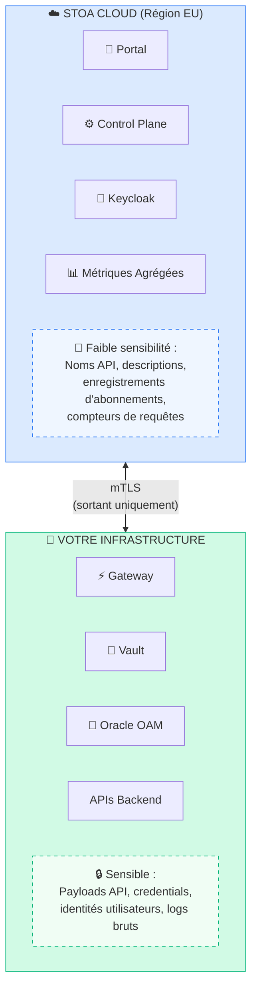

# Fiche #5 : Souveraineté des Données & RGPD

> L'architecture hybride de STOA est conçue pour que les données métier sensibles et les identités utilisateurs restent dans votre périmètre, tandis que les métadonnées et les métriques sont hébergées sur une infrastructure souveraine européenne.

## 5 Points Clés

### 1. Frontière Claire des Données : Ce qui Reste vs Ce qui Part

Une question clé pour toute entreprise : "Où vont mes données ?" STOA le rend explicite :



**Aucune connexion entrante requise.** Toutes les communications sont initiées depuis votre infrastructure.

### 2. Trois Modèles de Déploiement pour Chaque Niveau de Souveraineté

| Modèle | Résidence des Données | Idéal Pour |
|--------|----------------------|-----------|
| **Hybride** (défaut) | Données métier on-prem, métadonnées en cloud EU | La plupart des entreprises |
| **Entièrement On-Premise** | 100% dans votre infrastructure | Air-gapped, défense, bancaire |
| **Multi-Cloud** | Distribué entre régions | Organisations mondiales |

### 3. Couverture Réglementaire : RGPD, DORA, NIS2

| Réglementation | Exigence Clé | Comment STOA Aide |
|----------------|-------------|-------------------|
| **RGPD** | Minimisation des données, droit d'accès | Anonymisation des logs configurable, export d'utilisation par consommateur |
| **DORA** | Gestion des risques TIC, déclaration d'incident en 24h | Piste d'audit complète, alertes en temps réel, logs structurés |
| **NIS2** | Sécurité de la chaîne d'approvisionnement, souveraineté | Traçabilité de la provenance des APIs, plan de contrôle hébergé en EU |

### 4. Protection CLOUD Act

Le US CLOUD Act peut contraindre les fournisseurs dont le siège est aux États-Unis à remettre des données stockées à l'étranger. STOA atténue ce risque :

- **Control Plane hébergé en EU** (OVHcloud / Scaleway — pas AWS/Azure/GCP)
- **Les données métier sont conçues pour rester dans vos locaux** en mode hybride
- **Option entièrement on-prem** élimine toute dépendance au cloud
- **Base de code open-source** — aucune exfiltration de données cachée, entièrement auditable

```
Matrice d'Exposition US CLOUD Act
─────────────────────────────────────────
              │ Fournisseur US │ Fournisseur EU │ On-Prem
──────────────┼────────────────┼────────────────┼────────
Métadonnées   │    ⚠️ Risque   │  ✅ Sécurisé  │ ✅ Sécurisé
Payloads      │    ❌ Risque   │  ✅ Sécurisé  │ ✅ Sécurisé
Credentials   │    ❌ Risque   │  ✅ Sécurisé  │ ✅ Sécurisé
─────────────────────────────────────────
STOA par défaut : cloud EU (métadonnées) + On-prem (payloads)
```

### 5. Chiffrement à Chaque Couche

| Couche | Mécanisme |
|--------|-----------|
| **En Transit** | TLS 1.3 (externe), mTLS (interne) |
| **Au Repos** | AES-256 (bases de données), AES-256-GCM (Vault) |
| **Au Niveau Champ** | Chiffrement des champs PII dans les logs |
| **Secrets** | HashiCorp Vault avec rotation automatique |

## Objections et Réponses

| Objection | Réponse |
|-----------|---------|
| "N'importe quel composant cloud est un risque pour la souveraineté" | Le déploiement entièrement on-premise est supporté sans dépendance cloud requise. Votre cluster, vos règles. |
| "L'hébergement EU ne protège pas du CLOUD Act" | Correct si le fournisseur a son siège aux États-Unis. L'option EU de STOA utilise des fournisseurs souverains européens (OVHcloud, Scaleway). |
| "Nous avons besoin de la certification SOC 2 / ISO 27001" | Sur la feuille de route : SOC 2 Type II (T4 2026), ISO 27001 (2027). L'architecture actuelle est conçue pour répondre à ces normes. |
| "Le RGPD exige le droit à l'effacement — STOA peut-il le faire ?" | Oui. L'isolation des données par consommateur permet une suppression ciblée. Les logs d'audit peuvent être configurés avec des politiques de rétention. |
| "Notre DPO n'approuvera pas le SaaS" | Partagez le diagramme des frontières de données ci-dessus. Seules les métadonnées API (noms, descriptions) vont dans le cloud. Ou déployez entièrement on-prem. |

## Pour Aller Plus Loin

- [Sécurité & Conformité](/docs/enterprise/security-compliance) — Détails DORA, NIS2, RGPD complets
- [Déploiement Hybride](/docs/deployment/hybrid) — Modèles de déploiement et flux de données
- [RGPD (EU)](https://gdpr.eu/) — Ressource officielle RGPD
- [Règlement DORA](https://www.digital-operational-resilience-act.com/) — Présentation de DORA
- [Directive NIS2](https://digital-strategy.ec.europa.eu/en/policies/nis2-directive) — Information EU NIS2
