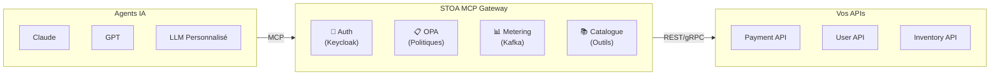

# Fiche #3 : Protocole MCP — Le USB-C des LLMs

> MCP (Model Context Protocol) est un standard ouvert qui permet à n'importe quel agent IA de découvrir et d'invoquer n'importe quel outil via une interface unique — comme l'USB-C a remplacé les chargeurs propriétaires, MCP remplace les intégrations IA personnalisées.

## 5 Points Clés

### 1. Un Protocole, N'importe Quel Agent IA, N'importe Quel Outil

Avant MCP, connecter Claude à votre CRM nécessitait du code personnalisé. Connecter GPT au même CRM nécessitait un code personnalisé différent. MCP définit une interface universelle : `tools/list` pour découvrir, `tools/call` pour invoquer. Écrivez l'intégration une seule fois, chaque agent IA peut l'utiliser.

```
AVANT MCP                            AVEC MCP
┌────────┐ ─custom─► ┌─────┐        ┌────────┐
│ Claude │ ─custom─► │ CRM │        │ Claude │──┐
└────────┘           └─────┘        └────────┘  │
┌────────┐ ─custom─► ┌─────┐        ┌────────┐  │  MCP    ┌─────┐
│  GPT   │ ─custom─► │ CRM │        │  GPT   │──┼────────►│ CRM │
└────────┘           └─────┘        └────────┘  │         └─────┘
┌────────┐ ─custom─► ┌─────┐        ┌────────┐  │
│ Gemini │ ─custom─► │ CRM │        │ Gemini │──┘
└────────┘           └─────┘        └────────┘
 6 intégrations                      1 intégration
```

### 2. Les Trois Primitives

MCP définit trois types de ressources qui couvrent toute la surface d'interaction agent-outil :

| Primitive | Objectif | Exemple |
|-----------|---------|---------|
| **Outils** (Tools) | Actions que l'IA peut invoquer | `create_invoice`, `search_orders` |
| **Ressources** (Resources) | Données que l'IA peut lire | Schémas de base de données, fichiers de config |
| **Prompts** | Templates de prompt réutilisables | "Résume cette réponse API" |

### 3. STOA = MCP Gateway pour l'Entreprise

Le MCP brut n'a pas d'authentification, pas de multi-tenancy, pas de limitation de débit. STOA ajoute la couche enterprise :



### 4. Transport : HTTP/SSE (Aujourd'hui), Streamable HTTP (Demain)

MCP utilise les Server-Sent Events sur HTTP pour les réponses en streaming. Cela fonctionne à travers les pare-feux, les load balancers et les CDNs — aucune mise à niveau WebSocket requise. La version de protocole `2024-11-05` est stable en production.

| Transport | Statut | Cas d'Usage |
|-----------|--------|-------------|
| HTTP/SSE | Production | Réponses en streaming, temps réel |
| Streamable HTTP | Émergent | Bidirectionnel simplifié |

### 5. Enregistrement des Outils via Kubernetes CRDs

Dans STOA, les outils sont déclarés comme ressources personnalisées Kubernetes. Compatible GitOps, versionnés, auditables :

```yaml
apiVersion: gostoa.dev/v1alpha1
kind: Tool
metadata:
  name: create-invoice
  namespace: tenant-acme
spec:
  displayName: Create Invoice
  description: Creates a new invoice in the billing system
  endpoint: https://billing.acme.com/v1/invoices
  method: POST
```

Appliquez avec `kubectl apply`, et l'outil est immédiatement découvrable par les agents IA autorisés via `tools/list`.

## Objections et Réponses

| Objection | Réponse |
|-----------|---------|
| "MCP est trop récent, c'est risqué" | MCP a été créé par Anthropic et a été adopté par Claude, Cursor, Windsurf et des dizaines de projets open-source. La spec est stable (2024-11-05). |
| "On a déjà des APIs REST, pourquoi ajouter MCP ?" | Vous gardez vos APIs REST. MCP est le protocole que les agents IA utilisent pour les découvrir et les appeler. STOA fait le bridge MCP vers REST — vos backends ne changent pas. |
| "Et OpenAI function calling ?" | Le function calling est spécifique au vendeur. MCP est un standard ouvert. STOA supporte les deux — les agents utilisant le function calling peuvent tout de même passer par le gateway. |
| "Nos APIs sont internes, les agents IA ne devraient pas y accéder" | C'est exactement ce que le gateway contrôle. Les politiques OPA définissent quels agents peuvent accéder à quels outils. Pas de politique = pas d'accès. |

## Pour Aller Plus Loin

- [Spécification MCP](https://modelcontextprotocol.io/) — Documentation officielle Model Context Protocol
- [Concept MCP Gateway](/docs/concepts/mcp-gateway) — Architecture MCP Gateway de STOA
- [Positionnement MCP Gateway](/docs/concepts/mcp-gateway-positioning) — Ce que STOA fait (et ne fait pas)
- [Référence API](/docs/api/mcp-gateway) — Endpoints MCP Gateway
