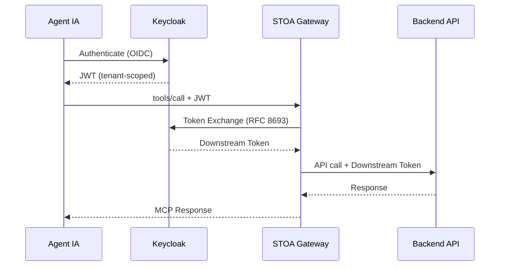

# Fiche #2 : OAuth 2.0 + Échange de Tokens (RFC 8693)

> STOA exploite OAuth 2.0 avec l'échange de tokens RFC 8693 pour permettre aux agents IA et aux utilisateurs d'accéder de façon sécurisée aux APIs multi-tenant sans partager de credentials entre les frontières de confiance.

## 5 Points Clés

### 1. Keycloak comme Broker d'Identité Fédéré

STOA utilise Keycloak avec un realm par tenant. Chaque realm isole les utilisateurs, les rôles et les clients. Keycloak se fédère avec les fournisseurs d'identité enterprise existants (Oracle OAM, Okta, Azure AD) via OIDC — aucune migration d'utilisateurs requise.

```
┌─────────────────────────────────────┐
│        Keycloak (STOA)              │
│  ┌───────────┐  ┌───────────┐      │
│  │ realm-acme│  │realm-globex│     │
│  └─────┬─────┘  └─────┬─────┘     │
│        │               │           │
│   Fédération      Fédération       │
│        │               │           │
│  ┌─────▼─────┐  ┌─────▼─────┐     │
│  │ Oracle OAM│  │  Azure AD │     │
│  └───────────┘  └───────────┘     │
└─────────────────────────────────────┘
```

### 2. L'Échange de Tokens (RFC 8693) Fait le Pont entre les Domaines de Confiance

Lorsqu'un agent IA authentifié via Keycloak a besoin d'appeler un backend derrière un gateway différent (ex. webMethods), STOA effectue un échange de tokens conforme aux standards. Le JWT de l'agent est échangé contre un token compatible avec le système downstream — aucun partage de credentials.



### 3. Accès Scopé avec Claims RBAC

Chaque JWT émis par STOA contient des claims et des scopes spécifiques au tenant (`stoa:read`, `stoa:write`, `stoa:admin`). Le MCP Gateway et les politiques OPA appliquent un contrôle d'accès fin par outil, par utilisateur, par tenant — pas de tokens sur-privilégiés.

| Scope | Actions Autorisées |
|-------|-------------------|
| `stoa:read` | Lister les outils, lire les ressources |
| `stoa:write` | Invoquer les outils, créer des abonnements |
| `stoa:admin` | Gérer les tenants, configurer les politiques |

### 4. Tokens de Courte Durée, Sans Credentials Stockés

Les tokens d'accès ont une courte durée de vie (défaut : 1 heure). Les refresh tokens gèrent la ré-authentification. Aucun credential de longue durée ne circule entre le cloud et les locaux — seuls des JWTs fédérés de courte durée franchissent la frontière.

### 5. Flux Standards pour Chaque Cas d'Usage

| Flux | Cas d'Usage |
|------|-------------|
| **Client Credentials** | Machine-to-machine (agents IA, CI/CD) |
| **Authorization Code + PKCE** | Applications web, Portail Développeur |
| **Token Exchange (RFC 8693)** | Délégation inter-gateway, inter-realm |

## Objections et Réponses

| Objection | Réponse |
|-----------|---------|
| "On a déjà OAuth — pourquoi un autre IdP ?" | Keycloak se fédère avec votre IdP existant. Pas de migration, pas de duplication. Il ajoute l'isolation multi-tenant par-dessus. |
| "L'échange de tokens ajoute de la latence" | L'échange se produit une fois par session, pas par requête. Les tokens downstream sont mis en cache. Surcharge typique : minimale (dépend du réseau et de l'infrastructure). |
| "Notre équipe sécurité n'acceptera pas l'auth cloud" | Le déploiement entièrement on-premise est supporté. Keycloak tourne dans votre cluster. |
| "RFC 8693 est niche — sera-t-il supporté longtemps ?" | RFC 8693 est un standard IETF supporté par Keycloak, Auth0 et Azure AD. C'est la façon standard de déléguer les tokens entre frontières de confiance. |

## Pour Aller Plus Loin

- [RFC 8693 — OAuth 2.0 Token Exchange](https://datatracker.ietf.org/doc/html/rfc8693)
- [Configuration de l'Authentification](/docs/guides/authentication) — Guide d'authentification STOA
- [Sécurité & Conformité](/docs/enterprise/security-compliance) — Couverture DORA, NIS2, RGPD
- [MCP Gateway](/docs/concepts/mcp-gateway) — Comment le gateway valide les tokens
