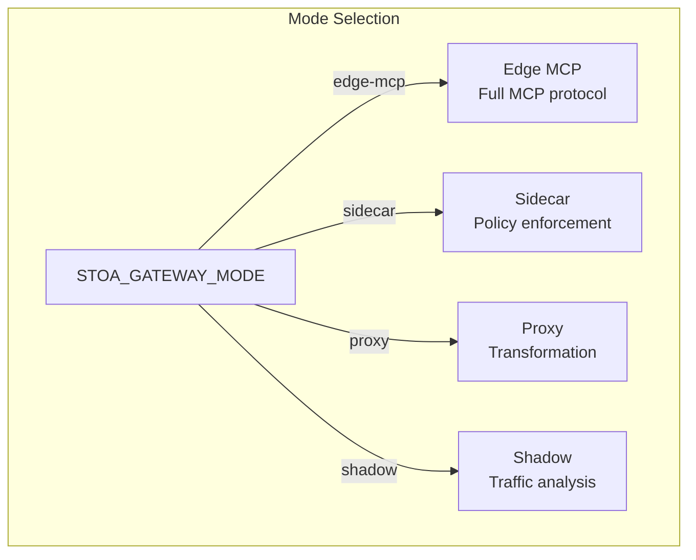
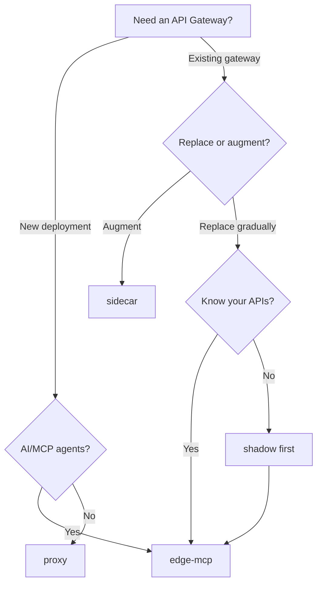

import EnvSetup from '@site/docs/_partials/_env-setup.mdx';

# Modes du Gateway

STOA Gateway supporte 4 modes de déploiement (définis dans [ADR-024](/docs/architecture/adr/adr-024-gateway-unified-modes)), chacun optimisé pour un pattern d'intégration différent. Sélectionnez le mode via la variable d'environnement `STOA_GATEWAY_MODE`.

## Vue d'Ensemble des Modes

| Mode | Port | Support MCP | Cas d'Usage | Statut |
|------|------|-------------|----------|--------|
| **edge-mcp** | 8080 | Oui | Gateway MCP autonome avec support complet du protocole | Production |
| **sidecar** | 8081 | Non | Application des politiques aux côtés des gateways existants | T2 2026 |
| **proxy** | 8082 | Non | Transformation inline des requêtes/réponses | T3 2026 |
| **shadow** | 8083 | Non | Capture passive du trafic et génération UAC | T4 2026 |



## Capacités par Mode

| Capacité | edge-mcp | sidecar | proxy | shadow |
|-----------|----------|---------|-------|--------|
| Protocole MCP (SSE) | Oui | Non | Non | Non |
| Découverte/invocation d'outils | Oui | Non | Non | Non |
| Authentification JWT | Oui | Oui | Oui | Non |
| Limitation de débit | Oui | Oui | Oui | Non |
| Disjoncteur | Oui | Non | Oui | Non |
| Transformation des requêtes | Non | Non | Oui | Non |
| Capture de trafic | Non | Non | Non | Oui |
| Génération UAC | Non | Non | Non | Oui |
| Nécessite un upstream | Non | Non | Oui | Oui |
| Passif (lecture seule) | Non | Non | Non | Oui |

## Mode Edge-MCP (Production)

Le mode de production par défaut et principal. Implémente le protocole MCP complet avec transport SSE, découverte OAuth 2.1, gestion des outils et gestion des sessions.

### Configuration

```bash
# Variables d'environnement
STOA_GATEWAY_MODE=edge-mcp

# Paramètres spécifiques edge-MCP
STOA_SSE_KEEPALIVE=true
STOA_SSE_KEEPALIVE_INTERVAL_SECS=30
STOA_MAX_SESSIONS=10000
STOA_SESSION_TIMEOUT_SECS=3600
```

### Valeurs Helm

```yaml
stoaGateway:
  mode: edge-mcp
  edgeMcp:
    sseKeepalive: true
    sseKeepaliveIntervalSecs: 30
    maxSessions: 10000
    sessionTimeoutSecs: 3600
```

### Routes Exposées

| Chemin | Méthode | Objectif |
|------|--------|---------|
| `/.well-known/oauth-authorization-server` | GET | Découverte OAuth 2.1 |
| `/.well-known/oauth-protected-resource` | GET | Métadonnées de ressource protégée |
| `/mcp/sse` | GET | Endpoint de transport SSE |
| `/mcp/messages` | POST | Endpoint de messages JSON-RPC |
| `/oauth/authorize` | GET | Proxy OIDC (vers Keycloak) |
| `/oauth/token` | POST | Proxy de tokens (vers Keycloak) |
| `/oauth/register` | POST | Enregistrement dynamique de clients |
| `/admin/*` | Divers | API Admin (22 endpoints) |
| `/health` | GET | Contrôle de santé |
| `/metrics` | GET | Métriques Prometheus |

### Quand Utiliser

- Déploiement gateway MCP autonome
- Intégration d'agents AI (Claude, GPT, agents personnalisés)
- Gestion complète des APIs avec limitation de débit, quotas et disjoncteurs
- Charges de production nécessitant le transport SSE

## Mode Sidecar

Se déploie aux côtés d'un gateway API existant (Kong, webMethods, Envoy) pour ajouter l'application des politiques STOA sans remplacer le gateway principal.

### Configuration

```bash
STOA_GATEWAY_MODE=sidecar

# Paramètres spécifiques sidecar
STOA_UPSTREAM_TYPE=generic       # Options : generic, webmethods, kong, envoy, apigee
STOA_USER_INFO_HEADER=X-User-Info
STOA_TENANT_ID_HEADER=X-Tenant-ID
STOA_DECISION_FORMAT=StatusCode  # Options : StatusCode, JsonBody, EnvoyExtAuthz, KongPlugin
```

### Format de Décision

Le sidecar répond aux vérifications d'auth/politiques dans un format compatible avec le gateway hôte :

| Format | Compatible Avec | Réponse |
|--------|----------------|----------|
| `StatusCode` | N'importe quel gateway | 200 (autoriser) ou 403 (refuser) |
| `JsonBody` | Intégrations personnalisées | JSON avec `allowed: true/false` et `reason` |
| `EnvoyExtAuthz` | Envoy, Istio | Réponse gRPC/HTTP ext_authz |
| `KongPlugin` | Kong | Réponse compatible plugin Kong |

### Routes Exposées

| Chemin | Méthode | Objectif |
|------|--------|---------|
| `/authz` | POST | Endpoint de décision d'autorisation |
| `/health` | GET | Contrôle de santé |
| `/metrics` | GET | Métriques Prometheus |

### Quand Utiliser

- Ajout du RBAC/limitation de débit STOA à un déploiement Kong ou Envoy existant
- Migration progressive depuis un gateway legacy
- Environnements où le remplacement du gateway n'est pas faisable

## Mode Proxy

Se positionne en ligne dans le chemin des requêtes, transformant les requêtes et les réponses entre les clients et les backends. Supporte l'injection d'en-têtes, la transformation de corps et le passthrough WebSocket.

### Configuration

```bash
STOA_GATEWAY_MODE=proxy

# Paramètres spécifiques proxy
STOA_TRANSFORM_REQUEST=false
STOA_TRANSFORM_RESPONSE=false
STOA_INJECT_HEADERS=true
STOA_WEBSOCKET_PASSTHROUGH=false
STOA_CONNECTION_POOL_SIZE=100
```

### Capacités

| Fonctionnalité | Défaut | Description |
|---------|---------|-------------|
| Transformation des requêtes | Désactivé | Modifier les en-têtes/corps avant transmission |
| Transformation des réponses | Désactivé | Modifier les en-têtes/corps avant retour |
| Injection d'en-têtes | Activé | Ajouter des en-têtes de tenant, trace et corrélation |
| Passthrough WebSocket | Désactivé | Transmettre les connexions WebSocket |
| Pool de connexions | 100 | Taille du pool de connexions upstream |

### Quand Utiliser

- Transformation requête/réponse entre clients et backends
- Ajout d'en-têtes d'observabilité au trafic API existant
- Proxying WebSocket avec application de politiques
- Environnements nécessitant une manipulation inline du trafic

## Mode Shadow

Capture passif le trafic pour analyse et génération automatique d'UAC (Universal API Contract). Ne modifie ni ne bloque aucune requête.

### Configuration

```bash
STOA_GATEWAY_MODE=shadow

# Paramètres spécifiques shadow
STOA_CAPTURE_METHOD=Inline       # Options : EnvoyTap, PortMirror, Inline, KafkaReplay
STOA_UAC_OUTPUT_DIR=/var/stoa/uac
STOA_AUTO_CREATE_MR=false
STOA_MIN_REQUESTS_FOR_UAC=100
STOA_ANALYSIS_WINDOW_HOURS=168   # 7 jours
```

### Méthodes de Capture

| Méthode | Description | Infrastructure |
|--------|-------------|----------------|
| `Inline` | STOA capture le trafic directement | Pas d'infra supplémentaire |
| `EnvoyTap` | Le filtre tap d'Envoy transmet des copies | Sidecar Envoy |
| `PortMirror` | Mise en miroir du trafic au niveau réseau | Config switch/routeur |
| `KafkaReplay` | Rejeu depuis un topic Kafka | Redpanda/Kafka |

### Génération d'UAC

Après avoir collecté `min_requests_for_uac` requêtes sur `analysis_window_hours`, le mode shadow génère un Universal API Contract :

```
1. Capturer le trafic (requêtes + réponses)
2. Analyser les patterns (endpoints, schémas, codes d'erreur)
3. Générer la spec OpenAPI + annotations UAC STOA
4. Sortie vers UAC_OUTPUT_DIR (ou auto-création MR si configuré)
```

### Routes Exposées

| Chemin | Méthode | Objectif |
|------|--------|---------|
| `/shadow/status` | GET | Statistiques de capture |
| `/shadow/generate` | POST | Déclencher la génération UAC |
| `/health` | GET | Contrôle de santé |
| `/metrics` | GET | Métriques Prometheus |

### Quand Utiliser

- Découverte d'APIs non documentées dans les environnements legacy
- Génération automatique de contrats API depuis le trafic en direct
- Analyse pré-migration avant passage à STOA
- Audit de conformité des patterns de trafic API

## Guide de Sélection du Mode



| Scénario | Mode Recommandé |
|----------|-----------------|
| Déploiement MCP greenfield | `edge-mcp` |
| Ajout de politiques à Kong existant | `sidecar` |
| Couche de transformation API | `proxy` |
| Découverte d'API legacy | `shadow` → puis `edge-mcp` |
| Migration progressive depuis webMethods | `shadow` → `sidecar` → `edge-mcp` |

## Configuration à l'Exécution

Définissez le mode via une variable d'environnement ou les valeurs Helm :

```bash
# Variable d'environnement (priorité la plus haute)
export STOA_GATEWAY_MODE=edge-mcp

# Valeurs Helm
stoaGateway:
  mode: edge-mcp
```

Le mode est journalisé au démarrage :

```
INFO Starting STOA Gateway version=2.0.0 mode=edge-mcp
```

Le gateway écoute sur le port par défaut du mode (8080-8083) sauf si surchargé.

## Dépannage

| Problème | Cause | Solution |
|---------|-------|-----|
| "Unknown mode" au démarrage | Valeur `STOA_GATEWAY_MODE` invalide | Utilisez : `edge-mcp`, `sidecar`, `proxy`, ou `shadow` |
| Les endpoints MCP retournent 404 | Mauvais mode sélectionné | Seul `edge-mcp` sert les routes MCP |
| Sidecar n'applique pas les politiques | Incompatibilité du format de décision | Faites correspondre `STOA_DECISION_FORMAT` au gateway hôte |
| Shadow ne capture pas le trafic | La méthode de capture nécessite une infra | Utilisez `Inline` si pas d'Envoy/Kafka disponible |
| Proxy abandonne le WebSocket | Passthrough désactivé | Définissez `STOA_WEBSOCKET_PASSTHROUGH=true` |

## Voir Aussi

- [Orchestration Multi-Gateway](/docs/guides/multi-gateway-setup) -- Pattern adaptateur multi-gateway
- [API MCP Gateway](/docs/api/mcp-gateway) -- Référence du protocole Edge-MCP
- [API Admin Gateway](/docs/api/gateway-admin-api) -- Endpoints admin
- [Guide d'Installation](/docs/admin/installation) -- Configuration du chart Helm
- [Vue d'Ensemble de l'Architecture](/docs/concepts/architecture) -- Architecture de la plateforme
