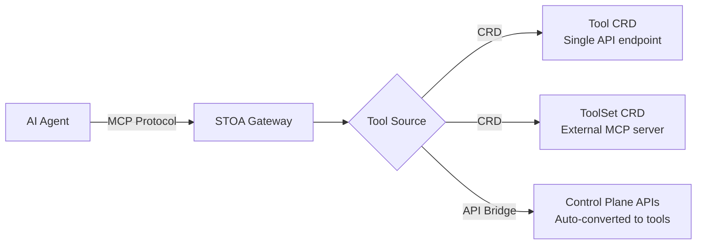

# Développement d'Outils MCP

Construisez, testez et déployez des outils MCP sur la plateforme STOA.

## Architecture

STOA expose des outils aux agents IA via deux mécanismes :



| Source | Cas d'Usage | Fonctionnement |
|--------|-------------|----------------|
| **Tool CRD** | Encapsuler une API REST en outil MCP | Définir l'endpoint + le schéma en YAML, le gateway l'appelle |
| **ToolSet CRD** | Connecter un serveur MCP existant | Le gateway découvre les outils via SSE/HTTP upstream |
| **API Bridge** | Exposer les APIs Control Plane comme outils | Conversion automatique des APIs enregistrées en outils MCP |

## Référence Tool CRD

### Schéma Complet

```yaml
apiVersion: gostoa.dev/v1alpha1
kind: Tool
metadata:
  name: <tool-name>          # Minuscules, tirets autorisés
  namespace: stoa-system      # Doit être dans le namespace gateway
spec:
  displayName: <string>       # Obligatoire — nom lisible par l'humain
  description: <string>       # Obligatoire — description pour le contexte LLM
  endpoint: <url>             # Obligatoire — endpoint HTTP backend
  method: <GET|POST|PUT|DELETE|PATCH>  # Obligatoire
  inputSchema:                # Obligatoire — JSON Schema pour les arguments
    type: object
    properties: { ... }
    required: [ ... ]
  outputSchema:               # Optionnel — JSON Schema pour la réponse
    type: object
    properties: { ... }
  auth: <bearer|service_account|none>  # Défaut : none
  rateLimit: "<N>/<unit>"     # Optionnel — ex. "100/min", "1000/hour"
  annotations:                # Optionnel — hints MCP 2025-03-26
    readOnly: <boolean>       # L'outil ne fait que lire des données
    destructive: <boolean>    # L'outil supprime/modifie de façon irréversible
    idempotent: <boolean>     # Même appel deux fois = même résultat
    openWorld: <boolean>      # Interagit avec des systèmes externes
```

### Statut (lecture seule, défini par le gateway)

```yaml
status:
  registered: true            # Le gateway a chargé cet outil
  lastSeen: "2026-02-13T10:30:00Z"
  error: ""                   # Vide = aucune erreur
```

### Bonnes Pratiques pour les Annotations

Les annotations aident les agents IA à décider quand et comment utiliser les outils en toute sécurité :

| Type d'Action | readOnly | destructive | idempotent | openWorld |
|---------------|----------|-------------|------------|-----------|
| **Lire/Rechercher** | `true` | `false` | `true` | selon cas |
| **Créer** | `false` | `false` | `false` | selon cas |
| **Mettre à jour** | `false` | `false` | `true` | selon cas |
| **Supprimer** | `false` | `true` | `false` | selon cas |
| **Appel externe** | selon cas | selon cas | selon cas | `true` |

:::tip
En cas de doute, définissez `openWorld: true` — cela signale que l'outil a des effets de bord au-delà du système local. Les agents IA traitent les outils avec `openWorld: false` comme sûrs à appeler de façon spéculative.
:::

### Patterns de Schéma d'Entrée

#### Paramètre de requête simple

```yaml
inputSchema:
  type: object
  properties:
    query:
      type: string
      description: "Search term"
  required: [query]
```

#### Objet complexe avec validation

```yaml
inputSchema:
  type: object
  properties:
    customer_id:
      type: string
      pattern: "^[A-Z]{2}-[0-9]{6}$"
      description: "Customer ID (format: XX-000000)"
    amount:
      type: number
      minimum: 0
      maximum: 1000000
      description: "Transaction amount in EUR"
    currency:
      type: string
      enum: [EUR, USD, GBP]
      default: EUR
  required: [customer_id, amount]
```

#### Objets imbriqués

```yaml
inputSchema:
  type: object
  properties:
    filters:
      type: object
      properties:
        status:
          type: string
          enum: [active, suspended, archived]
        created_after:
          type: string
          format: date
      description: "Filter criteria"
    pagination:
      type: object
      properties:
        page:
          type: integer
          minimum: 1
          default: 1
        per_page:
          type: integer
          minimum: 1
          maximum: 100
          default: 20
```

## Référence ToolSet CRD

### Schéma Complet

```yaml
apiVersion: gostoa.dev/v1alpha1
kind: ToolSet
metadata:
  name: <toolset-name>
  namespace: stoa-system
spec:
  upstream:
    url: <string>              # Obligatoire — URL du serveur MCP
    transport: <sse|streamable-http>  # Défaut : sse
    auth:                      # Optionnel
      type: <bearer|header>
      secretRef: <string>      # Nom du Secret K8s
      headerName: <string>     # Pour le type header uniquement
    timeoutSeconds: <integer>  # Timeout de connexion
  tools: []                    # Noms des outils à exposer (vide = tous)
  prefix: <string>             # Optionnel — préfixe pour les noms d'outils
```

### Statut (lecture seule)

```yaml
status:
  connected: true
  toolCount: 12
  discoveredTools:
    - search_customers
    - create_order
    - get_invoice
  lastSync: "2026-02-13T10:30:00Z"
  error: ""
```

### Exposition Sélective des Outils

Exposez uniquement des outils spécifiques depuis un serveur upstream :

```yaml
spec:
  tools:
    - search_customers
    - get_customer_detail
  # Seuls ces 2 outils seront disponibles, même si le serveur en a 20
```

### Préfixe pour Éviter les Conflits

Lorsque vous connectez plusieurs serveurs MCP qui peuvent avoir des outils avec le même nom :

```yaml
spec:
  prefix: "crm"
  # "search_customers" devient "crm_search_customers"
```

## Patterns d'Authentification

### Sans Auth (APIs Publiques)

```yaml
spec:
  auth: none
  endpoint: https://api.open-meteo.com/v1/forecast
```

### Bearer Token (Secret K8s)

```yaml
spec:
  auth: bearer
---
# Créer le secret d'abord
apiVersion: v1
kind: Secret
metadata:
  name: my-api-token
  namespace: stoa-system
type: Opaque
stringData:
  token: "sk-my-secret-token"
```

### Compte de Service (OAuth2 M2M)

```yaml
spec:
  auth: service_account
  # Utilise les credentials du compte de service Keycloak configuré dans le gateway
```

## Tester les Outils

### Vérifier que le CRD est Appliqué

```bash
kubectl get tools.gostoa.dev -n stoa-system -o wide
```

### Tester via REST

```bash
# Lister les outils
curl -s -X POST "${STOA_GATEWAY_URL}/mcp/v1/tools" \
  -H "Authorization: Bearer ${TOKEN}" | jq '.tools[] | {name, description}'

# Invoquer
curl -s -X POST "${STOA_GATEWAY_URL}/mcp/v1/tools/invoke" \
  -H "Authorization: Bearer ${TOKEN}" \
  -H "Content-Type: application/json" \
  -d '{"name": "get-weather", "arguments": {"q": "Berlin"}}' | jq
```

### Tester via le Protocole MCP

```bash
# Initialiser la session
curl -s -X POST "${STOA_GATEWAY_URL}/mcp/sse" \
  -H "Authorization: Bearer ${TOKEN}" \
  -H "Content-Type: application/json" \
  -d '{
    "jsonrpc": "2.0",
    "method": "initialize",
    "params": {
      "protocolVersion": "2025-03-26",
      "capabilities": {"tools": {}},
      "clientInfo": {"name": "test", "version": "1.0"}
    },
    "id": 1
  }' | jq

# Lister les outils
curl -s -X POST "${STOA_GATEWAY_URL}/mcp/sse" \
  -H "Authorization: Bearer ${TOKEN}" \
  -H "Content-Type: application/json" \
  -d '{"jsonrpc": "2.0", "method": "tools/list", "id": 2}' | jq

# Appeler un outil
curl -s -X POST "${STOA_GATEWAY_URL}/mcp/sse" \
  -H "Authorization: Bearer ${TOKEN}" \
  -H "Content-Type: application/json" \
  -d '{
    "jsonrpc": "2.0",
    "method": "tools/call",
    "params": {"name": "get-weather", "arguments": {"q": "Berlin"}},
    "id": 3
  }' | jq
```

### Vérifier via l'Admin Gateway

```bash
curl -s "${STOA_GATEWAY_URL}/admin/health" \
  -H "Authorization: Bearer ${ADMIN_TOKEN}" | jq
```

## Patterns de Déploiement

### Pattern 1 : Encapsuler une API REST Existante

Le pattern le plus courant — exposer l'API interne d'une entreprise aux agents IA :

```yaml
apiVersion: gostoa.dev/v1alpha1
kind: Tool
metadata:
  name: search-orders
  namespace: stoa-system
spec:
  displayName: Search Orders
  description: "Search customer orders by status, date range, or customer ID. Returns order summary with amounts."
  endpoint: https://erp.internal.example.com/api/v2/orders/search
  method: POST
  inputSchema:
    type: object
    properties:
      customer_id:
        type: string
        description: "Customer identifier"
      status:
        type: string
        enum: [pending, shipped, delivered, cancelled]
      date_from:
        type: string
        format: date
    required: [customer_id]
  auth: bearer
  rateLimit: "100/min"
  annotations:
    readOnly: true
    idempotent: true
    openWorld: false
```

### Pattern 2 : Fédération via ToolSet

Connecter un serveur MCP entier et exposer ses outils via l'auth et la limitation de débit de STOA :

```yaml
apiVersion: gostoa.dev/v1alpha1
kind: ToolSet
metadata:
  name: data-science-tools
  namespace: stoa-system
spec:
  upstream:
    url: https://ds-tools.internal.example.com/mcp
    transport: sse
    auth:
      type: bearer
      secretRef: ds-tools-secret
    timeoutSeconds: 60
  prefix: "ds"
  tools:
    - run_prediction
    - feature_importance
    - model_metrics
```

### Pattern 3 : Distribution Multi-Gateway des Outils

Déployer le même outil sur plusieurs instances gateway pour la haute disponibilité :

```bash
# Le Tool CRD est à portée de cluster — tous les gateways du namespace le voient
kubectl apply -f my-tool.yaml -n stoa-system

# Vérifier sur chaque gateway
curl -s "${STOA_GATEWAY_URL}/mcp/v1/tools" \
  -H "Authorization: Bearer ${TOKEN}" | jq '.tools | length'
```

## Prochaines Étapes

| Sujet | Lien |
|-------|------|
| Démarrage MCP | [Tutoriel rapide](/docs/guides/mcp-getting-started) |
| Référence API MCP | [Référence complète des endpoints](/docs/api/mcp-gateway) |
| Spec Tool CRD | [Référence CRD](/docs/reference/crds/tool) |
| Spec ToolSet CRD | [Référence CRD](/docs/reference/crds/toolset) |
| Modes du gateway | [Concepts d'architecture](/docs/concepts/mcp-gateway) |
