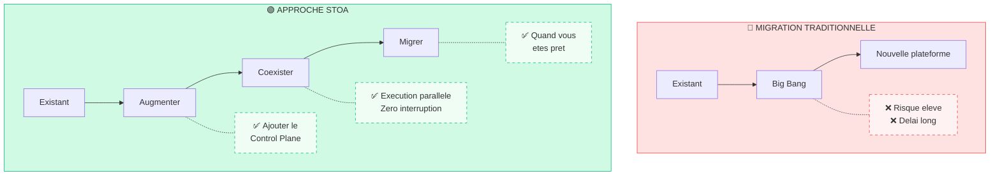

# Migration depuis les plateformes existantes

STOA Platform est concu pour **augmenter, et non remplacer** votre infrastructure API existante. Notre approche de migration minimise les risques tout en apportant une valeur immediate.

## Philosophie de migration

**Principe cle :** Gardez votre gateway existant en fonctionnement. Ajoutez STOA comme couche de controle. Migrez le trafic progressivement.

---

## Plateformes supportees

| Plateforme | Guide de migration | Complexite | Delai |
|----------|-----------------|------------|----------|
| [IBM webMethods / DataPower](/docs/guides/migration/ibm-webmethods) | Disponible | Moyenne | 4-8 semaines |
| [Oracle OAM / API Platform](/docs/guides/migration/oracle-oam) | Disponible | Moyenne | 4-8 semaines |
| Kong OSS / Enterprise | Bientot disponible | Faible | 2-4 semaines |
| Google Apigee | Bientot disponible | Moyenne | 4-6 semaines |
| AWS API Gateway | Prevu | Faible | 2-4 semaines |
| Azure API Management | Prevu | Moyenne | 4-6 semaines |

---

## Etapes generales de migration

Quelle que soit la plateforme source, la migration suit ces phases :

### Phase 1 : Evaluation (1-2 semaines)

1. **Inventaire** — Cataloguer toutes les APIs, consommateurs et dependances
2. **Analyse** — Identifier les patterns d'integration et les protocoles
3. **Planification** — Definir les vagues de migration et les criteres de succes

**Livrables :**
- Tableur d'inventaire des APIs
- Diagramme d'architecture d'integration
- Plan de vagues de migration

### Phase 2 : Mise en place parallele (2-4 semaines)

1. **Deployer STOA** — Installer le Control Plane et le Gateway
2. **Federer l'identite** — Connecter Keycloak au IdP existant
3. **Importer les APIs** — Enregistrer les APIs existantes dans le catalogue STOA
4. **Configurer le routage** — Mettre en place les chemins de trafic paralleles

**Livrables :**
- Environnement STOA operationnel
- Federation d'identite fonctionnelle
- APIs de test accessibles via les deux chemins

### Phase 3 : Migration du trafic (2-4 semaines)

1. **Mode Shadow** — STOA recoit une copie du trafic, aucun impact
2. **Canary** — 1-5% du trafic via STOA
3. **Progressif** — Augmentation a 50%, 75%, 100%
4. **Basculement** — Trafic de production complet

**Livrables :**
- Comparaison des metriques de trafic
- Validation des performances
- Rollback teste

### Phase 4 : Optimisation (Continu)

1. **Decommissionnement** — Supprimer l'ancien routage quand vous etes pret
2. **Amelioration** — Ajouter les fonctionnalites natives STOA (rate limiting, analytics)
3. **Expansion** — Integrer les nouvelles APIs directement dans STOA

---

## Attenuation des risques

### Strategie de rollback

Chaque phase de migration inclut un plan de rollback :

| Phase | Action de rollback | Delai de rollback |
|-------|-----------------|------------------|
| Shadow | Desactiver le routage shadow | Immediat |
| Canary | Revertir le poids du trafic | < 1 minute |
| Progressif | Reduire le pourcentage STOA | < 1 minute |
| Complet | Fallback DNS/routage | 5-15 minutes |

### Continuite des donnees

- **Configuration** — Versionnee dans Git
- **Metriques** — Donnees historiques preservees dans les deux systemes
- **Logs** — Unifies dans OpenSearch quelle que soit la source

---

## Ce que vous conservez

La migration STOA ne necessite pas d'abandonner votre investissement :

| Asset | Statut apres migration |
|-------|------------------------|
| Gateway existant | Peut continuer a fonctionner (mode hybride) |
| Definitions d'API | Importees dans le catalogue STOA |
| Fournisseur d'identite | Federe via Keycloak |
| Stack de monitoring | Integre (Prometheus, Grafana) |
| Politiques personnalisees | Traduites au format STOA |

---

## Ce qui change

| Avant | Apres |
|--------|-------|
| Integration manuelle des APIs | Portail en libre-service |
| Logs disperses | Observabilite unifiee |
| Metriques cloisonnees | Tableaux de bord centralises |
| Integrations point-a-point | Catalogue d'APIs avec decouverte |
| Demandes d'acces par email | Workflow d'abonnement automatise |

---

## Metriques de succes

Suivez ces KPIs pendant la migration :

| Metrique | Objectif |
|--------|--------|
| Enregistrement des APIs | 100% importees |
| Migration du trafic | 100% via STOA |
| Taux d'erreur | ≤ pre-migration |
| Latence | ≤ pre-migration + 5ms |
| Satisfaction developpeurs | Amelioration du NPS |

---

## Prochaines etapes

Choisissez le guide correspondant a votre plateforme source :

- [IBM webMethods / DataPower](/docs/guides/migration/ibm-webmethods) — Migration depuis Software AG
- [Oracle OAM / API Platform](/docs/guides/migration/oracle-oam) — Migration depuis la stack Oracle
- [Kong OSS / Enterprise](/docs/guides/migration/kong) — Kong vers STOA (bientot disponible)
- [Google Apigee](/docs/guides/migration/apigee) — Migration Apigee (bientot disponible)

Ou [contactez-nous](mailto:contact@gostoa.dev) pour une evaluation de migration personnalisee.
