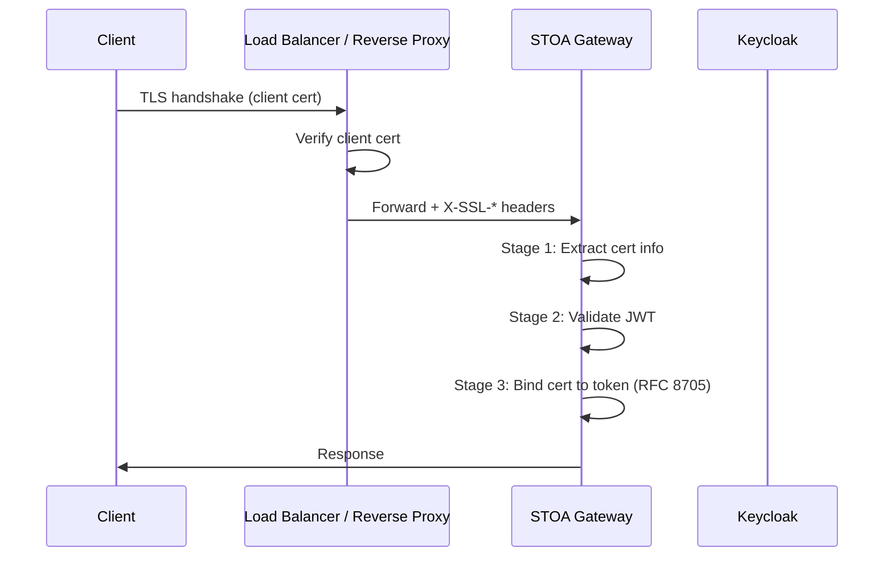

import EnvSetup from '@site/docs/_partials/_env-setup.mdx';

# Configuration mTLS

STOA Gateway supporte le mTLS (mutual TLS) avec validation de tokens liés aux certificats selon la RFC 8705. Les certificats clients sont validés au niveau du gateway, et leurs empreintes sont liées aux tokens JWT pour une preuve de possession de bout en bout.

## Architecture



Le load balancer (nginx, HAProxy, F5) termine le TLS et transmet les détails du certificat via les en-têtes `X-SSL-*`. Le gateway valide ces en-têtes et les lie aux tokens JWT.

## Configuration

### Variables d'Environnement

| Variable | Défaut | Description |
|----------|---------|-------------|
| `STOA_MTLS_ENABLED` | `false` | Activer le traitement mTLS |
| `STOA_MTLS_REQUIRE_BINDING` | `true` | Exiger la claim JWT `cnf` lorsqu'un certificat est présent |
| `STOA_MTLS_TRUSTED_PROXIES` | (vide) | CIDRs de proxies de confiance séparés par des virgules |
| `STOA_MTLS_ALLOWED_ISSUERS` | (vide) | DNs d'émetteurs autorisés séparés par des virgules |
| `STOA_MTLS_REQUIRED_ROUTES` | (vide) | Patterns glob pour les routes nécessitant des certificats |
| `STOA_MTLS_TENANT_FROM_DN` | `true` | Extraire le tenant du DN sujet du certificat |

### Mapping des En-têtes

Le gateway lit les données du certificat depuis ces en-têtes (configurables) :

| En-tête | Défaut | Contenu |
|--------|---------|---------|
| `X-SSL-Client-Verify` | -- | `SUCCESS` si le certificat est vérifié |
| `X-SSL-Client-Fingerprint` | -- | Empreinte SHA-256 |
| `X-SSL-Client-S-DN` | -- | DN Sujet (RFC 2253) |
| `X-SSL-Client-I-DN` | -- | DN Émetteur |
| `X-SSL-Client-Serial` | -- | Numéro de série (hex) |
| `X-SSL-Client-NotBefore` | -- | Début de validité |
| `X-SSL-Client-NotAfter` | -- | Fin de validité |

## Tokens Liés aux Certificats RFC 8705

Lorsqu'un client présente à la fois un certificat et un JWT, le gateway vérifie que le token a été émis pour ce certificat spécifique :

1. Extraire l'empreinte du certificat (SHA-256) depuis `X-SSL-Client-Fingerprint`
2. Extraire la claim `cnf.x5t#S256` du JWT
3. Comparer en utilisant une comparaison à temps constant (`subtle::ConstantTimeEq`)
4. En cas de divergence : rejeter avec `403 MTLS_BINDING_MISMATCH`

### Token JWT avec Claim cnf

```json
{
  "sub": "user-123",
  "iss": "https://auth.<YOUR_DOMAIN>/realms/stoa",
  "cnf": {
    "x5t#S256": "base64url-encoded-sha256-thumbprint"
  }
}
```

### Normalisation du Format d'Empreinte

Le gateway normalise automatiquement les empreintes depuis trois formats :

| Format d'Entrée | Exemple | Sortie |
|-------------|---------|--------|
| Hex avec deux-points | `a1:b2:c3:...` | `a1b2c3...` (hex minuscules) |
| Hex brut | `A1B2C3...` | `a1b2c3...` (hex minuscules) |
| Base64url | `obsz...` | Décodé en hex |

## Déploiement Progressif

### Phase 1 : Surveillance Uniquement

Activer le traitement mTLS sans application :

```bash
STOA_MTLS_ENABLED=true
STOA_MTLS_REQUIRE_BINDING=false
```

Les certificats sont extraits et journalisés, mais les requêtes sans certificats sont toujours autorisées.

### Phase 2 : Requis sur les Routes de Test

```bash
STOA_MTLS_ENABLED=true
STOA_MTLS_REQUIRE_BINDING=true
STOA_MTLS_REQUIRED_ROUTES=/api/v1/test-mtls/*
```

### Phase 3 : Application en Production

```bash
STOA_MTLS_ENABLED=true
STOA_MTLS_REQUIRE_BINDING=true
STOA_MTLS_REQUIRED_ROUTES=/api/v1/payments/*,/api/v1/transfers/*
STOA_MTLS_TRUSTED_PROXIES=10.0.1.0/24
STOA_MTLS_ALLOWED_ISSUERS=CN=STOA Intermediate CA,O=STOA Platform,C=FR
```

## Configuration des Proxies de Confiance

Lorsque `STOA_MTLS_TRUSTED_PROXIES` est défini, le gateway n'accepte les en-têtes `X-SSL-*` que depuis des requêtes provenant d'IPs de confiance :

```bash
# Faire confiance à des plages CIDR spécifiques
STOA_MTLS_TRUSTED_PROXIES=10.0.0.0/8,172.16.0.0/12

# Faire confiance à une IP unique
STOA_MTLS_TRUSTED_PROXIES=10.0.1.50

# Vide = accepter depuis toutes les sources (dev uniquement)
STOA_MTLS_TRUSTED_PROXIES=
```

Les sources non fiables envoyant des en-têtes `X-SSL-*` reçoivent `403 MTLS_UNTRUSTED_PROXY`.

## Réponses d'Erreur

| Code d'Erreur | Statut HTTP | Cause |
|------------|-------------|-------|
| `MTLS_CERT_REQUIRED` | 401 | Certificat requis sur cette route |
| `MTLS_CERT_INVALID` | 403 | L'en-tête Verify n'est pas `SUCCESS` |
| `MTLS_CERT_EXPIRED` | 403 | Le `NotAfter` du certificat est dans le passé |
| `MTLS_ISSUER_DENIED` | 403 | Émetteur absent de la liste autorisée |
| `MTLS_BINDING_REQUIRED` | 403 | Le JWT manque la claim `cnf` (liaison requise) |
| `MTLS_BINDING_MISMATCH` | 403 | L'empreinte du certificat ne correspond pas au JWT |
| `MTLS_UNTRUSTED_PROXY` | 403 | En-têtes X-SSL-* depuis une IP non fiable |

## En-têtes en Aval

Après une validation réussie, le gateway transmet ces en-têtes aux services backend :

```
X-Authenticated-Client-Fingerprint: {16 premiers caractères de l'empreinte}
X-Authenticated-Client-Subject: {DN sujet}
```

## Voir Aussi

- [Durcissement de la Sécurité](/docs/admin/security-hardening) -- Sécurité en production
- [Guide d'Authentification](/docs/guides/authentication) -- Flux OIDC
- [Configuration de Sécurité](/docs/reference/security-configuration) -- Paramètres JWT et CORS
- [Intégration des Consommateurs](/docs/guides/consumer-onboarding) -- Provisionnement des certificats mTLS
