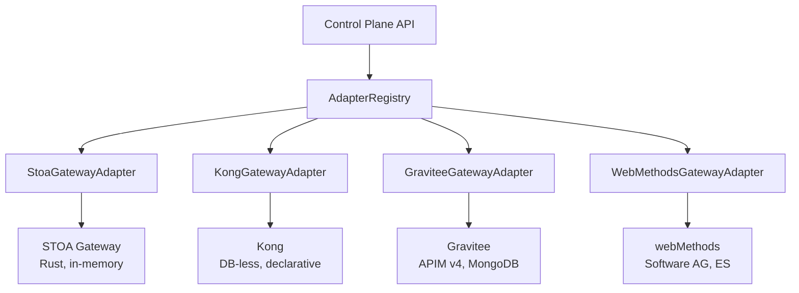
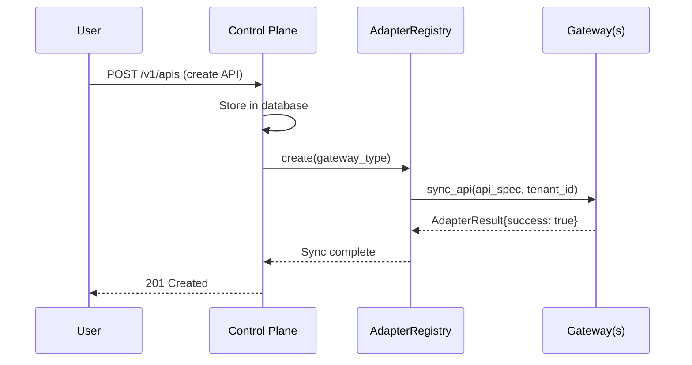
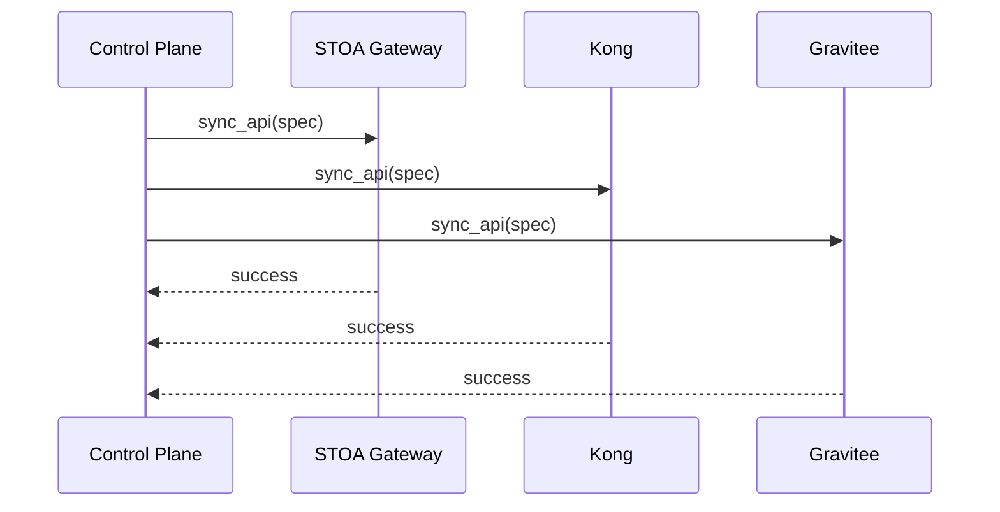

import EnvSetup from '@site/docs/_partials/_env-setup.mdx';

# Orchestration Multi-Gateway

Le Plan de Contrôle STOA orchestre plusieurs gateways API grâce à un **pattern Adaptateur** unifié. Enregistrez n'importe quel gateway supporté, et le Plan de Contrôle gère la synchronisation des APIs, l'application des politiques et le provisionnement des consommateurs sur tous ces gateways.

## Architecture



## Gateways Supportés

| Gateway | Type | Stockage | API Admin | Statut Adaptateur |
|---------|------|---------|-----------|----------------|
| **STOA** | Rust, axum | En mémoire | REST (`/admin/*`) | Support complet |
| **Kong** | Lua, OpenResty | YAML DB-less | REST (`:8001`) | Support complet |
| **Gravitee** | Java | MongoDB + ES | REST (`:8083`) | Support complet |
| **webMethods** | Java | Elasticsearch | REST (`:5555`) | Support complet (16/16 méthodes) |

## Interface Adaptateur

Chaque adaptateur de gateway implémente 16 méthodes abstraites organisées en 5 catégories :

### Cycle de Vie (3 méthodes)

| Méthode | Objectif | Retourne |
|--------|---------|---------|
| `health_check()` | Vérifier la connectivité du gateway | `AdapterResult` |
| `connect()` | Initialiser la connexion/session | `None` |
| `disconnect()` | Libérer les ressources | `None` |

### Gestion des APIs (3 méthodes)

| Méthode | Objectif | Retourne |
|--------|---------|---------|
| `sync_api(api_spec, tenant_id)` | Créer ou mettre à jour une route API | `AdapterResult` |
| `delete_api(api_id)` | Supprimer une route API | `AdapterResult` |
| `list_apis()` | Lister toutes les APIs gérées | `list[dict]` |

### Gestion des Politiques (3 méthodes)

| Méthode | Objectif | Retourne |
|--------|---------|---------|
| `upsert_policy(policy_spec)` | Créer ou mettre à jour une politique (limite de débit, CORS) | `AdapterResult` |
| `delete_policy(policy_id)` | Supprimer une politique | `AdapterResult` |
| `list_policies()` | Lister toutes les politiques gérées | `list[dict]` |

### Gestion des Consommateurs (3 méthodes)

| Méthode | Objectif | Retourne |
|--------|---------|---------|
| `provision_application(app_spec)` | Enregistrer un consommateur avec ses credentials | `AdapterResult` |
| `deprovision_application(app_id)` | Supprimer un consommateur | `AdapterResult` |
| `list_applications()` | Lister tous les consommateurs gérés | `list[dict]` |

### Étendu (4 méthodes, spécifiques au gateway)

| Méthode | Objectif | Supporté Par |
|--------|---------|--------------|
| `upsert_auth_server(auth_spec)` | Configurer un fournisseur OIDC | webMethods |
| `upsert_strategy(strategy_spec)` | Définir la stratégie d'auth | webMethods |
| `upsert_scope(scope_spec)` | Définir les scopes OAuth | webMethods |
| `upsert_alias(alias_spec)` | Configurer un alias d'endpoint | webMethods |
| `apply_config(config_spec)` | Appliquer la configuration complète | webMethods |
| `export_archive()` | Exporter une sauvegarde du gateway | webMethods |

Les méthodes non supportées retournent `AdapterResult(success=False, error="Not supported by <gateway>")`.

### AdapterResult

Toutes les méthodes d'adaptateur retournent un résultat standardisé :

```python
@dataclass
class AdapterResult:
    success: bool
    resource_id: str | None = None
    data: dict | None = None
    error: str | None = None
```

## Enregistrement des Gateways

Enregistrez les gateways via l'API du Plan de Contrôle ou via CRD :

### Via l'API

<EnvSetup />

```bash
curl -X POST "${STOA_API_URL}/v1/gateways" \
  -H "Authorization: Bearer ${TOKEN}" \
  -H "Content-Type: application/json" \
  -d '{
    "name": "kong-production",
    "display_name": "Kong Production (GRA)",
    "gateway_type": "kong",
    "base_url": "http://kong-admin:8001",
    "environment": "prod",
    "capabilities": ["rest", "rate_limiting"]
  }'
```

### Via CRD

```yaml
apiVersion: gostoa.dev/v1alpha1
kind: GatewayInstance
metadata:
  name: kong-production
  namespace: stoa-system
spec:
  displayName: Kong Production (GRA)
  gatewayType: kong
  environment: prod
  baseUrl: http://kong-admin:8001
  capabilities: [rest, rate_limiting]
```

### Types de Gateways

Valeurs valides pour `gateway_type` :

| Type | Description |
|------|-------------|
| `stoa` | STOA Gateway (générique) |
| `stoa_edge_mcp` | STOA en mode edge-mcp |
| `stoa_sidecar` | STOA en mode sidecar |
| `stoa_proxy` | STOA en mode proxy |
| `stoa_shadow` | STOA en mode shadow |
| `kong` | Kong (DB-less) |
| `gravitee` | Gravitee APIM v4 |
| `webmethods` | Software AG webMethods |
| `apigee` | Google Apigee |
| `aws_apigateway` | AWS API Gateway |

## Détails par Gateway

### STOA Gateway (Rust)

| Aspect | Détail |
|--------|--------|
| API Admin | `POST /admin/apis`, `POST /admin/policies`, `GET /admin/health` |
| Auth | Token Bearer (`admin_api_token`) |
| Stockage | En mémoire (le Plan de Contrôle est la source de vérité) |
| Idempotence | `sync_api` et `upsert_policy` sont tous deux des upserts |
| Comportement clé | Tout l'état est perdu au redémarrage ; l'API CP re-synchronise automatiquement |

```bash
# Contrôle de santé
curl "${STOA_GATEWAY_URL}/admin/health" \
  -H "Authorization: Bearer ${ADMIN_TOKEN}"
```

### Kong (DB-less)

| Aspect | Détail |
|--------|--------|
| API Admin | `GET /services`, `GET /plugins`, `POST /config` |
| Auth | En-tête `Kong-Admin-Token` |
| Stockage | YAML déclaratif via `POST /config` (rechargement atomique) |
| Pattern d'état | Lire l'état actuel → fusionner les modifications → POST de la configuration complète |
| Version de config | `_format_version: "3.0"` requis |

Le mode DB-less de Kong rend l'API Admin en lecture seule pour les écritures individuelles. Toutes les mutations suivent le pattern lire-fusionner-poster :

```
1. GET /services + /plugins + /consumers → état actuel
2. Fusionner le changement souhaité (upsert par nom/tag)
3. POST /config avec le payload déclaratif complet → rechargement atomique
```

### Gravitee (APIM v4)

| Aspect | Détail |
|--------|--------|
| API Management | `/management/v2/environments/DEFAULT/apis` |
| Auth | Auth Basic (configurable) |
| Stockage | MongoDB + Elasticsearch (CRUD complet) |
| Cycle de vie API | `CREATED → PUBLISHED → STARTED → DEPLOYED` |
| Plans | Limitation de débit via des Plans avec flows (pas des politiques autonomes) |

Les APIs Gravitee nécessitent des transitions de cycle de vie explicites :

```
1. POST /apis (créer, définition V4)
2. POST /apis/{id}/_start (démarrer)
3. POST /apis/{id}/deployments (déployer)
```

### webMethods (Software AG)

| Aspect | Détail |
|--------|--------|
| API Admin | `/rest/apigateway/*` |
| Auth | Auth Basic (`Administrator:manage`) |
| Stockage | Elasticsearch (interne) |
| Ensemble de fonctionnalités | 16/16 méthodes complètes (adaptateur le plus complet) |
| Import OpenAPI | Seulement 3.0.x supporté (pas 3.1.0) |

webMethods est l'adaptateur le plus complet, supportant l'intégration OIDC, les alias d'endpoints, la gestion de configuration et la sauvegarde/export complète.

## Flux de Synchronisation

Lorsque vous créez ou mettez à jour une API dans le Plan de Contrôle, elle se synchronise avec tous les gateways liés :



Pour les configurations multi-gateway, le Plan de Contrôle se synchronise avec chaque gateway lié :



## Ajouter un Nouvel Adaptateur de Gateway

1. Copiez `control-plane-api/src/adapters/template/` vers `adapters/<new_gateway>/`
2. Implémentez les 16 méthodes abstraites dans `adapter.py`
3. Créez les fonctions de traduction de spec dans `mappers.py`
4. Enregistrez dans `adapters/registry.py`
5. Ajoutez le type à la migration de base de données `gateway_type_enum`
6. Écrivez des tests (~30+ tests unitaires avec appels HTTP mockés)

### Règles du Contrat Adaptateur

- Toutes les méthodes **doivent être idempotentes** (appeler deux fois produit le même résultat)
- Retourner `AdapterResult(success=False, error="...")` pour les échecs ; ne jamais lever d'exceptions
- Utiliser `httpx.AsyncClient` pour les appels HTTP (async, pool de connexions)
- Journaliser les avertissements pour les échecs non critiques (par exemple plan non souscriptible)

## Dépannage

| Problème | Cause | Solution |
|---------|-------|-----|
| `sync_api` retourne 404 | Gateway non enregistré | Enregistrez d'abord via l'API ou CRD |
| Le rechargement de config Kong échoue | Service invalide dans le payload | Tout ou rien : un mauvais service casse le rechargement |
| L'API Gravitee n'est pas accessible | API non démarrée/déployée | Exécutez le cycle de vie complet : créer → plan → publier → déployer → démarrer |
| L'import webMethods échoue | Spec OpenAPI 3.1.0 | Convertir en 3.0.3 : `sed 's/3.1.0/3.0.3/'` |
| L'adaptateur retourne "Not supported" | Méthode étendue sur non-webMethods | Attendu ; seul webMethods supporte les 16 méthodes |

## Voir Aussi

- [Modes du Gateway](/docs/guides/gateway-modes) -- Modes de déploiement du gateway STOA
- [Guide d'Installation](/docs/admin/installation) -- Chart Helm et CRDs
- [API Admin Gateway](/docs/api/gateway-admin-api) -- Endpoints admin du gateway STOA
- [Vue d'Ensemble de l'Architecture](/docs/concepts/architecture) -- Architecture de la plateforme
- [Déploiement Hybride](/docs/deployment/hybrid) -- Déploiement multi-cloud de gateways
