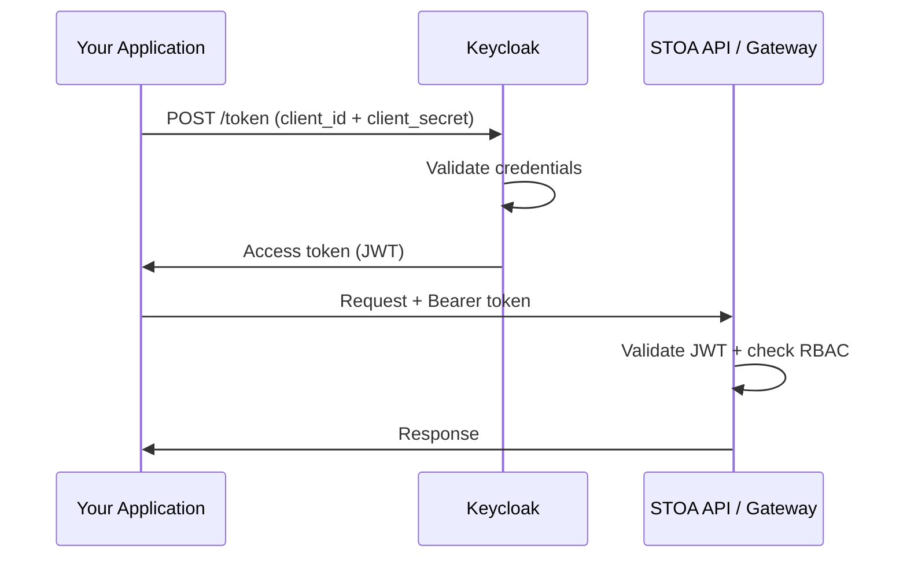

import EnvSetup from '@site/docs/_partials/_env-setup.mdx';

# Comptes de Service

Les comptes de service fournissent un accès machine à machine (M2M) aux APIs STOA en utilisant le grant OAuth2 `client_credentials`. Ils sont idéaux pour les pipelines CI/CD, les services backend et les scripts d'automatisation.

## Fonctionnement



1. Votre application s'authentifie auprès de Keycloak avec `client_id` et `client_secret`
2. Keycloak retourne un token d'accès JWT
3. Le token est utilisé comme token Bearer pour les requêtes API
4. Le compte de service hérite du rôle RBAC de l'utilisateur qui l'a créé

## Créer un Compte de Service

### Via l'API

<EnvSetup />

```bash
curl -X POST "${STOA_API_URL}/v1/service-accounts" \
  -H "Authorization: Bearer $TOKEN" \
  -H "Content-Type: application/json" \
  -d '{
    "name": "ci-pipeline",
    "description": "CI/CD pipeline for API deployments"
  }'
```

Réponse (credentials affichés une seule fois) :

```json
{
  "id": "sa_abc123",
  "name": "ci-pipeline",
  "client_id": "sa-ci-pipeline-a1b2c3",
  "client_secret": "generated-secret-shown-once",
  "created_at": "2026-02-13T10:00:00Z"
}
```

**Sauvegardez le `client_secret` immédiatement** — il ne peut pas être récupéré après la création.

### Via le Portail

1. Accédez à **Comptes de Service** dans la barre latérale du Portail
2. Cliquez sur **Créer un Compte de Service**
3. Saisissez un nom et une description optionnelle
4. Cliquez sur **Créer**
5. Copiez le `client_id` et le `client_secret` (affichés une seule fois)

## Utiliser un Compte de Service

### Obtenir un Token d'Accès

```bash
TOKEN=$(curl -s -X POST "${STOA_AUTH_URL}/realms/stoa/protocol/openid-connect/token" \
  -d "grant_type=client_credentials" \
  -d "client_id=sa-ci-pipeline-a1b2c3" \
  -d "client_secret=your-client-secret" \
  | jq -r '.access_token')
```

### Effectuer des Requêtes API

```bash
# Lister les APIs
curl -s "${STOA_API_URL}/v1/apis" \
  -H "Authorization: Bearer $TOKEN"

# Appeler un outil via MCP Gateway
curl -s "${STOA_GATEWAY_URL}/v1/tools/payment-tool/execute" \
  -H "Authorization: Bearer $TOKEN" \
  -H "Content-Type: application/json" \
  -d '{"input": {"amount": 100}}'
```

### Exemple Python

```python
import httpx

async def get_token(client_id: str, client_secret: str) -> str:
    async with httpx.AsyncClient() as client:
        response = await client.post(
            f"{auth_url}/realms/stoa/protocol/openid-connect/token",
            data={
                "grant_type": "client_credentials",
                "client_id": client_id,
                "client_secret": client_secret,
            },
        )
        return response.json()["access_token"]
```

## Héritage RBAC

Les comptes de service héritent du rôle de l'utilisateur qui les a créés :

| Rôle du Créateur | Permissions du Compte de Service |
|-------------|---------------------------|
| `cpi-admin` | Accès complet à la plateforme |
| `tenant-admin` | Tenant propre : lecture + écriture |
| `devops` | Tenant propre : déployer + promouvoir |
| `viewer` | Accès en lecture seule |

Les comptes de service sont limités au même tenant que leur créateur.

## Rotation des Secrets

### Régénérer un Secret

```bash
curl -X POST "${STOA_API_URL}/v1/service-accounts/{sa_id}/regenerate-secret" \
  -H "Authorization: Bearer $TOKEN"
```

Réponse :

```json
{
  "client_id": "sa-ci-pipeline-a1b2c3",
  "client_secret": "new-generated-secret"
}
```

L'ancien secret est invalidé immédiatement. Mettez à jour tous les systèmes utilisant ce compte de service avant de faire la rotation.

### Bonnes Pratiques de Rotation

1. **Rotation tous les 90 jours** — alignez avec votre politique de rotation des secrets
2. **Mettez à jour les consommateurs en premier** — déployez le nouveau secret sur tous les clients avant la rotation
3. **Utilisez des variables d'environnement** — ne codez jamais les secrets en dur dans le code source
4. **Surveillez les échecs de tokens** — un pic d'erreurs 401 après la rotation indique des mises à jour manquées

## Gérer les Comptes de Service

### Lister les Comptes de Service

```bash
curl "${STOA_API_URL}/v1/service-accounts" \
  -H "Authorization: Bearer $TOKEN"
```

### Supprimer un Compte de Service

```bash
curl -X DELETE "${STOA_API_URL}/v1/service-accounts/{sa_id}" \
  -H "Authorization: Bearer $TOKEN"
```

La suppression retire le client Keycloak et invalide immédiatement tous les tokens.

## Intégration CI/CD

### GitHub Actions

```yaml
jobs:
  deploy-api:
    steps:
      - name: Get STOA token
        run: |
          TOKEN=$(curl -s -X POST "$STOA_AUTH_URL/realms/stoa/protocol/openid-connect/token" \
            -d "grant_type=client_credentials" \
            -d "client_id=${{ secrets.STOA_CLIENT_ID }}" \
            -d "client_secret=${{ secrets.STOA_CLIENT_SECRET }}" \
            | jq -r '.access_token')
          echo "STOA_TOKEN=$TOKEN" >> $GITHUB_ENV

      - name: Sync API spec
        run: |
          curl -X POST "$STOA_API_URL/v1/apis/sync" \
            -H "Authorization: Bearer $STOA_TOKEN" \
            -H "Content-Type: application/json" \
            -d @openapi.json
```

### Mise en Cache des Tokens

Les tokens d'accès ont un TTL par défaut de 5 minutes. Pour les processus de longue durée, rafraîchissez le token avant l'expiration :

```bash
# Vérifier l'expiration du token
echo $TOKEN | cut -d. -f2 | base64 -d 2>/dev/null | jq '.exp'
```

## Voir Aussi

- [Guide d'Authentification](/docs/guides/authentication) -- Flux OIDC pour les utilisateurs interactifs
- [Permissions RBAC](/docs/reference/rbac-permissions) -- Matrice des rôles
- [Administration Keycloak](/docs/admin/keycloak) -- Configuration des clients
- [Configuration de Sécurité](/docs/reference/security-configuration) -- Paramètres JWT
