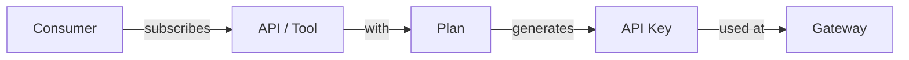
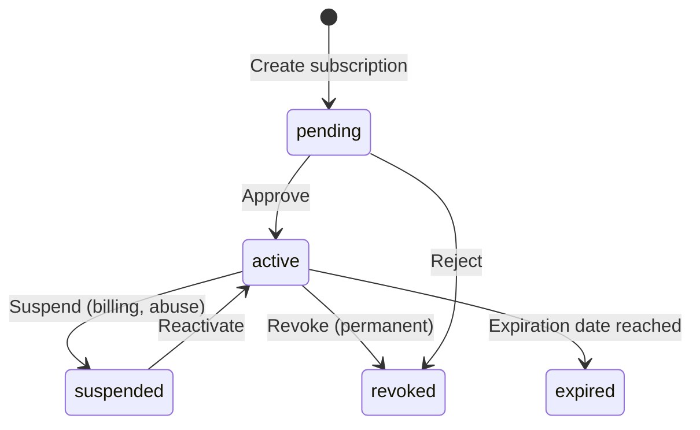

import EnvSetup from '@site/docs/_partials/_env-setup.mdx';

# Cycle de Vie des Abonnements

Comment les abonnements passent de la demande à la clé API active — avec les workflows d'approbation, les transitions d'état et le provisionnement gateway.

## Vue d'Ensemble

Tout accès à une API ou un outil MCP dans STOA passe par un abonnement. Les abonnements connectent un **consommateur** (qui veut accéder) à une **API** (ce à quoi il veut accéder) via un **plan** (le niveau d'accès accordé).



## États des Abonnements



| État | Accès | Transition Depuis | Transition Vers |
|------|--------|----------------|---------------|
| **pending** | Aucun — en attente d'approbation | `[*]` | `active`, `revoked` |
| **active** | Accès complet à l'API | `pending`, `suspended` | `suspended`, `revoked`, `expired` |
| **suspended** | Bloqué temporairement | `active` | `active`, `revoked` |
| **revoked** | Annulé définitivement | `pending`, `active`, `suspended` | Terminal |
| **expired** | Expiré automatiquement | `active` | Terminal |

## Format des Clés API

Lorsqu'un abonnement est approuvé, STOA génère une clé API unique :

```
stoa_sk_a1b2c3d4e5f6a1b2c3d4e5f6a1b2c3d4
└──────┘ └──────────────────────────────────┘
 prefix   32 hex characters (128 bits entropy)
```

| Variante | Préfixe | Utilisation |
|---------|--------|-------|
| Abonnement API REST | `stoa_sk_` | Accès API standard via l'en-tête `X-API-Key` |
| Abonnement serveur MCP | `stoa_mcp_` | Accès aux outils MCP via gateway |

**Sécurité** :
- La clé API complète est retournée **une seule fois** à la création — stockez-la en lieu sûr
- STOA ne stocke qu'un **hash SHA-256** — la clé ne peut pas être récupérée
- Le **préfixe** (`stoa_sk_a1b2`) est stocké pour identification dans les tableaux de bord

<EnvSetup />

## Créer un Abonnement

### Via l'API REST

```bash
curl -X POST "${STOA_API_URL}/v1/subscriptions" \
  -H "Authorization: Bearer ${TOKEN}" \
  -H "Content-Type: application/json" \
  -d '{
    "api_id": "billing-api",
    "plan_name": "gold",
    "application_name": "my-payment-app"
  }'
```

**Réponse :**

```json
{
  "id": "sub-uuid-123",
  "status": "pending",
  "api_key": "stoa_sk_a1b2c3d4e5f6a1b2c3d4e5f6a1b2c3d4",
  "api_key_prefix": "stoa_sk_a1b2",
  "api_name": "billing-api",
  "plan_name": "gold",
  "created_at": "2026-02-13T10:00:00Z"
}
```

:::warning Sauvegardez Votre Clé API
Le champ `api_key` n'est retourné qu'une seule fois. Copiez-le dans un endroit sécurisé (par exemple Infisical, variable d'environnement). Il ne pourra pas être récupéré ultérieurement — seulement renouvelé.
:::

### Via le Portail Développeur

1. Parcourez le **Catalogue d'API** sur `portal.<YOUR_DOMAIN>`
2. Cliquez sur **S'abonner** sur n'importe quelle API
3. Sélectionnez un plan (par exemple Gold, Silver, Community)
4. Nommez votre application
5. Cliquez sur **Demander l'Accès**
6. Copiez votre clé API depuis l'écran de confirmation

## Workflows d'Approbation

### Approbation Manuelle (Par Défaut)

Lorsqu'un plan a `requires_approval: true`, les abonnements démarrent à l'état **pending** :

```bash
# Admin : Lister les abonnements en attente pour votre tenant
curl "${STOA_API_URL}/v1/subscriptions/tenant/${TENANT_ID}/pending" \
  -H "Authorization: Bearer ${TOKEN}"

# Admin : Approuver un abonnement
curl -X POST "${STOA_API_URL}/v1/subscriptions/${SUB_ID}/approve" \
  -H "Authorization: Bearer ${TOKEN}"
```

### Auto-Approbation

Les plans peuvent définir des rôles qui contournent l'approbation manuelle :

```json
{
  "slug": "community",
  "name": "Community Plan",
  "requires_approval": false,
  "auto_approve_roles": ["tenant-admin", "devops"]
}
```

Lorsque `requires_approval` est `false`, les abonnements passent directement à l'état **active** et la clé API est utilisable immédiatement.

## Transitions d'État

### Suspendre un Abonnement

Bloque temporairement l'accès (par exemple problèmes de facturation, détection d'abus) :

```bash
curl -X POST "${STOA_API_URL}/v1/subscriptions/${SUB_ID}/suspend" \
  -H "Authorization: Bearer ${TOKEN}" \
  -H "Content-Type: application/json" \
  -d '{"reason": "Payment overdue"}'
```

Le consommateur reçoit une erreur `401 Unauthorized` lors des appels API. La clé API n'est pas supprimée — elle peut être réactivée.

### Réactiver un Abonnement

```bash
curl -X POST "${STOA_API_URL}/v1/subscriptions/${SUB_ID}/reactivate" \
  -H "Authorization: Bearer ${TOKEN}"
```

### Révoquer un Abonnement

Annule définitivement l'accès — irréversible :

```bash
curl -X POST "${STOA_API_URL}/v1/subscriptions/${SUB_ID}/revoke" \
  -H "Authorization: Bearer ${TOKEN}" \
  -H "Content-Type: application/json" \
  -d '{"reason": "Terms of service violation"}'
```

## Provisionnement Gateway

Lorsqu'un abonnement est approuvé, STOA provisionne la route API sur le gateway. Ce processus est suivi via un statut de provisionnement séparé :

| Statut de Provisionnement | Signification |
|---------------------|---------|
| `none` | Aucun provisionnement gateway nécessaire |
| `pending` | En attente de provisionnement |
| `provisioning` | Route en cours de création sur le gateway |
| `ready` | Route active — trafic en cours |
| `failed` | Erreur de provisionnement (vérifier `provisioning_error`) |
| `deprovisioning` | Route en cours de suppression |
| `deprovisioned` | Route supprimée du gateway |

## Utiliser Votre Clé API

Une fois votre abonnement **actif** et le provisionnement **prêt**, utilisez la clé API :

```bash
curl "${STOA_GATEWAY_URL}/apis/${TENANT_ID}/${API_NAME}/v1/endpoint" \
  -H "X-API-Key: stoa_sk_a1b2c3d4e5f6a1b2c3d4e5f6a1b2c3d4"
```

Le gateway valide la clé, vérifie le statut de l'abonnement et applique les limites de débit du plan avant de transmettre au backend.

## Plans d'Abonnement

Les plans définissent les quotas et les règles d'approbation pour les abonnements :

| Champ | Type | Description |
|-------|------|-------------|
| `slug` | string | Identifiant unique par tenant (par exemple `gold`) |
| `rate_limit_per_second` | int | Nombre maximum de requêtes par seconde |
| `rate_limit_per_minute` | int | Nombre maximum de requêtes par minute |
| `daily_request_limit` | int | Nombre maximum de requêtes par jour |
| `monthly_request_limit` | int | Nombre maximum de requêtes par mois |
| `burst_limit` | int | Nombre maximum de requêtes simultanées |
| `requires_approval` | bool | Si un administrateur doit approuver |
| `auto_approve_roles` | list | Rôles qui contournent l'approbation |

### Exemples de Plans

| Plan | Débit/min | Journalier | Mensuel | Approbation |
|------|----------|-------|---------|----------|
| Community | 60 | 10 000 | 100 000 | Auto |
| Silver | 300 | 50 000 | 1 000 000 | Auto |
| Gold | 1 000 | 500 000 | 10 000 000 | Manuelle |
| Enterprise | Personnalisé | Personnalisé | Personnalisé | Manuelle |

## Voir Aussi

- [Rotation des Clés API](/docs/guides/api-key-rotation) — Renouveler les clés sans interruption
- [Intégration des Consommateurs](/docs/guides/consumer-onboarding) — Enregistrer les consommateurs d'API
- [Application des Quotas](/docs/reference/quotas) — Limites de débit et quotas
- [Vue d'Ensemble des Abonnements](/docs/guides/subscriptions) — Concepts généraux des abonnements
