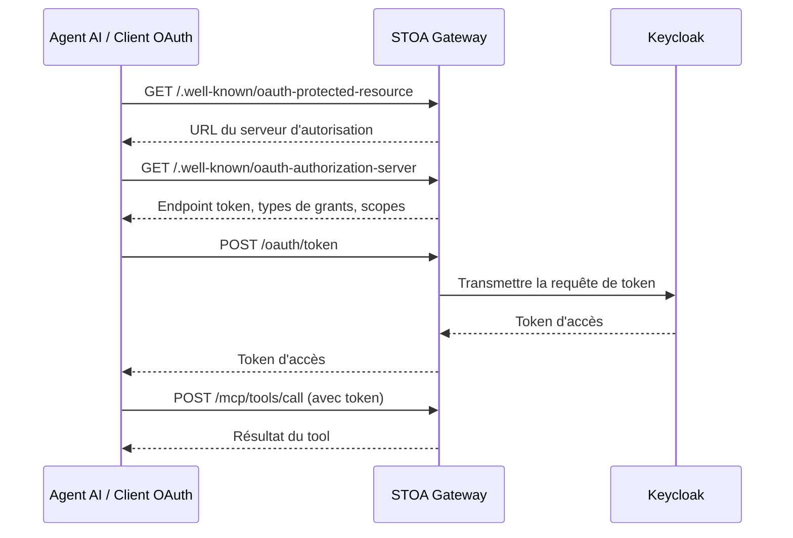

# Découverte OAuth 2.1

STOA implémente les standards de découverte OAuth 2.1 pour que les agents AI et les clients OAuth puissent découvrir automatiquement les endpoints d'authentification et obtenir des tokens — sans coder en dur les URLs Keycloak.

## Pourquoi la Découverte est Importante

Sans découverte, chaque client MCP devrait connaître :
- L'URL Keycloak
- Le nom du realm
- Le chemin de l'endpoint token
- Les types de grants supportés

Avec la découverte, le client n'a besoin que de l'URL du gateway (`mcp.<YOUR_DOMAIN>`) et peut découvrir tout le reste automatiquement.



---

## Métadonnées de Ressource Protégée (RFC 9728)

### GET /.well-known/oauth-protected-resource

Indique aux clients OAuth que cette ressource est protégée et où s'authentifier.

```bash
curl "https://mcp.<YOUR_DOMAIN>/.well-known/oauth-protected-resource"
```

**Réponse :**

```json
{
  "resource": "https://mcp.<YOUR_DOMAIN>",
  "authorization_servers": [
    "https://auth.<YOUR_DOMAIN>/realms/stoa"
  ],
  "scopes_supported": [
    "openid",
    "profile",
    "email",
    "stoa:read",
    "stoa:write",
    "stoa:admin"
  ],
  "bearer_methods_supported": ["header"]
}
```

| Champ | Description |
|-------|-------------|
| `resource` | L'identifiant de la ressource protégée (URL du gateway) |
| `authorization_servers` | Liste des serveurs d'autorisation pouvant émettre des tokens |
| `scopes_supported` | Scopes OAuth que la ressource comprend |
| `bearer_methods_supported` | Comment présenter les tokens (`header` = en-tête Authorization) |

---

## Métadonnées du Serveur d'Autorisation (RFC 8414)

### GET /.well-known/oauth-authorization-server

Retourne les métadonnées du serveur d'autorisation. Les endpoints token et d'enregistrement pointent vers le **gateway** (pas directement vers Keycloak), permettant au gateway de proxifier ces requêtes.

```bash
curl "https://mcp.<YOUR_DOMAIN>/.well-known/oauth-authorization-server"
```

**Réponse :**

```json
{
  "issuer": "https://auth.<YOUR_DOMAIN>/realms/stoa",
  "authorization_endpoint": "https://auth.<YOUR_DOMAIN>/realms/stoa/protocol/openid-connect/auth",
  "token_endpoint": "https://mcp.<YOUR_DOMAIN>/oauth/token",
  "registration_endpoint": "https://mcp.<YOUR_DOMAIN>/oauth/register",
  "jwks_uri": "https://auth.<YOUR_DOMAIN>/realms/stoa/protocol/openid-connect/certs",
  "scopes_supported": [
    "openid", "profile", "email",
    "stoa:read", "stoa:write", "stoa:admin"
  ],
  "response_types_supported": ["code"],
  "grant_types_supported": [
    "authorization_code",
    "client_credentials",
    "refresh_token"
  ],
  "token_endpoint_auth_methods_supported": [
    "none",
    "client_secret_basic",
    "client_secret_post"
  ],
  "code_challenge_methods_supported": ["S256"],
  "subject_types_supported": ["public"]
}
```

Points clés :
- `token_endpoint` pointe vers le **gateway** (`/oauth/token`), pas directement vers Keycloak
- `registration_endpoint` pointe vers le **gateway** (`/oauth/register`) pour le DCR
- `authorization_endpoint` pointe vers **Keycloak** (page de connexion côté utilisateur)
- PKCE S256 est requis pour les flux authorization code

---

## Découverte OpenID Connect

### GET /.well-known/openid-configuration

Proxifie le document de découverte OIDC de Keycloak, en remplaçant les endpoints token et d'enregistrement pour passer par le gateway.

```bash
curl "https://mcp.<YOUR_DOMAIN>/.well-known/openid-configuration"
```

La réponse est la découverte OIDC standard de Keycloak avec deux remplacements :
- `token_endpoint` → `https://mcp.<YOUR_DOMAIN>/oauth/token`
- `registration_endpoint` → `https://mcp.<YOUR_DOMAIN>/oauth/register`

| Statut | Signification |
|--------|---------|
| `200 OK` | Document de découverte retourné |
| `502 Bad Gateway` | Keycloak inaccessible |
| `503 Service Unavailable` | Keycloak non configuré |

---

## Proxy Token

### POST /oauth/token

Proxy transparent vers l'endpoint token de Keycloak. Le gateway transmet le corps de la requête tel quel et retourne la réponse de Keycloak.

**Grant Client Credentials :**

```bash
curl -X POST "https://mcp.<YOUR_DOMAIN>/oauth/token" \
  -H "Content-Type: application/x-www-form-urlencoded" \
  -d "grant_type=client_credentials" \
  -d "client_id=my-app" \
  -d "client_secret=my-secret"
```

**Grant Authorization Code (avec PKCE) :**

```bash
curl -X POST "https://mcp.<YOUR_DOMAIN>/oauth/token" \
  -H "Content-Type: application/x-www-form-urlencoded" \
  -d "grant_type=authorization_code" \
  -d "code=AUTH_CODE" \
  -d "client_id=my-app" \
  -d "code_verifier=PKCE_VERIFIER" \
  -d "redirect_uri=https://myapp.example.com/callback"
```

**Réponse :**

```json
{
  "access_token": "eyJhbGciOiJSUzI1NiIs...",
  "token_type": "Bearer",
  "expires_in": 3600,
  "refresh_token": "refresh-token-xyz",
  "scope": "openid profile email stoa:read"
}
```

| Statut | Signification |
|--------|---------|
| `200 OK` | Token émis |
| `400 Bad Request` | Grant ou paramètres invalides |
| `401 Unauthorized` | Identifiants client invalides |
| `502 Bad Gateway` | Keycloak inaccessible |

---

## Enregistrement Dynamique de Clients (DCR)

### POST /oauth/register

Proxy vers l'endpoint DCR de Keycloak. Après l'enregistrement, le gateway patche automatiquement le client pour qu'il soit **public** (sans client_secret) avec le support **PKCE S256** — requis pour les agents AI comme Claude.ai.

```bash
curl -X POST "https://mcp.<YOUR_DOMAIN>/oauth/register" \
  -H "Content-Type: application/json" \
  -d '{
    "client_name": "claude-mcp-connector",
    "application_type": "web",
    "grant_types": ["authorization_code"],
    "response_types": ["code"],
    "token_endpoint_auth_method": "none",
    "redirect_uris": ["https://claude.ai/oauth/callback"]
  }'
```

**Réponse (201 Created) :**

```json
{
  "client_id": "new-client-abc123",
  "client_name": "claude-mcp-connector",
  "application_type": "web",
  "grant_types": ["authorization_code"],
  "response_types": ["code"],
  "registration_access_token": "rat-xyz",
  "registration_client_uri": "https://auth.<YOUR_DOMAIN>/..."
}
```

### Patch PKCE Post-Enregistrement

Après un enregistrement réussi, le gateway :
1. Obtient automatiquement un token admin de Keycloak
2. Trouve le client nouvellement créé
3. Le patche pour définir `publicClient: true` et `pkce.code.challenge.method: S256`

Cela garantit que les agents AI peuvent s'authentifier en utilisant le flux authorization code avec PKCE, sans avoir besoin d'un client secret.

| Statut | Signification |
|--------|---------|
| `201 Created` | Client enregistré |
| `400 Bad Request` | Paramètres d'enregistrement invalides |
| `403 Forbidden` | DCR désactivé dans Keycloak |
| `502 Bad Gateway` | Keycloak inaccessible |

---

## Exemple d'Intégration d'Agent AI

Voici comment un agent AI (ex : Claude.ai) découvre et s'authentifie avec STOA :

1. **Découverte** : `GET /.well-known/oauth-protected-resource` → trouve le serveur d'autorisation
2. **Métadonnées** : `GET /.well-known/oauth-authorization-server` → trouve l'endpoint token, les flux supportés
3. **Enregistrement** (première fois) : `POST /oauth/register` → obtient le `client_id`
4. **Autorisation** : Redirige l'utilisateur vers la connexion Keycloak → obtient le code d'autorisation
5. **Token** : `POST /oauth/token` avec code + vérificateur PKCE → obtient le token d'accès
6. **Appel des tools** : `POST /mcp/tools/call` avec `Authorization: Bearer <token>`

## Voir Aussi

- [MCP Gateway API](/docs/api/mcp-gateway) — Endpoints du protocole MCP
- [Guide d'Authentification](/docs/guides/authentication) — Configuration Keycloak et OIDC
- [Permissions RBAC](/docs/reference/rbac-permissions) — Rôles et scopes
- [Configuration de Sécurité](/docs/reference/security-configuration) — Bonnes pratiques de sécurité
