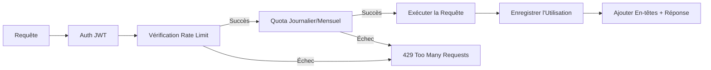

import EnvSetup from '@site/docs/_partials/_env-setup.mdx';

# Application des Quotas

STOA applique des quotas API par consumer au niveau du gateway — limites de débit (par seconde/minute), plafonds journaliers et limites mensuelles. Les quotas sont définis dans les plans d'abonnement et appliqués en temps réel.

## Pipeline d'Application

Chaque requête API passe par la vérification de quota après l'authentification :



## Types de Quota

| Type | Fenêtre | Exemple | Cas d'Usage |
|------|--------|---------|----------|
| **Par seconde** | Glissante 1s | 100 req/s | Protection contre les rafales |
| **Par minute** | Glissante 1min | 1 000 req/min | Rate limiting en régime permanent |
| **Journalier** | Réinitialisation à minuit UTC | 100 000 req/jour | Plafonds d'utilisation journalière |
| **Mensuel** | Réinitialisation le 1er du mois | 1 000 000 req/mois | Limites par période de facturation |
| **Rafale** | Instantané | 50 simultanés | Plafond de requêtes simultanées |

## Configuration des Plans

Les quotas sont définis par plan dans le Control Plane :

<EnvSetup />

```bash
curl -X POST "${STOA_API_URL}/v1/plans" \
  -H "Authorization: Bearer ${TOKEN}" \
  -H "Content-Type: application/json" \
  -d '{
    "slug": "gold",
    "name": "Plan Gold",
    "rate_limit_per_second": 100,
    "rate_limit_per_minute": 5000,
    "daily_request_limit": 500000,
    "monthly_request_limit": 10000000,
    "burst_limit": 50
  }'
```

### Exemples de Plans

| Plan | Débit/sec | Débit/min | Journalier | Mensuel |
|------|----------|----------|-------|---------|
| Community | 5 | 60 | 10 000 | 100 000 |
| Silver | 20 | 300 | 50 000 | 1 000 000 |
| Gold | 100 | 5 000 | 500 000 | 10 000 000 |
| Enterprise | Personnalisé | Personnalisé | Personnalisé | Personnalisé |

## En-têtes de Réponse

Chaque réponse réussie inclut des en-têtes de rate limit :

```
X-RateLimit-Limit: 5000
X-RateLimit-Remaining: 4523
X-RateLimit-Reset: 1708000123
```

| En-tête | Description |
|--------|-------------|
| `X-RateLimit-Limit` | Nombre maximum de requêtes autorisées dans la fenêtre courante |
| `X-RateLimit-Remaining` | Requêtes restantes dans la fenêtre courante |
| `X-RateLimit-Reset` | Timestamp Unix de réinitialisation de la fenêtre |

## Réponse d'Erreur (429)

Quand un quota est dépassé, le gateway retourne `429 Too Many Requests` :

**Rate limit dépassé :**

```json
{
  "error": "quota_exceeded",
  "message": "Rate limit dépassé : limite par minute de 100 requêtes atteinte",
  "retry_after_secs": 45
}
```

**Quota journalier dépassé :**

```json
{
  "error": "quota_exceeded",
  "message": "Quota journalier dépassé : 10000/10000 requêtes utilisées. Réinitialisation à minuit UTC.",
  "retry_after_secs": null
}
```

L'en-tête `Retry-After` est également défini :

```
HTTP/1.1 429 Too Many Requests
Retry-After: 45
Content-Type: application/json
```

## Comportement de Réinitialisation

| Type de Quota | Se Réinitialise Quand |
|-----------|-------------|
| Par seconde | Après 1 seconde |
| Par minute | Après 60 secondes |
| Journalier | Minuit UTC (00:00 UTC) |
| Mensuel | 1er du mois (00:00 UTC) |

Les réinitialisations sont automatiques — aucune intervention manuelle nécessaire. Le gateway vérifie la date/heure courante à chaque requête et réinitialise les compteurs quand la fenêtre change.

## Monitoring des Quotas

### Via l'API Admin

```bash
# Lister toutes les statistiques de quota des consumers
curl "${STOA_GATEWAY_URL}/admin/quotas" \
  -H "Authorization: Bearer ${ADMIN_TOKEN}"
```

```json
[
  {
    "consumer_id": "user-123",
    "daily_count": 450,
    "daily_limit": 1000,
    "monthly_count": 12500,
    "monthly_limit": 50000,
    "daily_remaining": 550,
    "monthly_remaining": 37500
  }
]
```

### Stats par Consumer

```bash
curl "${STOA_GATEWAY_URL}/admin/quotas/${CONSUMER_ID}" \
  -H "Authorization: Bearer ${ADMIN_TOKEN}"
```

### Réinitialiser les Quotas (Admin)

Pour le dépannage ou le support client, les admins peuvent réinitialiser les compteurs de quota d'un consumer :

```bash
curl -X POST "${STOA_GATEWAY_URL}/admin/quotas/${CONSUMER_ID}/reset" \
  -H "Authorization: Bearer ${ADMIN_TOKEN}"
```

Cette opération réinitialise immédiatement les compteurs journaliers et mensuels à zéro.

## Métriques Prometheus

Le gateway expose des métriques Prometheus liées aux quotas :

| Métrique | Type | Description |
|--------|------|-------------|
| `stoa_requests_total` | Counter | Total des requêtes (par consumer, statut) |
| `stoa_rate_limited_total` | Counter | Requêtes rejetées par le rate limiter |
| `stoa_quota_exceeded_total` | Counter | Requêtes rejetées par le quota journalier/mensuel |
| `stoa_quota_usage_ratio` | Gauge | Utilisation courante en ratio (0.0-1.0) |

### Exemple d'Alerte Grafana

```yaml
# Alerte quand un consumer atteint 80% de son quota journalier
- alert: QuotaNearLimit
  expr: stoa_quota_usage_ratio{type="daily"} > 0.8
  for: 5m
  labels:
    severity: warning
  annotations:
    summary: "Consumer {{ $labels.consumer_id }} à {{ $value | humanizePercentage }} du quota journalier"
```

## Quotas par Défaut

Quand aucun plan n'est spécifié, le gateway applique des limites par défaut :

| Paramètre | Valeur par Défaut |
|---------|---------------|
| Débit par minute | 5 requêtes |
| Limite journalière | 10 000 requêtes |

Ces valeurs par défaut protègent contre les abus pour les consumers sans plan explicite. Configurez des limites plus élevées en assignant un plan à l'abonnement.

## Dépannage

| Problème | Cause | Solution |
|---------|-------|-----|
| 429 immédiatement à la première requête | Quota par défaut trop bas (5/min) | Assigner un plan à l'abonnement |
| Quota non réinitialisé à minuit | Décalage de fuseau horaire | Les quotas se réinitialisent à minuit **UTC** |
| Consumer affiche 0 restant mais les requêtes fonctionnent | Délai de cache | Attendre jusqu'à 5 minutes ou vider le cache |
| La réinitialisation admin du quota ne prend pas effet | Cache du gateway | Vider le cache après la réinitialisation : `POST /admin/cache/clear` |

## Voir Aussi

- [Cycle de Vie des Abonnements](/docs/guides/subscriptions-lifecycle) — Plans et abonnements
- [API Admin du Gateway](/docs/api/gateway-admin-api) — Endpoints admin des quotas
- [Guide d'Observabilité](/docs/guides/observability) — Prometheus et Grafana
- [MCP Gateway API](/docs/api/mcp-gateway) — Endpoints du protocole MCP
