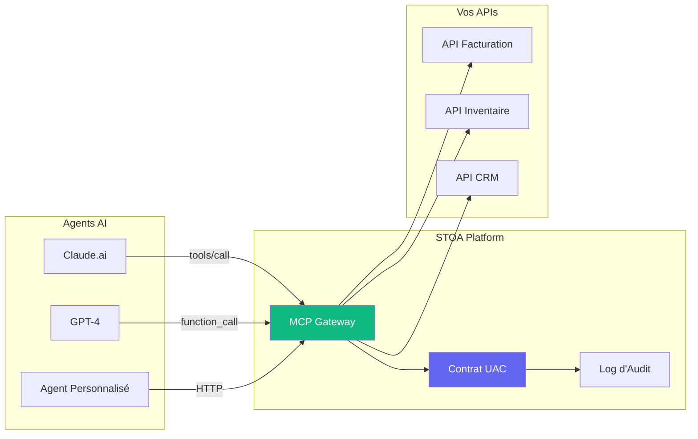
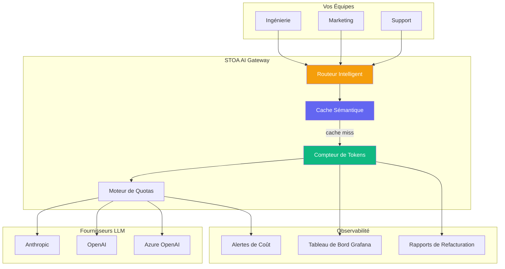
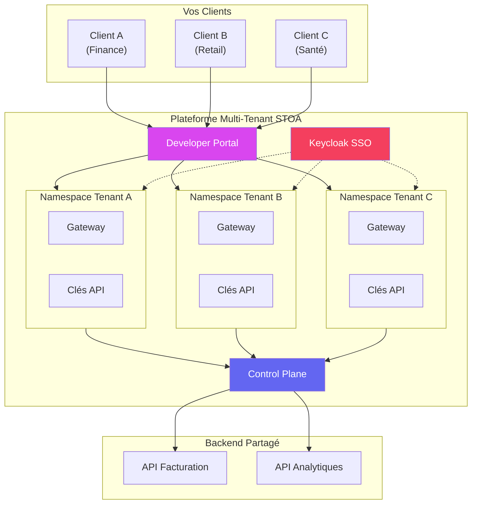

import Tabs from '@theme/Tabs';
import TabItem from '@theme/TabItem';

# Cas d'Usage

Découvrez comment STOA Platform résout des défis réels pour les entreprises adoptant l'AI et gérant des APIs à grande échelle.

---

## 🤖 Cas d'Usage 1 : API Gateway pour Agents AI

**Défi :** Vos agents AI (Claude, GPT, LLMs personnalisés) doivent appeler des APIs internes, mais vous manquez de gouvernance, de pistes d'audit et de contrôle d'accès.

**Solution :** Le MCP Gateway de STOA fournit un point d'entrée unifié pour toutes les interactions AI-vers-API.



### Bénéfices

| Sans STOA | Avec STOA |
|--------------|-----------|
| Accès direct aux APIs, sans gouvernance | Application centralisée des politiques |
| Aucune visibilité sur les appels AI | Piste d'audit complète par agent |
| Gestion manuelle des clés API | Auto-découverte via MCP |
| Rate limiting dispersé | Quotas unifiés par tenant |

### Implémentation Rapide

```bash
# 1. Enregistrer votre API dans STOA
stoa api register --name billing-api --upstream https://billing.internal

# 2. Claude.ai la découvre automatiquement
# Dans Claude : "Quelles APIs de facturation sont disponibles ?"
# Claude appelle : stoa_catalog(action="search", query="billing")

# 3. L'agent s'abonne et appelle
# stoa_subscription(action="create", api_id="billing-api")
# Appel direct via MCP Gateway avec audit complet
```

---

## 📊 Cas d'Usage 2 : Gestion des Coûts AI et Metering de Tokens

**Défi :** Plusieurs équipes utilisent des LLMs, mais vous n'avez aucune visibilité sur la consommation de tokens, les coûts s'envolent et il n'existe pas de mécanisme de refacturation.

**Solution :** L'AI Gateway de STOA trace chaque token, fournit des tableaux de bord en temps réel et permet des quotas par équipe.



### Bénéfices

| Métrique | Avant STOA | Après STOA |
|--------|-------------|------------|
| Visibilité des coûts | Aucune | Temps réel par équipe |
| Gaspillage de tokens | Appels LLM redondants | Réduit avec le cache sémantique* |
| Contrôle du budget | Factures surprises mensuelles | Application automatique des quotas |
| Dépendance au fournisseur | Fournisseur unique | Basculement multi-fournisseur |

*Le cache sémantique peut réduire significativement les appels LLM redondants. Les économies réelles varient selon les patterns de requêtes et les cas d'usage.*

### Aperçu du Tableau de Bord

```
┌─────────────────────────────────────────────────────────┐
│  Utilisation de Tokens par Équipe (Janvier 2026)        │
├─────────────────────────────────────────────────────────┤
│  Ingénierie  ████████████████████░░░░  2,4M tokens      │
│  Marketing   ████████░░░░░░░░░░░░░░░░  800K tokens      │
│  Support     ████████████░░░░░░░░░░░░  1,2M tokens      │
├─────────────────────────────────────────────────────────┤
│  Coût Total : 1 240 €  |  Économies Cache : 520 € (30%) │
└─────────────────────────────────────────────────────────┘
```

---

## 🏢 Cas d'Usage 3 : Plateforme API Multi-Tenant

**Défi :** Vous êtes un ESN/ISV exposant des APIs à plusieurs clients. Vous avez besoin d'isolation, de quotas par client, de facturation et de conformité (NIS2/DORA).

**Solution :** STOA fournit une multi-tenant native avec une isolation complète et la souveraineté européenne.



### Architecture d'Isolation des Tenants

| Aspect | Implémentation |
|--------|----------------|
| **Réseau** | Kubernetes NetworkPolicy par namespace |
| **Données** | Schéma par tenant dans PostgreSQL |
| **Auth** | Realm Keycloak séparé par tenant |
| **Secrets** | Chemins Vault isolés |
| **Quotas** | Rate limits indépendants |

### Fonctionnalités de Conformité

- **NIS2** — Signalement des incidents de sécurité, contrôles d'accès
- **DORA** — Gestion des risques TIC, tests de résilience
- **RGPD** — Résidence des données en UE, pistes d'audit
- **Hébergement Européen** — Option de résidence des données en UE disponible*

*La juridiction légale dépend de multiples facteurs. Consultez votre conseiller juridique pour des conseils de conformité.*

---

## Démarrer

Prêt à mettre en œuvre ces cas d'usage ?

:::info Accès Anticipé — Bêta Privée
STOA Platform est actuellement en bêta privée. [Demandez l'accès](mailto:christophe@hlfh.io) pour déployer ces cas d'usage sur votre infrastructure, ou explorez la [Vue d'Ensemble de l'Architecture](/docs/concepts/architecture) pour comprendre comment fonctionne STOA.
:::

<Tabs>
  <TabItem value="saas" label="☁️ SaaS" default>
    ```
    1. Demander l'accès bêta → christophe@hlfh.io
    2. Recevoir vos identifiants tenant
    3. Se connecter sur https://console.gostoa.dev
    4. Créer votre première API dans la Console
    ```
  </TabItem>
  <TabItem value="self-hosted" label="🏠 Auto-hébergé">
    ```
    1. Demander l'accès bêta → christophe@hlfh.io
    2. Recevoir l'accès au chart Helm
    3. helm repo add stoa https://charts.gostoa.dev
    4. helm install stoa stoa/stoa-platform -n stoa-system
    ```
  </TabItem>
</Tabs>

---

## Besoin d'Aide ?

- 📚 [Guide de Démarrage Rapide](/docs/guides/quickstart)
- 💬 [Communauté Discord](https://discord.gostoa.dev)
- 📧 [Contacter les Ventes](mailto:sales@gostoa.dev) pour les cas d'usage enterprise

---

*Claude est une marque commerciale d'Anthropic, PBC. GPT-4 et Azure OpenAI sont des marques commerciales d'OpenAI/Microsoft. Tous les autres noms de produits sont des marques de leurs propriétaires respectifs.*
